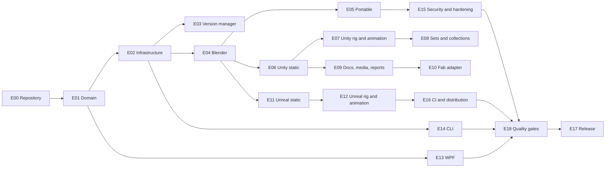

# Package Builder — Complete Implementation Backlog

**Document status:** Active project backlog
**Repository:** `C:\Dev\PackageBuilder`
**GitHub repository:** [https://github.com/avivperets26/3DModels-Package-Builder](https://github.com/avivperets26/3DModels-Package-Builder)
**GitHub visibility:** Public, approved by the user on 2026-07-22
**Runtime data:** `C:\Dev\PackageBuilder\runtime-data`
**Planned default branch:** `main`
**Last reviewed:** 2026-07-24

## 1. Purpose

This file is the Jira-style source of truth for building Package Builder from an empty repository to a validated version 1 system.

It covers:

- Repository and development-environment setup.
- Core domain, manifests, storage, orchestration, and worker contracts.
- Blender source inspection and normalization.
- Portable FBX and GLB packages.
- Unity static, rigged, animated, set, and collection outputs.
- Unreal static, rigged, animated, set, and collection outputs.
- Documentation, preview media, reports, and the Fab marketplace adapter.
- Desktop UI, CLI, testing, security, CI, installer, and release validation.

The product and architecture documents remain authoritative for requirements and technical decisions. This backlog turns those decisions into branch-sized implementation work.

### Supported Product Cases

| Case | Product type | Required outputs |
|---|---|---|
| 1 | Model without rig and without animation | Renamed FBX/GLB archive, Unity package, Unreal package, documentation, previews, and validation report |
| 2 | Model with rig but without animation | Case 1 outputs plus preserved skeleton, skin weights, rig metadata, and rig validation |
| 3 | Model with rig and animations | Case 2 outputs plus named clips, controllers/state machines, animation previews, and runtime animation validation |
| 4 | Set of items | Coordinated item hierarchy, individual and group prefabs/actors, visibility preview, shared or per-item materials, and set documentation |
| 5 | Collection of items | Batch-built products plus a collection showcase, collection metadata, consolidated documentation, and collection archives |

Every case supports a configurable publisher root such as `AvivPeretsFBX`; no publisher name may be hard-coded into workers or templates.

### Non-Negotiable Environment Constraints

- `C:\Dev\PackageBuilder` is the only project filesystem root. Project files, managed tools, downloads, logs, runtime data, caches, temporary files, and generated artifacts must remain beneath it.
- `tools`, `downloads`, `logs`, `runtime-data`, and `artifacts` are repository-local directories that remain excluded from Git.
- The required technology stack must have a no-cost local path. No task may introduce a mandatory paid software edition, paid subscription, or paid hosted service.
- Visual Studio Code plus PowerShell and repository-local CLI tools is the supported development baseline. Paid Visual Studio is optional and must never be required by an acceptance condition.
- Tool discovery and path configuration must reject selected executables or writable project paths outside the project root.
- `docs/QUALITY_AND_RELEASE_GATES.md` is normative. UX/accessibility, traceability, complete test layers, coverage, mutation, performance, security, installation, engineering-quality, and fail-closed release requirements cannot be deferred implicitly.
- The canonical release blockers are REL-001 through REL-008 in `docs/QUALITY_AND_RELEASE_GATES.md`; missing, stale, unreadable, contradictory, or failing evidence blocks release.
- No coverage percentage, test count, review statement, or unsupported quality claim substitutes for mapped acceptance evidence.

## 2. Task Workflow

### Status Markers

- `[ ]` — not complete.
- `[x]` — complete and verified.
- 🟢 **DONE** — every acceptance, test, Git/GitHub, and user-confirmation gate has passed; the marker, `[x]`, Active Work removal, and Completion Log row are recorded during the approved next-task rollover.
- 🟡 **PROCESS** — work is active, progressing through publication gates, or awaiting approved next-task rollover synchronization; the task stays `[ ]`.
- 🔴 **BLOCKED** — a specific unresolved condition prevents meaningful progress; record that blocker and keep the task `[ ]`.
- Lifecycle markers supplement the `[ ]` and `[x]` checkboxes; do not invent additional checkbox symbols or treat a marker as completion evidence.

### Git Authority

- The user exclusively controls Git commits and remote operations.
- Codex must never run `git commit` or `git push` unless the user explicitly authorizes that exact action.
- Codex must not stage files, merge branches, create pull requests, create tags, or publish releases unless the user explicitly authorizes the exact action.
- Authorization for one Git or remote action does not authorize another action or a future action.
- Codex may use read-only Git commands such as `git status`, `git diff`, `git log`, and `git branch --show-current` for inspection and validation.
- Pull requests are optional. A direct merge requires local validation, the task commit, task-branch push, merge into `main`, push of `main`, successful `main` CI, and explicit user confirmation. Branch CI is not required when the direct task-branch push does not trigger it, and no branch CI may be claimed without evidence.
- Every future task must begin by reading `AGENTS.md` completely before any other project action.

### Codex Task Handoff

At the end of every task, Codex must report:

- Changed files.
- Test and validation results.
- Suggested branch name.
- Suggested commit message.
- Manual commands the user can run.

### Logical Completion Rule

A task is logically complete only when all of the following are satisfied:

1. Its acceptance condition is satisfied.
2. Required automated tests pass locally.
3. Every applicable requirement and acceptance criterion has current mapped evidence, and all approved quality thresholds and release gates pass.
4. The task is committed once on its documented branch.
5. The task branch is pushed to GitHub.
6. The task is merged into `main`, and `main` is pushed.
7. The resulting `main` CI succeeds, unless the user explicitly approves and documents an exception.
8. The user explicitly confirms the commit, push, merge, required `main` CI, and task completion.

Read-only repository evidence does not replace user confirmation. Merely writing code locally does not complete a task. Pull-request or branch CI may provide additional evidence when present, but neither is required for a direct merge, and branch CI must never be claimed when the direct task-branch push did not trigger it.

### Permanent One-Merge Rollover

Each implementation task is committed, pushed, and merged into `main` only once. Do not return to an already merged task branch solely for completion bookkeeping.

The required direct-merge sequence is:

1. Complete local validation.
2. Commit the task branch.
3. Push the task branch.
4. Merge it into `main`.
5. Push `main`.
6. Wait for successful `main` CI.
7. Receive explicit user confirmation.

After step 7 the task is logically complete. Its repository bookkeeping is recorded at the beginning of the next task branch, before that task's implementation:

1. Mark the previous task `[x]` and 🟢 **DONE**.
2. Remove it from Active Work.
3. Add exactly one Completion Log row.
4. Record its final task commit, merge into `main`, successful `main` CI, and explicit user confirmation.

This previous-task completion synchronization is an allowed documentation operation in the next task branch and does not violate the one-implementation-task-per-branch rule. The next task is then implemented normally in that same branch. Do not create a dedicated completion-only branch, commit cycle, pull request, or merge. The final project task or final milestone may use one final documentation-only synchronization when no successor task exists.

### Branch Naming

```text
<type>/PB-####-short-description
```

Allowed types:

- `chore` — repository, dependencies, configuration.
- `docs` — documentation-only change.
- `feat` — product capability.
- `fix` — correction to implemented behavior.
- `test` — test infrastructure or fixtures.
- `security` — security hardening.
- `release` — release preparation.

Example:

```text
feat/PB-0607-unity-urp-material-compiler
```

### One Task per Branch

- Each task should be independently reviewable and testable.
- Do not mix unrelated cleanup into a task branch.
- A dependent task starts from updated `main` after its dependencies are merged.
- Synchronizing the immediately previous confirmed task's completion at the beginning of the next task branch is allowed documentation work, not a second implementation task.
- If implementation reveals missing work, add a new ID rather than silently expanding scope.
- Bootstrap tasks also use one documented PB task per branch. Any temporary exception requires explicit user approval and must be recorded in the affected task and Completion Log.

### Priority

- **P0** — required for a working version 1 system.
- **P1** — required for production quality before public release.
- **P2** — explicitly deferred improvement; not required for the first working release.

## 3. Active Work

| Task | Status | Branch | Owner | Started | Current verified state | Current blocker |
|---|---|---|---|---|---|---|
| PB-0102 | 🟡 **PROCESS** | `feat/PB-0102-product-cases-targets` | Domain Engineering for local work; user for Git gates | 2026-07-24 | PB-0101 rollover is synchronized. Closed immutable product-case and build-target identities, exact canonical identifiers, explicit non-throwing parsing results, and public-behavior tests are implemented and locally validated. Focused PB-0102 tests pass 53/53; all Domain tests pass 161/161, preserving the prior 108; every new production file has 100% line and branch coverage; the normal/main/detached quality and ADR matrix passes in PowerShell 7 and Windows PowerShell 5.1; solution architecture passes 7/7; repository baseline passes 29/29; all nine core-CI stages pass with 164/164 tests and a 0-warning/0-error Release build. | No local implementation or validation blocker. The user-controlled PB-0102 commit and push, merge into and push of `main`, successful required `main` CI, explicit completion confirmation, and next-task rollover remain. |

### PB-0101 Completion Evidence

The detailed implementation, validation, and final publication evidence are recorded in `docs/PB-0101_PRODUCT_IDENTITY_EVIDENCE.md`.

- Final task commit `915dda5d7cd6b93b741841336c4e06aea4ad99ef` was pushed on `feat/PB-0101-product-identity`.
- The task was merged through [pull request #15](https://github.com/avivperets26/3DModels-Package-Builder/pull/15) into `main` as `67d8884799a99bcfd5e1407fff534561206424d9`.
- [PR workflow run 30089954442](https://github.com/avivperets26/3DModels-Package-Builder/actions/runs/30089954442) and required [main workflow run 30090184878](https://github.com/avivperets26/3DModels-Package-Builder/actions/runs/30090184878) completed successfully.
- The user explicitly confirmed the task commit, push, merge, successful required `main` CI, and completion on 2026-07-24.
- No CI, completion, or quality exception was used.
- This PB-0102 rollover marks PB-0101 `[x]` / 🟢 **DONE**, removes it from Active Work, and adds exactly one chronological Completion Log row.

### PB-0013 Completion Evidence

The detailed implementation, historical conflict, validation, and final publication evidence are recorded in `docs/PB-0013_QUALITY_RELEASE_GATES_EVIDENCE.md`.

- Final task commit `8f79883d9a78c1a211510ee4ea8c855405e12e3c` was pushed on `docs/PB-0013-quality-release-gates`.
- The task was merged through [pull request #14](https://github.com/avivperets26/3DModels-Package-Builder/pull/14) into `main` as `859a97a83d6328b45e70cd515a058c10bc519205`.
- Optional [PR workflow run 30087261318](https://github.com/avivperets26/3DModels-Package-Builder/actions/runs/30087261318) failed only in the PB-0013 changed-file-history validator because GitHub checked out a detached synthetic merge commit and the validator indexed the empty result of `git branch --show-current`, producing `Index was outside the bounds of the array.` It is not recorded as successful and no alternate cause is asserted.
- Required [main workflow run 30087267104](https://github.com/avivperets26/3DModels-Package-Builder/actions/runs/30087267104) completed successfully for the merge commit.
- The user explicitly confirmed the task commit, push, merge, successful required `main` CI, and completion on 2026-07-24.
- Pull-request and branch CI are optional while required `main` CI passed, so no CI exception was used. No completion or quality exception was used.
- Historical PB-0013 commits `fc34bffff838cac41198940ed54b91b25c33f838` and `a1032c48f2a8d0dc98d0c589f1a845605950952b`, historical pull request [#1](https://github.com/avivperets26/3DModels-Package-Builder/pull/1), merge `13e5875b686c3219e3571d45ceaa93c463e881ff`, and the early one-task-per-branch conflict remain preserved.
- This PB-0101 rollover marks PB-0013 `[x]` / 🟢 **DONE**, removes it from Active Work, adds exactly one chronological Completion Log row, and records E00/M0 complete.

### PB-0012 Completion Evidence

The detailed implementation and final publication evidence are recorded in `docs/PB-0012_INITIAL_ADRS_EVIDENCE.md`.

- Final task commit `335691dcceeaa645231539a2ec83a3dae9db2a3e` was pushed on `docs/PB-0012-initial-adrs`.
- The task was merged through [pull request #13](https://github.com/avivperets26/3DModels-Package-Builder/pull/13) into `main` as `f4b5a5d39b2de97e404f837150bbe0d869e3a366`.
- [PR workflow run 30083665801](https://github.com/avivperets26/3DModels-Package-Builder/actions/runs/30083665801) and required [main workflow run 30083674462](https://github.com/avivperets26/3DModels-Package-Builder/actions/runs/30083674462) completed successfully.
- The user explicitly confirmed the task commit, push, merge, green required `main` CI, and completion on 2026-07-24.
- No CI, completion, or quality exception was used.
- PB-0012 is `[x]` / 🟢 **DONE**, removed from Active Work, and recorded exactly once in the Completion Log during this PB-0013 rollover.

### PB-0011 Completion Evidence

The detailed implementation and final publication evidence are recorded in `docs/PB-0011_GITHUB_GOVERNANCE_EVIDENCE.md`.

- Final task commit `02491ce01e32559c2b41ce886f5595c286677555` was pushed on `chore/PB-0011-github-governance`.
- The task was merged through [pull request #12](https://github.com/avivperets26/3DModels-Package-Builder/pull/12) into `main` as `5b37b3c8081d246c03eabe8dc3099b1a99f31ca1`.
- [PR workflow run 30080298582](https://github.com/avivperets26/3DModels-Package-Builder/actions/runs/30080298582) and required [main workflow run 30080304495](https://github.com/avivperets26/3DModels-Package-Builder/actions/runs/30080304495) completed successfully.
- The user explicitly confirmed the task commit, push, merge, green required `main` CI, and completion on 2026-07-24.
- No CI, completion, or quality exception was used.
- PB-0011 is `[x]` / 🟢 **DONE**, removed from Active Work, and recorded exactly once in the Completion Log during this PB-0012 rollover. PB-0013 is unchanged.

### PB-0010 Completion Evidence

The detailed implementation and final publication evidence are recorded in `docs/PB-0010_CONTRIBUTION_WORKFLOW_EVIDENCE.md`.

- Final task commit `eaf8846df7bf4bb8edc82d8407da8c1a61130231` was pushed on `docs/PB-0010-contribution-workflow`.
- The task was merged through [pull request #11](https://github.com/avivperets26/3DModels-Package-Builder/pull/11) into `main` as `b7396bf6b557da26df2f2d08a70c6f6d1b1a3796`.
- [PR workflow run 30077559953](https://github.com/avivperets26/3DModels-Package-Builder/actions/runs/30077559953) and required [main workflow run 30077718661](https://github.com/avivperets26/3DModels-Package-Builder/actions/runs/30077718661) completed successfully.
- The user explicitly confirmed the task commit, push, merge, green required `main` CI, and completion on 2026-07-24.
- No CI, completion, or quality exception was used.
- PB-0010 is `[x]` / 🟢 **DONE**, removed from Active Work, and recorded exactly once in the Completion Log during this PB-0011 rollover. PB-0013 is unchanged.

### PB-0009 Completion Evidence

The detailed implementation, failure-recovery history, and final publication evidence are recorded in `docs/PB-0009_CORE_CI_EVIDENCE.md`.

- Final task commit `973aec7be954115e83fe1c18d0c8139f2d111fda` was pushed on `chore/PB-0009-core-ci`.
- The task was merged through [pull request #10](https://github.com/avivperets26/3DModels-Package-Builder/pull/10) into `main` as `96c13a565f9ed85d66d13a357cfa2571b2e4dd93`.
- Final [PR workflow run 30047612915](https://github.com/avivperets26/3DModels-Package-Builder/actions/runs/30047612915) completed successfully.
- Required [main workflow run 30047819416](https://github.com/avivperets26/3DModels-Package-Builder/actions/runs/30047819416) completed successfully for the merge commit; both `Validate repository baseline` and `Validate core application` passed.
- The user explicitly confirmed the commit, push, merge, green required `main` CI, and task completion on 2026-07-23.
- No CI, completion, or quality exception was used.
- PB-0009 is `[x]` / 🟢 **DONE**, removed from Active Work, and recorded exactly once in the Completion Log during this PB-0010 rollover. PB-0013 is unchanged.

### Dated Repository Verification Checkpoints

The detailed PB-0002 audit is recorded in `docs/PB-0002_REPOSITORY_BASELINE.md`. Hashes below describe the state verified on 2026-07-22; they are not permanent claims about a future `HEAD` or branch tip.

- Before PB-0002 edits, the working tree was clean and `HEAD` on `chore/PB-0002-initialize-repository` was `979c2a773ebe222343d5a3d2b4f72f383b532d60`.
- Local `main`, its `origin/main` upstream, and read-only remote `main` evidence all resolved to checkpoint `979c2a773ebe222343d5a3d2b4f72f383b532d60`.
- GitHub reported the approved repository as public with default branch `main`; local fetch and push URLs both matched `https://github.com/avivperets26/3DModels-Package-Builder.git`.
- PB-0001 baseline commit `1562abfef49071e83978e7573499d07e629b0c53` was a valid commit and an ancestor of the verified `main` checkpoint.
- All required planning, governance, baseline, SDK-pin, and environment-entry files were tracked. No tools, downloads, logs, runtime data, artifacts, build outputs, user-specific files, prohibited binaries, generated engine assets, or out-of-root paths were in the index.
- Reachable history passed strict integrity checks with no missing objects. Representative ignore checks passed for the existing PB-0001 rules; uncovered Unity, Unreal, Blender, credential, and key-file patterns remain explicitly deferred to PB-0004.
- At the initial repository-audit checkpoint, PB-0001 was the only completed task and Completion Log entry; PB-0002 and PB-0013 were still active and incomplete.
- Before the bootstrap CI continuation began, `chore/PB-0002-initialize-repository` and its configured upstream both resolved to `cb0748f9e7300f2122014bff5e9a130b47b3dc5d`, and the working tree was clean.
- Read-only GitHub evidence shows that commit was merged through PR #3 into remote `main` at `c75c119cfae7c8e9bfe4f2b0fea2fbd77575e028`; the task branch had zero workflow runs before this continuation.
- Bootstrap CI commit `0b1700e4d999069ef7372fcc0ba0e6971789b8e5` was pushed on the documented task branch and merged directly into `main` as `86ac34ac61f1cb729e59fc0c7c10ffd772b2ee2a`. PR #3 contained only the original baseline; no second pull request was used for the CI continuation.
- [Repository baseline workflow run 29957972750](https://github.com/avivperets26/3DModels-Package-Builder/actions/runs/29957972750) concluded successfully for the direct `main` merge. The user explicitly confirmed the commit, push, merge, and successful CI gates on 2026-07-22. No PB-0002 CI exception was used.
- PB-0002 is complete and recorded in the Completion Log. PB-0013 remains active and unchanged.

### PB-0003 Completion Evidence

The detailed PB-0003 audit and final gate evidence are recorded in `docs/PB-0003_GITHUB_REPOSITORY_EVIDENCE.md`. Evidence verified on 2026-07-23 shows:

- GitHub repository `avivperets26/3DModels-Package-Builder` is public and its default branch is `main`.
- The local origin fetch and push URLs both remain `https://github.com/avivperets26/3DModels-Package-Builder.git`; no SSH requirement or remote change was introduced.
- At the initial acceptance checkpoint, local `main` tracked `origin/main`, and local `main`, `origin/main`, read-only remote `main`, and remote `HEAD` all resolved to `2a520bbb2d17245756ca392883ba5a6916f60fef`.
- The required repository baseline files, PB-0002 completion evidence, reusable validation script, and SHA-pinned Repository baseline workflow were present on `main`.
- Final task commit `eecd16ba1906af4c36906eaed7b99ce67f5150a4` was pushed on `chore/PB-0003-github-remote` and merged through [pull request #4](https://github.com/avivperets26/3DModels-Package-Builder/pull/4) into `main` as `aa0b82b7a2e7880f5d6c57a5399d30e3391912cc`.
- [PR workflow run 29998957170](https://github.com/avivperets26/3DModels-Package-Builder/actions/runs/29998957170) and final [main workflow run 29999066840](https://github.com/avivperets26/3DModels-Package-Builder/actions/runs/29999066840) completed successfully.
- The user explicitly confirmed the task commit, push, CI, pull-request merge, and final `main` CI. No CI exception was used.
- The planned repository name `package-builder` still differs from the actual name `3DModels-Package-Builder`; the discrepancy remains explicit and unresolved.
- PB-0003 is `[x]` and 🟢 **DONE** and is recorded once in the Completion Log.

### PB-0007 Completion Evidence

The detailed implementation and final publication evidence are recorded in `docs/PB-0007_FORMATTING_EVIDENCE.md`. Evidence independently verified on 2026-07-23 shows:

- Final task commit `56a1974dddd67b30e51084a3cbce6a985e1e9fd7` was pushed on `chore/PB-0007-formatting`.
- The task was merged through [pull request #8](https://github.com/avivperets26/3DModels-Package-Builder/pull/8) into `main` as `908e4b0ca92629d07a8ced5b529e72d6b4f5c0a5`.
- [Repository baseline workflow run 30024743745](https://github.com/avivperets26/3DModels-Package-Builder/actions/runs/30024743745) was independently verified as an attempt-1 `push` run on `main` for merge commit `908e4b0ca92629d07a8ced5b529e72d6b4f5c0a5`; the run and its `Validate repository baseline` job completed successfully.
- The user explicitly confirmed on 2026-07-23 that PB-0007 was pushed, merged into `main`, and had green required `main` CI.
- No CI, quality, or completion exception was used.
- PB-0007 is `[x]` and 🟢 **DONE** and is recorded exactly once in the Completion Log.

### Unresolved Bootstrap Decisions

- **Historical one-task-per-branch conflict:** PB-0013 quality commit `fc34bffff838cac41198940ed54b91b25c33f838` was pushed on the PB-0001 branch rather than `docs/PB-0013-quality-release-gates`; later PB-0013 branch commit `a1032c48f2a8d0dc98d0c589f1a845605950952b` was merged through historical PR #1 as `13e5875b686c3219e3571d45ceaa93c463e881ff`. That history is preserved without rewrite or concealment. The current continuation occurs on the correct documented PB-0013 branch after its user-performed fast-forward to current `main`.
- **Repository name:** planning specifies `package-builder`, while the actual repository is `3DModels-Package-Builder`. No rename or documentation-policy change is selected here.

### PB-0001 One-Time GitHub CI Bootstrap Exception

- **Scope:** PB-0001 only, solely for verification of the machine-local repository-contained .NET SDK installation.
- **Reason:** PB-0001 must establish and verify the local SDK before the repository's CI infrastructure exists; no GitHub workflow is currently available to execute this machine-local installation validation.
- **Approved:** 2026-07-22, explicitly by the user.
- **Effect:** the GitHub CI-pass completion gate is waived only for PB-0001. Every local PB-0001 acceptance criterion, integrity check, containment check, build validation, documentation update, user-controlled commit/push/integration gate, and explicit user completion confirmation remains required.
- **No precedent:** this exception does not weaken, replace, defer, or create precedent for CI requirements on PB-0002 or any later task. Any future exception requires separate explicit user approval and documentation.

## 4. Completion Log

During the approved next-task rollover, append exactly one row for the immediately previous task when it is marked `[x]`. The row must record its final task commit, merge into `main`, successful `main` CI or approved exception, explicit user confirmation, and completion date.

| Task | Branch | Final commit | Integration | Completed | Notes |
|---|---|---|---|---|---|
| PB-0001 | `chore/PB-0001-dotnet-10-sdk` | `c68ff924eb3162efcea79af27f19bff2b9dad896` | [#2](https://github.com/avivperets26/3DModels-Package-Builder/pull/2) | 2026-07-22 | Merged into `main` as `e7f92aa9fc389c40bd4e3d1ee3a368e3d7f55993`. Only the missing CI run was waived by the approved PB-0001-only bootstrap exception; all other completion gates passed. |
| PB-0002 | `chore/PB-0002-initialize-repository` | `0b1700e4d999069ef7372fcc0ba0e6971789b8e5` | [#3](https://github.com/avivperets26/3DModels-Package-Builder/pull/3) — original baseline only | 2026-07-22 | Original baseline commit `cb0748f9e7300f2122014bff5e9a130b47b3dc5d` merged through PR #3 as `c75c119cfae7c8e9bfe4f2b0fea2fbd77575e028`. Bootstrap CI commit `0b1700e4d999069ef7372fcc0ba0e6971789b8e5` was merged directly into `main` as `86ac34ac61f1cb729e59fc0c7c10ffd772b2ee2a`; [workflow run 29957972750](https://github.com/avivperets26/3DModels-Package-Builder/actions/runs/29957972750) succeeded. No second PR and no CI exception were used; the user confirmed all completion gates. |
| PB-0003 | `chore/PB-0003-github-remote` | `eecd16ba1906af4c36906eaed7b99ce67f5150a4` | [#4](https://github.com/avivperets26/3DModels-Package-Builder/pull/4) | 2026-07-23 | Merged into `main` as `aa0b82b7a2e7880f5d6c57a5399d30e3391912cc`; [PR workflow run 29998957170](https://github.com/avivperets26/3DModels-Package-Builder/actions/runs/29998957170) and final [main workflow run 29999066840](https://github.com/avivperets26/3DModels-Package-Builder/actions/runs/29999066840) succeeded. No CI exception was used; the user confirmed the commit, push, CI, pull-request merge, and final `main` CI gates. |
| PB-0004 | `chore/PB-0004-gitignore` | `235c952a06951fa21e9b18b72a1ac69ce45e3487` | [#5](https://github.com/avivperets26/3DModels-Package-Builder/pull/5) — original implementation; corrective cycle had no PR | 2026-07-23 | Original commit `3f9a9a920d2ef1ef233e8f5f2b55bae75f5deab9` merged through PR #5 as `cab7c3cbf803bf8f1c6187c2ee18dc5f08717988`; [PR workflow run 30003215780](https://github.com/avivperets26/3DModels-Package-Builder/actions/runs/30003215780) and original [main workflow run 30003275017](https://github.com/avivperets26/3DModels-Package-Builder/actions/runs/30003275017) succeeded. Corrective commit `235c952a06951fa21e9b18b72a1ac69ce45e3487` was merged directly into `main` as `835916065f38b735ae31b83092dea989298c0d0e`; corrected [main workflow run 30004427880](https://github.com/avivperets26/3DModels-Package-Builder/actions/runs/30004427880) succeeded. No corrective PR and no CI exception existed; the user explicitly confirmed the push, direct merge, and successful CI. |
| PB-0005 | `chore/PB-0005-solution-skeleton` | `8c7a0a888621b9e0c43ebf2a91f323de53c617d4` | [#6](https://github.com/avivperets26/3DModels-Package-Builder/pull/6) | 2026-07-23 | Merged into `main` as `b1132fa6e6c66db5abbc521fd64d89fc2ef4eef5`; [PR workflow run 30011460541](https://github.com/avivperets26/3DModels-Package-Builder/actions/runs/30011460541) and final [main workflow run 30011511939](https://github.com/avivperets26/3DModels-Package-Builder/actions/runs/30011511939) succeeded. No exception was used; the user explicitly confirmed all completion gates. |
| PB-0006 | `chore/PB-0006-central-build-config` | `41255c6f5953fc7d2dfe96530617484a1e3f87d9` | [#7](https://github.com/avivperets26/3DModels-Package-Builder/pull/7) | 2026-07-23 | Merged into `main` as `9de260b0e02d201cf539fdfd154224fe99a3122b`; [PR workflow run 30022944913](https://github.com/avivperets26/3DModels-Package-Builder/actions/runs/30022944913) and final [main workflow run 30022954605](https://github.com/avivperets26/3DModels-Package-Builder/actions/runs/30022954605) succeeded. No CI or quality exception was used; the user explicitly confirmed the merge and green `main` CI on 2026-07-23. |
| PB-0007 | `chore/PB-0007-formatting` | `56a1974dddd67b30e51084a3cbce6a985e1e9fd7` | [#8](https://github.com/avivperets26/3DModels-Package-Builder/pull/8) | 2026-07-23 | Merged into `main` as `908e4b0ca92629d07a8ced5b529e72d6b4f5c0a5`; [main workflow run 30024743745](https://github.com/avivperets26/3DModels-Package-Builder/actions/runs/30024743745) succeeded for that exact merge commit. No exception was used; the user explicitly confirmed the task-branch push, merge, and green required `main` CI on 2026-07-23. |
| PB-0008 | `test/PB-0008-test-projects` | `cdf08733edc28d1990b86a4a70b7d59c33fdcbeb` | [#9](https://github.com/avivperets26/3DModels-Package-Builder/pull/9) | 2026-07-23 | Merged into `main` as `37dbd69690f3397ecf60ef7d96094d9d09221f9a`; [main workflow run 30029052452](https://github.com/avivperets26/3DModels-Package-Builder/actions/runs/30029052452) succeeded for that exact merge commit. No exception was used; the user explicitly confirmed the merge and green required `main` CI on 2026-07-23. |
| PB-0009 | `chore/PB-0009-core-ci` | `973aec7be954115e83fe1c18d0c8139f2d111fda` | [#10](https://github.com/avivperets26/3DModels-Package-Builder/pull/10) | 2026-07-23 | Merged into `main` as `96c13a565f9ed85d66d13a357cfa2571b2e4dd93`; final [PR workflow run 30047612915](https://github.com/avivperets26/3DModels-Package-Builder/actions/runs/30047612915) and required [main workflow run 30047819416](https://github.com/avivperets26/3DModels-Package-Builder/actions/runs/30047819416) succeeded, including both repository-baseline and core-application jobs. No exception was used; the user explicitly confirmed the commit, push, merge, green required `main` CI, and completion on 2026-07-23. |
| PB-0010 | `docs/PB-0010-contribution-workflow` | `eaf8846df7bf4bb8edc82d8407da8c1a61130231` | [#11](https://github.com/avivperets26/3DModels-Package-Builder/pull/11) | 2026-07-24 | Merged into `main` as `b7396bf6b557da26df2f2d08a70c6f6d1b1a3796`; [PR workflow run 30077559953](https://github.com/avivperets26/3DModels-Package-Builder/actions/runs/30077559953) and required [main workflow run 30077718661](https://github.com/avivperets26/3DModels-Package-Builder/actions/runs/30077718661) succeeded. No exception was used; the user explicitly confirmed the commit, push, merge, green required `main` CI, and completion on 2026-07-24. |
| PB-0011 | `chore/PB-0011-github-governance` | `02491ce01e32559c2b41ce886f5595c286677555` | [#12](https://github.com/avivperets26/3DModels-Package-Builder/pull/12) | 2026-07-24 | Merged into `main` as `5b37b3c8081d246c03eabe8dc3099b1a99f31ca1`; [PR workflow run 30080298582](https://github.com/avivperets26/3DModels-Package-Builder/actions/runs/30080298582) and required [main workflow run 30080304495](https://github.com/avivperets26/3DModels-Package-Builder/actions/runs/30080304495) succeeded. No exception was used; the user explicitly confirmed the task commit, push, merge, green required `main` CI, and completion on 2026-07-24. |
| PB-0012 | `docs/PB-0012-initial-adrs` | `335691dcceeaa645231539a2ec83a3dae9db2a3e` | [#13](https://github.com/avivperets26/3DModels-Package-Builder/pull/13) | 2026-07-24 | Merged into `main` as `f4b5a5d39b2de97e404f837150bbe0d869e3a366`; [PR workflow run 30083665801](https://github.com/avivperets26/3DModels-Package-Builder/actions/runs/30083665801) and required [main workflow run 30083674462](https://github.com/avivperets26/3DModels-Package-Builder/actions/runs/30083674462) succeeded. No exception was used; the user explicitly confirmed all completion gates on 2026-07-24. |
| PB-0013 | `docs/PB-0013-quality-release-gates` | `8f79883d9a78c1a211510ee4ea8c855405e12e3c` | [#14](https://github.com/avivperets26/3DModels-Package-Builder/pull/14) | 2026-07-24 | Merged into `main` as `859a97a83d6328b45e70cd515a058c10bc519205`; optional [PR workflow run 30087261318](https://github.com/avivperets26/3DModels-Package-Builder/actions/runs/30087261318) failed in detached-HEAD changed-file validation as documented, while required [main workflow run 30087267104](https://github.com/avivperets26/3DModels-Package-Builder/actions/runs/30087267104) succeeded. Pull-request CI was optional, no CI exception was used, and the user explicitly confirmed all completion gates on 2026-07-24. |
| PB-0101 | `feat/PB-0101-product-identity` | `915dda5d7cd6b93b741841336c4e06aea4ad99ef` | [#15](https://github.com/avivperets26/3DModels-Package-Builder/pull/15) | 2026-07-24 | Merged into `main` as `67d8884799a99bcfd5e1407fff534561206424d9`; [PR workflow run 30089954442](https://github.com/avivperets26/3DModels-Package-Builder/actions/runs/30089954442) and required [main workflow run 30090184878](https://github.com/avivperets26/3DModels-Package-Builder/actions/runs/30090184878) succeeded. No exception was used; the user explicitly confirmed the task commit, push, merge, successful required `main` CI, and completion on 2026-07-24. |

## 5. Milestones

| Milestone | Outcome | Required epics |
|---|---|---|
| M0 — Repository Ready | Buildable .NET solution with CI and approved architecture | E00 |
| M1 — Core Ready | Manifests, safe jobs, persistence, process orchestration | E01–E03 |
| M2 — Portable Static Slice | Static source becomes validated FBX/GLB package | E04–E05 |
| M3 — Unity Static Slice | Static source becomes validated Unity package and preview | E06, relevant E09–E10 |
| M4 — Unity Rig and Animation | Rigged and animated products work in Unity | E07 |
| M5 — Sets and Collections | All five product cases work in portable and Unity targets | E08 |
| M6 — Fab Package Ready | Fab archives, media, documentation, and reports validate | E09–E10 |
| M7 — Unreal Complete | All five product cases work in Unreal | E11–E12 |
| M8 — Operator Experience | WPF and CLI drive the same production pipeline | E13–E14 |
| M9 — Release Candidate | Security, CI, installer, quality gates, and full regression pass | E15–E18 |

M0 — Repository Ready is complete: every E00 task from PB-0001 through PB-0013 is `[x]` / 🟢 **DONE**, and each appears exactly once in the Completion Log.

## 6. Critical Path



---

# E00 — Repository and Development Foundation

**Goal:** An approved public GitHub repository with a buildable, testable .NET 10 solution and agreed project rules.

- [x] **PB-0001 — Install and verify the .NET 10 LTS SDK** — **P0** — 🟢 **DONE**
  - Branch: `chore/PB-0001-dotnet-10-sdk`
  - Depends on: none
  - Done when: official release metadata identifies the approved active LTS SDK; SDK `10.0.302` and its verified downloads live beneath the project root; Microsoft SHA-512/signature and extracted-file integrity checks pass; `dotnet --version`, `dotnet --list-sdks`, and `dotnet --info` resolve only the repository-local SDK; WPF CLI templates are available for Visual Studio Code development; all CLI state/temp/log paths are contained; the old staging transfer is removed only after verification; and the environment baseline is committed.

- [x] **PB-0002 — Initialize the local Git repository and `main` branch** — **P0** — 🟢 **DONE**
  - Branch: `chore/PB-0002-initialize-repository`
  - Depends on: PB-0001
  - Done when: the minimal PB-0001 bootstrap repository is normalized onto `main`; required planning and validation files are tracked; ignored single-root runtime directories, prohibited binaries, generated engine assets, secrets, and personal paths are absent from the repository; local history contains the verified PB-0001 baseline commit; and the reusable repository-baseline script passes locally and in a minimal SHA-pinned GitHub Actions workflow on pull requests and pushes to `main` using a free Windows GitHub-hosted runner. This bootstrap workflow validates repository/documentation structure, governance, diffs, and reachable history only; PB-0009 remains the owner of full restore, build, format, test, and application CI, while later tasks own coverage and supply-chain gates. PB-0002 remained `[ ]` and 🟡 **PROCESS** until its commit, push, GitHub workflow, merge, and explicit user-confirmation gates passed.

- [x] **PB-0003 — Establish the approved public GitHub repository and push `main`** — **P0** — 🟢 **DONE**
  - Branch: `chore/PB-0003-github-remote`
  - Depends on: PB-0002
  - Done when: the approved public repository is documented and verified at [https://github.com/avivperets26/3DModels-Package-Builder](https://github.com/avivperets26/3DModels-Package-Builder); visibility remains public and the default branch remains `main`; the user-approved HTTPS origin fetch/push URLs remain unchanged unless a separately authorized correction is required; local `main` tracks `origin/main`; local `main`, `origin/main`, and read-only remote `main` resolve consistently; PB-0002 remains complete with its successful repository-baseline workflow present on `main`; no secret, personal path, prohibited binary, generated engine asset, or runtime directory is tracked; and the planned `package-builder` versus actual `3DModels-Package-Builder` repository-name discrepancy remains explicit and unresolved until the user makes a separate decision.

- [x] **PB-0004 — Add repository-safe `.gitignore` rules** — **P0** — 🟢 **DONE**
  - Branch: `chore/PB-0004-gitignore`
  - Depends on: PB-0003
  - Done when: the documented, categorized policy ignores .NET build/cache output; Visual Studio, JetBrains, and machine-local VS Code state; PowerShell/Python caches and temporary files; Blender backup/recovery/cache state; Unity and Unreal generated state; operating-system metadata; credentials; private keys; signing files; and the repository-local `tools`, `downloads`, `logs`, `runtime-data`, and `artifacts` directories without ignoring shared `.vscode` configuration, legitimate source/engine/fixture/package-input formats, or safe configuration examples; `scripts/Test-GitIgnorePolicy.ps1` verifies synthetic repository-relative ignored and trackable cases, exact negations, path containment, and every tracked path with `git check-ignore -v --no-index`; and the repository-baseline script runs the same validation locally and in GitHub Actions.

- [x] **PB-0005 — Create the .NET solution and project skeleton** — **P0** — 🟢 **DONE**
  - Branch: `chore/PB-0005-solution-skeleton`
  - Depends on: PB-0004
  - Done when: all projects defined in the architecture document exist, reference inward correctly, and repository-local `dotnet build` succeeds from a Visual Studio Code terminal without Visual Studio.

- [x] **PB-0006 — Add centralized SDK, build, and NuGet configuration** — **P0** — 🟢 **DONE**
  - Branch: `chore/PB-0006-central-build-config`
  - Depends on: PB-0005
  - Done when: `global.json`, `Directory.Build.props`, and `Directory.Packages.props` pin approved versions and enable nullable references, warnings, deterministic builds, and analyzers.

- [x] **PB-0007 — Add coding style and formatting enforcement** — **P0** — 🟢 **DONE**
  - Branch: `chore/PB-0007-formatting`
  - Depends on: PB-0006
  - Done when: `.editorconfig`, `dotnet format`, and Ruff configuration run successfully and are documented.

- [x] **PB-0008 — Create baseline unit-test projects** — **P0** — 🟢 **DONE**
  - Branch: `test/PB-0008-test-projects`
  - Depends on: PB-0005
  - Done when: Domain, Application, Infrastructure, and Contract test projects execute at least one passing smoke test.

- [x] **PB-0009 — Add core GitHub Actions CI** — **P0** — 🟢 **DONE**
  - Branch: `chore/PB-0009-core-ci`
  - Depends on: PB-0006, PB-0008
  - Done when: building on, rather than replacing, PB-0002's repository-bootstrap checks, pull requests restore, build, format-check, and test the solution on a Windows runner using no paid runner or service requirement, and the identical commands remain runnable locally. PB-0009 owns application restore/build/test CI; PB-0002 does not.

- [x] **PB-0010 — Add contribution and branch workflow documentation** — **P0** — 🟢 **DONE**
  - Branch: `docs/PB-0010-contribution-workflow`
  - Depends on: PB-0003
  - Done when: a professional root README accurately separates the repository-foundation status from planned portable FBX/GLB, Unity, Unreal, marketplace-adapter, and five-case functionality; README and CONTRIBUTING document exact contained Visual Studio Code commands, PB task IDs, all approved branch types, lifecycle markers, one task per branch, optional pull requests, allowed direct merges, the permanent one-merge rollover, required `main` CI, explicit user confirmation, manual Git ownership, documentation synchronization, clearly scoped commits, version/dependency pinning, single-root containment, no-cost prerequisites, external engine licensing boundaries, public-repository safeguards, and prohibited tracked content; task IDs, pinned tool/dependency versions, Package Builder releases, independently versioned marketplace-requirements profiles, and the unapproved release-versioning decision remain distinct; a dependency-free PowerShell validator checks required policy, real commands/files, local links, agreement with `AGENTS.md` and this backlog, no mandatory paid tooling, no unsupported current capability, and no secret/personal/prohibited-content example; the validator runs from `Test-RepositoryBaseline.ps1`; and PB-0010 evidence plus Active Work state remain current without adding PB-0010 to the Completion Log on its own branch.

- [x] **PB-0011 — Add pull-request, issue, ownership, and dependency-update configuration** — **P1** — 🟢 **DONE**
  - Branch: `chore/PB-0011-github-governance`
  - Depends on: PB-0009, PB-0010
  - Done when: the optional pull-request template covers PB/dependency identity, scope, requirements-to-tests mapping, validation, documentation, UX/accessibility, performance, security, containment, licensing, public-repository checks, and manual publication control; stable Markdown bug and feature issue templates plus their chooser configuration prevent sensitive public reports without using preview Issue Forms; `.github/CODEOWNERS` assigns `@avivperets26` by default and explicitly owns `.github/`; Dependabot v2 alone proposes bounded weekly NuGet and GitHub Actions updates against `main` without private registries, credentials, automerge, paid services, or unsupported ecosystems; a minimal `SECURITY.md` records the currently unverified private-reporting limitation without inventing a contact channel; GitHub's automatic free public-repository secret scanning is documented while `.github/secret_scanning.yml` remains absent because no path exclusion is approved; PB-1611 retains future pinned local/CI dependency, licence, vulnerability, and secret scanning; and a dependency-free Windows PowerShell 5.1/PowerShell 7 validator enforces these rules through the repository baseline.

- [x] **PB-0012 — Record initial architecture decisions** — **P0** — 🟢 **DONE**
  - Branch: `docs/PB-0012-initial-adrs`
  - Depends on: PB-0010
  - Done when: ADRs 0001–0013 from the architecture document exist; each records status, date, context, decision, alternatives, consequences and trade-offs, evolution, implementation status, and repository links without claiming implementation completion; the documentation indexes and architecture inventory link every ADR; a dependency-free Windows PowerShell 5.1/PowerShell 7 validator checks the exact sequential inventory, required sections, valid statuses, unresolved local links, lifecycle distinction, placeholders, and permanent-policy consistency; and the validator runs through the repository baseline.

- [x] **PB-0013 — Establish the permanent quality and release-gate baseline** — **P0** — 🟢 **DONE**
  - Branch: `docs/PB-0013-quality-release-gates`
  - Owner: Architecture and Quality Engineering
  - Depends on: none
  - Done when: `AGENTS.md`, the product plan, architecture, backlog, and `docs/QUALITY_AND_RELEASE_GATES.md` agree on the 68 stable UX, testing, performance, security, installation, engineering, and release requirements; every requirement group maps to an owned E18 task with a dependency and measurable `Done when` condition; release-blocking rules and required coverage thresholds are identical across documents; Markdown, requirement-ID, task-ID, dependency-reference, branch-format, changed-file-scope, and cross-document consistency tests pass; and no application implementation is included.

**E00 exit:** M0 is complete because PB-0001 through PB-0013 are complete.

---

# E01 — Domain Model, Manifests, and Contracts

**Goal:** Stable typed models and versioned schemas describe every supported product case and worker exchange.

- [x] **PB-0101 — Implement product identity and naming value objects** — **P0** — 🟢 **DONE**
  - Branch: `feat/PB-0101-product-identity`
  - Depends on: PB-0005
  - Done when: display name, asset ID, folder name, publisher root, validation, and canonical `Albedo` spelling have unit tests.

- [ ] **PB-0102 — Implement product-case and target models** — **P0** — 🟡 **PROCESS**
  - Branch: `feat/PB-0102-product-cases-targets`
  - Depends on: PB-0101
  - Done when: static, rigged, rigged-animated, item-set, and item-collection cases plus Portable, Unity, and Unreal targets are represented without engine dependencies.

- [ ] **PB-0103 — Implement source-asset and texture-assignment models** — **P0**
  - Branch: `feat/PB-0103-source-assets-textures`
  - Depends on: PB-0102
  - Done when: FBX, GLB, archive, image, texture-role, colour-space, and normal-convention data are typed and validated.

- [ ] **PB-0104 — Implement renderer-independent material definitions** — **P0**
  - Branch: `feat/PB-0104-material-domain`
  - Depends on: PB-0103
  - Done when: metallic/roughness, normal, emission, AO, height, opacity, surface mode, UV, and double-sided properties are covered by tests.

- [ ] **PB-0105 — Implement rig and animation definitions** — **P0**
  - Branch: `feat/PB-0105-rig-animation-domain`
  - Depends on: PB-0102
  - Done when: skeleton, bones, root, rig type, clip name, frame range, FPS, loop, root motion, and pose data are represented and validated.

- [ ] **PB-0106 — Implement set and collection item definitions** — **P0**
  - Branch: `feat/PB-0106-set-collection-domain`
  - Depends on: PB-0102, PB-0104
  - Done when: item IDs, ordering, relationships, attachment slots, shared assets, categories, and assembled-set rules have tests.

- [ ] **PB-0107 — Implement publisher and marketplace profile models** — **P0**
  - Branch: `feat/PB-0107-profile-domain`
  - Depends on: PB-0101
  - Done when: configurable publisher root, display name, support, copyright, AI disclosure, branding, and marketplace profile identity are typed.

- [ ] **PB-0108 — Implement build job, step, artifact, and state models** — **P0**
  - Branch: `feat/PB-0108-build-job-domain`
  - Depends on: PB-0102
  - Done when: state transitions match the architecture state machine and invalid transitions fail in tests.

- [ ] **PB-0109 — Implement validation finding and error-code model** — **P0**
  - Branch: `feat/PB-0109-validation-findings`
  - Depends on: PB-0108
  - Done when: stable codes, severity, blocking state, source, related artifact, explanation, and suggestion are serializable and tested.

- [ ] **PB-0110 — Define and validate the product manifest schema** — **P0**
  - Branch: `feat/PB-0110-product-manifest-schema`
  - Depends on: PB-0103 through PB-0107
  - Done when: JSON Schema and C# models cover all five cases and reject incomplete or contradictory manifests.

- [ ] **PB-0111 — Define publisher and marketplace profile schemas** — **P0**
  - Branch: `feat/PB-0111-profile-schemas`
  - Depends on: PB-0107
  - Done when: versioned schemas and valid example profiles exist for `AvivPeretsFBX` and Fab.

- [ ] **PB-0112 — Define worker request, progress, and result contracts** — **P0**
  - Branch: `feat/PB-0112-worker-contracts`
  - Depends on: PB-0108, PB-0109
  - Done when: request/result JSON schemas, JSON Lines progress events, protocol versioning, cancellation, artifacts, and retry safety have contract tests.

- [ ] **PB-0113 — Add manifest/profile migration framework** — **P1**
  - Branch: `feat/PB-0113-schema-migrations`
  - Depends on: PB-0110, PB-0111
  - Done when: older schema versions can be detected and upgraded through explicit tested migrations without silent data loss.

**E01 exit:** Typed models and schemas can describe valid examples for all five product cases.

---

# E02 — Safe Infrastructure and Job Orchestration

**Goal:** Source-safe staging, persistence, process execution, caching, and atomic release promotion.

- [ ] **PB-0201 — Implement configuration loading and path-root validation** — **P0**
  - Branch: `feat/PB-0201-configuration-paths`
  - Depends on: PB-0108
  - Done when: repository, tools, downloads, data, jobs, cache, temp, templates, builds, artifacts, and logs roots are typed and normalized; every writable/project-owned path is a descendant of `C:\Dev\PackageBuilder`; and sibling, user-profile, system-temp, root, unresolved, and reparse-point escapes are rejected.

- [ ] **PB-0202 — Implement safe archive inspection and extraction** — **P0**
  - Branch: `security/PB-0202-safe-archive-extraction`
  - Depends on: PB-0201
  - Done when: ZIP traversal, absolute paths, reparse points, duplicate targets, nesting limits, entry counts, and expanded-size quotas are tested.

- [ ] **PB-0203 — Implement immutable source snapshots** — **P0**
  - Branch: `feat/PB-0203-source-snapshots`
  - Depends on: PB-0201, PB-0202
  - Done when: source files are copied safely into a job, hashes are recorded, and tests prove originals remain unchanged.

- [ ] **PB-0204 — Implement streamed hashing and artifact identity** — **P0**
  - Branch: `feat/PB-0204-artifact-hashing`
  - Depends on: PB-0201
  - Done when: large files are SHA-256 hashed without full memory loading and duplicate content is detected.

- [ ] **PB-0205 — Implement artifact-store layout and metadata** — **P0**
  - Branch: `feat/PB-0205-artifact-store`
  - Depends on: PB-0203, PB-0204
  - Done when: job artifacts beneath `C:\Dev\PackageBuilder\artifacts` have typed paths, hashes, sizes, roles, and lifecycle rules.

- [ ] **PB-0206 — Implement atomic release promotion** — **P0**
  - Branch: `feat/PB-0206-atomic-promotion`
  - Depends on: PB-0205
  - Done when: only validated outputs can move into `Builds`, collisions are versioned safely, and interrupted promotion recovers without partial releases.

- [ ] **PB-0207 — Implement structured external process runner** — **P0**
  - Branch: `feat/PB-0207-process-runner`
  - Depends on: PB-0112
  - Done when: `ArgumentList`, stdout/stderr capture, environment, working directory, exit code, and executable metadata are tested without shell-string interpolation; executable, temp, cache, and log paths are contained beneath the project root.

- [ ] **PB-0208 — Implement process timeout, cancellation, and cleanup** — **P0**
  - Branch: `feat/PB-0208-process-cancellation`
  - Depends on: PB-0207
  - Done when: graceful cancellation, idle/total timeout, forced termination, child-process cleanup, and preserved logs are tested.

- [ ] **PB-0209 — Implement JSON Lines progress reader** — **P0**
  - Branch: `feat/PB-0209-jsonl-progress`
  - Depends on: PB-0112, PB-0207
  - Done when: progress, finding, metric, and malformed-line behavior are covered by contract tests.

- [ ] **PB-0210 — Implement SQLite schema and migrations** — **P0**
  - Branch: `feat/PB-0210-sqlite-schema`
  - Depends on: PB-0108, PB-0109
  - Done when: tables from the architecture document are created transactionally and migrations are tested against backups.

- [ ] **PB-0211 — Implement job, artifact, tool, and finding repositories** — **P0**
  - Branch: `feat/PB-0211-sqlite-repositories`
  - Depends on: PB-0210
  - Done when: jobs can be created, resumed, failed, cancelled, queried, and correlated with artifacts/findings.

- [ ] **PB-0212 — Implement structured logging and correlation IDs** — **P0**
  - Branch: `feat/PB-0212-structured-logging`
  - Depends on: PB-0207, PB-0211
  - Done when: application and per-job logs beneath `C:\Dev\PackageBuilder\logs` include correlation IDs, component, step, severity, and redaction, with no user-profile or system log fallback.

- [ ] **PB-0213 — Implement job orchestrator and persisted state transitions** — **P0**
  - Branch: `feat/PB-0213-job-orchestrator`
  - Depends on: PB-0203, PB-0206, PB-0208, PB-0211, PB-0212
  - Done when: a fake-worker job completes the full state machine, resumes after restart, and never promotes a failed job.

- [ ] **PB-0214 — Implement deterministic cache keys and cache storage** — **P1**
  - Branch: `feat/PB-0214-build-cache`
  - Depends on: PB-0204, PB-0205, PB-0213
  - Done when: cache keys include sources, manifest, worker, engine, target, and marketplace profile versions and incompatible outputs cannot be reused.

- [ ] **PB-0215 — Implement disk-space, quota, and concurrency guards** — **P1**
  - Branch: `feat/PB-0215-resource-guards`
  - Depends on: PB-0213
  - Done when: preflight blocks insufficient space, concurrency respects configured engine limits, and cache cleanup never deletes promoted releases.

**E02 exit:** A fake end-to-end job is safe, persisted, cancellable, resumable, and atomically promoted.

---

# E03 — Tool Discovery and Latest Stable Version Management

**Goal:** Discover installed tools, track vendor releases, test candidates, and pin exact build versions.

- [ ] **PB-0301 — Implement tool-installation and semantic engine-version models** — **P0**
  - Branch: `feat/PB-0301-tool-version-models`
  - Depends on: PB-0108
  - Done when: Blender, Unity, Unreal, and .NET installations plus stable/preview channels are represented and comparable without naive string sorting, and selected installations are valid only beneath `C:\Dev\PackageBuilder\tools`.

- [ ] **PB-0302 — Implement Blender installation discovery** — **P0**
  - Branch: `feat/PB-0302-blender-locator`
  - Depends on: PB-0301, PB-0207
  - Done when: contained configured and portable Blender installations are found beneath the project tool root and verified by executable version output; external detections are informational and cannot be selected.

- [ ] **PB-0303 — Implement Unity Hub editor discovery** — **P0**
  - Branch: `feat/PB-0303-unity-locator`
  - Depends on: PB-0301
  - Done when: Unity editors and required modules installed beneath the project tool root are discovered from contained Hub/configured paths and verified; external detections are informational and cannot be selected.

- [ ] **PB-0304 — Implement Unreal/Epic installation discovery** — **P0**
  - Branch: `feat/PB-0304-unreal-locator`
  - Depends on: PB-0301
  - Done when: launcher manifests, configured paths, and source builds identify verified Unreal installations beneath the project tool root; registry/standard-path detections outside it are informational and cannot be selected.

- [ ] **PB-0305 — Implement official release-catalog providers** — **P0**
  - Branch: `feat/PB-0305-release-catalogs`
  - Depends on: PB-0301, PB-0212
  - Done when: provider abstractions store release metadata beneath repository-local downloads/cache roots and return cached current stable/LTS/preview metadata with source and refresh timestamps; network failure uses last known metadata.

- [ ] **PB-0306 — Implement Latest Approved Stable selection policy** — **P0**
  - Branch: `feat/PB-0306-version-selection-policy`
  - Depends on: PB-0303 through PB-0305
  - Done when: preview versions are excluded by default, marketplace constraints apply, and unit tests cover newest-approved and Last Known Good fallback.

- [ ] **PB-0307 — Implement candidate approval and compatibility-state persistence** — **P0**
  - Branch: `feat/PB-0307-version-approval-state`
  - Depends on: PB-0211, PB-0306
  - Done when: Discovered, Installed, Candidate, Approved Latest, Rejected, and Last Known Good transitions are persisted with test results.

- [ ] **PB-0308 — Implement exact build lock generation** — **P0**
  - Branch: `feat/PB-0308-build-lock`
  - Depends on: PB-0306, PB-0307
  - Done when: every job records Package Builder, SDK, Blender, Unity, Unreal, schema, worker, and marketplace-profile versions.

- [ ] **PB-0309 — Implement engine update checks and installation guidance** — **P1**
  - Branch: `feat/PB-0309-engine-update-guidance`
  - Depends on: PB-0305, PB-0307
  - Done when: users can check for updates, see missing candidates, and launch documented contained install flows without silent downloads, EULA acceptance, paid-tier assumptions, or destinations outside the project root.

- [ ] **PB-0310 — Implement candidate compatibility-suite runner** — **P1**
  - Branch: `test/PB-0310-candidate-promotion-suite`
  - Depends on: PB-0213, PB-0307; complete fixture execution additionally depends on the applicable E16 fixture tasks
  - Done when: a candidate runs configured fixture builds, records results, promotes only on pass, and falls back safely on failure.

**E03 exit:** Tool versions are discovered, exact builds are locked, and stable engine upgrades cannot become default without tests.

---

# E04 — Blender Source Inspection and Normalization

**Goal:** A robust Blender worker turns heterogeneous FBX/GLB input into normalized, measured, reimport-verified interchange assets.

- [ ] **PB-0401 — Create Blender worker package and entrypoint** — **P0**
  - Branch: `feat/PB-0401-blender-worker-shell`
  - Depends on: PB-0112, PB-0207, PB-0302
  - Done when: Blender receives a request file, emits JSON Lines progress, writes a result, and returns documented exit codes.

- [ ] **PB-0402 — Implement Blender scene reset and context-safe utilities** — **P0**
  - Branch: `feat/PB-0402-blender-scene-utils`
  - Depends on: PB-0401
  - Done when: worker operations do not depend on UI selection/mode and cleanly dispose temporary data.

- [ ] **PB-0403 — Implement FBX import adapter** — **P0**
  - Branch: `feat/PB-0403-blender-fbx-import`
  - Depends on: PB-0402
  - Done when: static and skinned FBX fixtures import with axis/unit settings recorded and errors mapped to stable findings.

- [ ] **PB-0404 — Implement GLB/glTF import adapter** — **P0**
  - Branch: `feat/PB-0404-blender-glb-import`
  - Depends on: PB-0402
  - Done when: materials, embedded images, skins, and animations import from GLB fixtures.

- [ ] **PB-0405 — Implement geometry and transform inspection** — **P0**
  - Branch: `feat/PB-0405-geometry-inspection`
  - Depends on: PB-0403, PB-0404
  - Done when: objects, meshes, vertices, triangles, dimensions, bounds, transforms, UVs, normals, tangents, material slots, and index requirements are reported.

- [ ] **PB-0406 — Implement texture extraction and role inspection** — **P0**
  - Branch: `feat/PB-0406-texture-inspection`
  - Depends on: PB-0403, PB-0404
  - Done when: packed/external images, size, format, colour space, material connection, and probable roles are reported without modifying sources.

- [ ] **PB-0407 — Implement armature, skin, and weight inspection** — **P0**
  - Branch: `feat/PB-0407-rig-inspection`
  - Depends on: PB-0405
  - Done when: skeletons, hierarchy, roots, bones, deform flags, skinned meshes, bind data, missing groups, and unweighted vertices are reported.

- [ ] **PB-0408 — Implement action and animation inspection** — **P0**
  - Branch: `feat/PB-0408-animation-inspection`
  - Depends on: PB-0407
  - Done when: actions, clips, frame ranges, FPS, channels, motion presence, and likely loop behavior metadata are reported.

- [ ] **PB-0409 — Implement automatic product-case inference** — **P0**
  - Branch: `feat/PB-0409-case-inference`
  - Depends on: PB-0405, PB-0407, PB-0408
  - Done when: static, rigged, and animated inference is tested and set/collection ambiguity requires manifest input.

- [ ] **PB-0410 — Implement naming normalization** — **P0**
  - Branch: `feat/PB-0410-blender-naming-normalization`
  - Depends on: PB-0101, PB-0409
  - Done when: objects, meshes, armatures, materials, images, actions, and exported assets follow the manifest naming plan without collisions.

- [ ] **PB-0411 — Implement unit, axis, pivot, and transform normalization** — **P0**
  - Branch: `feat/PB-0411-transform-normalization`
  - Depends on: PB-0405
  - Done when: configured units/axes/pivot are applied without changing deformation and before/after metrics are reported.

- [ ] **PB-0412 — Implement helper cleanup and selection-safe export sets** — **P0**
  - Branch: `feat/PB-0412-scene-cleanup`
  - Depends on: PB-0405
  - Done when: cameras, lights, hidden backups, helpers, and orphaned data are excluded unless explicitly retained, while intended meshes/rigs remain.

- [ ] **PB-0413 — Implement material/image normalization** — **P0**
  - Branch: `feat/PB-0413-material-normalization`
  - Depends on: PB-0406, PB-0410
  - Done when: texture references are normalized, separate canonical maps are retained, and ambiguous roles block instead of silently misassigning.

- [ ] **PB-0414 — Implement rig/action normalization and baking policy** — **P0**
  - Branch: `feat/PB-0414-rig-animation-normalization`
  - Depends on: PB-0407, PB-0408, PB-0410, PB-0411
  - Done when: requested skeleton/action naming, baking, sampling, deform-bone export, and clip boundaries preserve motion in tests.

- [ ] **PB-0415 — Implement normalized FBX export** — **P0**
  - Branch: `feat/PB-0415-normalized-fbx-export`
  - Depends on: PB-0410 through PB-0414
  - Done when: static, rigged, and animated FBX fixtures export with selected assets, materials, rigs, and animations.

- [ ] **PB-0416 — Implement normalized GLB export** — **P0**
  - Branch: `feat/PB-0416-normalized-glb-export`
  - Depends on: PB-0410 through PB-0414
  - Done when: static, rigged, and animated GLB fixtures export with intended textures and animation.

- [ ] **PB-0417 — Implement Blender clean-reimport validator** — **P0**
  - Branch: `test/PB-0417-blender-reimport-validation`
  - Depends on: PB-0415, PB-0416
  - Done when: fresh Blender processes compare object/mesh/material/rig/animation counts, bounds, and representative deformations against expected results.

- [ ] **PB-0418 — Add Blender failure and regression fixtures** — **P1**
  - Branch: `test/PB-0418-blender-regression-fixtures`
  - Depends on: PB-0417
  - Done when: corrupt files, missing images, multiple rigs, no UVs, unsupported data, and invalid animations return stable findings without worker crashes.

**E04 exit:** Blender produces normalized FBX/GLB plus verified inspection metadata for static, rigged, and animated fixtures.

---

# E05 — Portable FBX and GLB Target

**Goal:** Normalized assets become clean, renamed, documented portable deliverables.

- [ ] **PB-0501 — Implement portable naming profile** — **P0**
  - Branch: `feat/PB-0501-portable-naming`
  - Depends on: PB-0101, PB-0410
  - Done when: FBX, GLB, Albedo, Normal, Metallic, Roughness, Emission, AO, and README names match examples and collision rules.

- [ ] **PB-0502 — Implement portable folder composer** — **P0**
  - Branch: `feat/PB-0502-portable-folder-composer`
  - Depends on: PB-0501, PB-0205
  - Done when: flat FBX folder and top-level product/media layout are produced without duplicates or unrelated files.

- [ ] **PB-0503 — Implement portable texture copy and conversion rules** — **P0**
  - Branch: `feat/PB-0503-portable-textures`
  - Depends on: PB-0413, PB-0502
  - Done when: canonical separate textures are named, copied, format-validated, and referenced correctly.

- [ ] **PB-0504 — Implement portable README generator** — **P0**
  - Branch: `feat/PB-0504-portable-readme`
  - Depends on: PB-0110, PB-0502
  - Done when: case-specific contents, formats, dimensions, material, rig, animation, usage, AI disclosure, support, and copyright render from typed data.

- [ ] **PB-0505 — Implement deterministic FBX ZIP creation** — **P0**
  - Branch: `feat/PB-0505-deterministic-fbx-zip`
  - Depends on: PB-0202, PB-0502 through PB-0504
  - Done when: archive order/timestamps are controlled, contents match the manifest, and repeated builds are logically identical.

- [ ] **PB-0506 — Implement portable target validator** — **P0**
  - Branch: `feat/PB-0506-portable-validator`
  - Depends on: PB-0417, PB-0505
  - Done when: archive, FBX, GLB, textures, README, naming, references, and reimport results produce a blocking pass/fail report.

- [ ] **PB-0507 — Complete portable static vertical slice** — **P0**
  - Branch: `test/PB-0507-portable-static-e2e`
  - Depends on: PB-0213, PB-0308, PB-0506
  - Done when: one static source builds from manifest to atomically promoted portable release with logs and JSON validation report.

**E05 exit:** M2 is complete.

---

# E06 — Unity Foundation and Static Products

**Goal:** A static normalized product becomes a correct URP package, prefab, overview scene, media output, and clean-reimported `.unitypackage`.

- [ ] **PB-0601 — Create versioned Unity project template** — **P0**
  - Branch: `feat/PB-0601-unity-template`
  - Depends on: PB-0303, PB-0308
  - Done when: a minimal current approved Unity/URP template contains only required `Assets`, `Packages`, and `ProjectSettings` content and no cache directories.

- [ ] **PB-0602 — Create Unity worker package and Editor assembly** — **P0**
  - Branch: `feat/PB-0602-unity-worker-package`
  - Depends on: PB-0112, PB-0601
  - Done when: `com.packagebuilder.worker` compiles in the template and contains no runtime dependency in exported customer content.

- [ ] **PB-0603 — Implement Unity batch entrypoint and progress protocol** — **P0**
  - Branch: `feat/PB-0603-unity-entrypoint`
  - Depends on: PB-0209, PB-0602
  - Done when: Unity reads requests, emits JSON Lines, writes results, saves assets, and exits with stable codes in batch mode.

- [ ] **PB-0604 — Implement Unity template cloning and exclusive job execution** — **P0**
  - Branch: `feat/PB-0604-unity-job-clone`
  - Depends on: PB-0208, PB-0601, PB-0603
  - Done when: each job uses an isolated clone, project locks prevent concurrent writers, and failed clones are retained or cleaned by policy.

- [ ] **PB-0605 — Implement Unity product folder generator** — **P0**
  - Branch: `feat/PB-0605-unity-folder-generator`
  - Depends on: PB-0101, PB-0603
  - Done when: configurable publisher root and case-specific Source, Meshes, Materials, Textures, Prefabs, Animations, Controllers, Documentation, Scenes, and Scripts folders are created without `_Template` output.

- [ ] **PB-0606 — Implement Unity TextureImporter policies** — **P0**
  - Branch: `feat/PB-0606-unity-texture-importers`
  - Depends on: PB-0104, PB-0605
  - Done when: Albedo/Emission use sRGB, data maps use linear, Normal is typed correctly, alpha rules are explicit, and import settings have Editor tests.

- [ ] **PB-0607 — Implement Unity metallic-smoothness texture packing** — **P0**
  - Branch: `feat/PB-0607-unity-metallic-smoothness`
  - Depends on: PB-0606
  - Done when: Metallic goes to red, `1 - Roughness` goes to alpha, dimensions are checked, and pixel tests verify output.

- [ ] **PB-0608 — Implement Unity URP/Lit material compiler** — **P0**
  - Branch: `feat/PB-0608-unity-urp-material`
  - Depends on: PB-0606, PB-0607
  - Done when: Base, Normal, MetallicSmoothness, Emission, AO, surface/cutout, culling, keywords, and render queue are correct without Inspector Fix prompts.

- [ ] **PB-0609 — Implement static ModelImporter policy** — **P0**
  - Branch: `feat/PB-0609-unity-static-importer`
  - Depends on: PB-0603, PB-0605
  - Done when: animation/rig are disabled, cameras/lights/visibility rules apply, normals/tangents/scale/preserve-hierarchy are controlled, and material remapping is deterministic.

- [ ] **PB-0610 — Implement safe mesh extraction policy** — **P0**
  - Branch: `feat/PB-0610-unity-mesh-assets`
  - Depends on: PB-0609
  - Done when: standalone `MS_` assets are generated only where references remain correct, have stable names, and are not duplicated in Source.

- [ ] **PB-0611 — Implement Unity prefab generator** — **P0**
  - Branch: `feat/PB-0611-unity-prefabs`
  - Depends on: PB-0608 through PB-0610
  - Done when: `P_<AssetId>.prefab` has a reset product root, reset `P_Model` child, correct renderers/materials, and no missing references.

- [ ] **PB-0612 — Create generic Unity overview scene template** — **P0**
  - Branch: `feat/PB-0612-unity-overview-scene`
  - Depends on: PB-0601
  - Done when: URP lighting, camera, background, `PreviewTarget`, and controller references load cleanly and contain no previous product.

- [ ] **PB-0613 — Refactor preview controller to frame camera without scaling assets** — **P0**
  - Branch: `feat/PB-0613-unity-preview-controller`
  - Depends on: PB-0612
  - Done when: orbit/zoom/auto-frame work using bounds while product transform and scale remain unchanged.

- [ ] **PB-0614 — Instantiate product into Unity overview scene** — **P0**
  - Branch: `feat/PB-0614-unity-scene-composition`
  - Depends on: PB-0611 through PB-0613
  - Done when: exactly the intended product is under `PreviewTarget`, scene assets save to the publisher root, and Play mode has no errors.

- [ ] **PB-0615 — Implement exact Unity package export** — **P0**
  - Branch: `feat/PB-0615-unitypackage-export`
  - Depends on: PB-0605, PB-0614
  - Done when: export contains only product, documentation, scene, required scripts, `.meta` files, and dependencies; no templates or unrelated assets.

- [ ] **PB-0616 — Implement Unity logs, reference, and console validator** — **P0**
  - Branch: `feat/PB-0616-unity-validation`
  - Depends on: PB-0614, PB-0615
  - Done when: missing scripts/materials/textures, compile errors, package-caused warnings, broken GUIDs, duplicate files, and incorrect paths block release.

- [ ] **PB-0617 — Implement clean Unity package reimport** — **P0**
  - Branch: `test/PB-0617-unity-clean-reimport`
  - Depends on: PB-0615, PB-0616
  - Done when: exported package imports into a fresh project, scene opens, prefab renders, material references resolve, and tests return structured results.

- [ ] **PB-0618 — Complete Unity static vertical slice** — **P0**
  - Branch: `test/PB-0618-unity-static-e2e`
  - Depends on: PB-0213, PB-0507, PB-0617
  - Done when: one static source produces portable and Unity releases, overview scene, validation report, and atomic promotion.

**E06 exit:** M3 is complete.

---

# E07 — Unity Rigged and Animated Products

**Goal:** Unity correctly handles rigs without animations and rigs with one or more animations.

- [ ] **PB-0701 — Implement Unity Generic rig importer policy** — **P0**
  - Branch: `feat/PB-0701-unity-generic-rig`
  - Depends on: PB-0407, PB-0609
  - Done when: Generic rig, root node, hierarchy, optimization, exposed transforms, and avatar settings are deterministic.

- [ ] **PB-0702 — Implement optional Humanoid validation policy** — **P1**
  - Branch: `feat/PB-0702-unity-humanoid-policy`
  - Depends on: PB-0701
  - Done when: Humanoid is allowed only by manifest and a valid avatar mapping; failures fall back only with explicit user approval.

- [ ] **PB-0703 — Implement Unity skin and skeleton validator** — **P0**
  - Branch: `feat/PB-0703-unity-skin-validator`
  - Depends on: PB-0407, PB-0701
  - Done when: SkinnedMeshRenderer, bones, root bone, bindposes, maximum influences, and missing/unweighted data are validated.

- [ ] **PB-0704 — Implement rigged-no-animation prefab flow** — **P0**
  - Branch: `feat/PB-0704-unity-rigged-no-animation`
  - Depends on: PB-0611, PB-0703
  - Done when: case 2 generates a skinned prefab and skeleton metadata without empty clips/controllers.

- [ ] **PB-0705 — Implement animation import and clip extraction** — **P0**
  - Branch: `feat/PB-0705-unity-animation-clips`
  - Depends on: PB-0408, PB-0701
  - Done when: source actions or manifest frame ranges create consistently named `A_` clips with exact ranges and sample rate.

- [ ] **PB-0706 — Implement clip loop, compression, and root-motion policy** — **P0**
  - Branch: `feat/PB-0706-unity-clip-settings`
  - Depends on: PB-0705
  - Done when: one-shot attacks do not loop, declared loops do, compression is configurable, and root motion is explicit and documented.

- [ ] **PB-0707 — Implement Animator Controller generator** — **P0**
  - Branch: `feat/PB-0707-unity-animator-controller`
  - Depends on: PB-0705, PB-0706
  - Done when: `AC_<AssetId>` contains one stable state per clip, sensible default, replay transitions/parameters, and no missing motions.

- [ ] **PB-0708 — Implement animated prefab flow** — **P0**
  - Branch: `feat/PB-0708-unity-animated-prefab`
  - Depends on: PB-0611, PB-0703, PB-0707
  - Done when: case 3 prefab contains the correct Animator and controller while preserving all skinned renderers.

- [ ] **PB-0709 — Implement Unity animation preview controls** — **P0**
  - Branch: `feat/PB-0709-unity-animation-preview`
  - Depends on: PB-0613, PB-0707
  - Done when: overview scene lists, selects, plays, stops, and replays clips without modifying packaged source animation.

- [ ] **PB-0710 — Implement animation movement and duration validation** — **P0**
  - Branch: `test/PB-0710-unity-animation-validation`
  - Depends on: PB-0708
  - Done when: clip count, names, duration, FPS, bindings, renderer/bone motion, and expected non-looping behavior are verified after import.

- [ ] **PB-0711 — Complete Unity rigged-no-animation fixture** — **P0**
  - Branch: `test/PB-0711-unity-rigged-e2e`
  - Depends on: PB-0704, PB-0617
  - Done when: case 2 clean-reimports with one correct rig and no animation assets.

- [ ] **PB-0712 — Complete Silverwing Talonbow animated fixture** — **P0**
  - Branch: `test/PB-0712-silverwing-unity-e2e`
  - Depends on: PB-0709, PB-0710, PB-0617
  - Done when: bow body and string animate together, `Bow_Shot` is present and non-looping, textures render, and clean reimport passes.

- [ ] **PB-0713 — Add multi-clip animated fixture** — **P1**
  - Branch: `test/PB-0713-unity-multi-clip`
  - Depends on: PB-0710
  - Done when: multiple clips with mixed loop settings generate correct controller states and survive clean reimport.

**E07 exit:** M4 is complete.

---

# E08 — Item Sets and Collections

**Goal:** Related sets and independent collections build consistently across portable and Unity targets, ready for Unreal reuse.

- [ ] **PB-0801 — Implement multi-item source-to-manifest mapper** — **P0**
  - Branch: `feat/PB-0801-multi-item-mapper`
  - Depends on: PB-0106, PB-0409
  - Done when: files can be assigned to stable item IDs and ambiguous grouping requires review.

- [ ] **PB-0802 — Implement content-hash and semantic asset deduplication** — **P0**
  - Branch: `feat/PB-0802-shared-asset-deduplication`
  - Depends on: PB-0204, PB-0801
  - Done when: truly identical textures/material inputs are reused while merely similar assets remain separate.

- [ ] **PB-0803 — Implement individual item prefab generator** — **P0**
  - Branch: `feat/PB-0803-unity-item-prefabs`
  - Depends on: PB-0611, PB-0801
  - Done when: every item gets a unique named prefab with correct material and no cross-item missing references.

- [ ] **PB-0804 — Implement assembled item-set prefab** — **P0**
  - Branch: `feat/PB-0804-unity-assembled-set`
  - Depends on: PB-0803
  - Done when: set items assemble in declared order/slots with reset set root and documented compatibility.

- [ ] **PB-0805 — Implement set attachment metadata and validation** — **P0**
  - Branch: `feat/PB-0805-set-attachments`
  - Depends on: PB-0804
  - Done when: sockets/bones/body slots are validated against declared targets and missing attachments block applicable builds.

- [ ] **PB-0806 — Implement collection item package flow** — **P0**
  - Branch: `feat/PB-0806-collection-items`
  - Depends on: PB-0802, PB-0803
  - Done when: independent items remain separate, names are unique, and no combined runtime prefab is created unless requested.

- [ ] **PB-0807 — Implement overview layout generator** — **P0**
  - Branch: `feat/PB-0807-overview-layout`
  - Depends on: PB-0612, PB-0803
  - Done when: sets and collections lay out all items using bounds-aware spacing and deterministic order.

- [ ] **PB-0808 — Implement preview item visibility selector** — **P0**
  - Branch: `feat/PB-0808-item-preview-selector`
  - Depends on: PB-0613, PB-0807
  - Done when: one selected item can be shown without modifying prefab assets and an all-items overview mode remains available.

- [ ] **PB-0809 — Implement set/collection portable archives and inventories** — **P0**
  - Branch: `feat/PB-0809-multi-item-portable-output`
  - Depends on: PB-0506, PB-0801, PB-0802
  - Done when: each item, shared asset, README, and inventory table appears once with correct names.

- [ ] **PB-0810 — Complete set fixture end-to-end** — **P0**
  - Branch: `test/PB-0810-item-set-e2e`
  - Depends on: PB-0804, PB-0805, PB-0808, PB-0809
  - Done when: one equipment-set fixture passes portable and Unity package/reimport tests.

- [ ] **PB-0811 — Complete twelve-item collection fixture end-to-end** — **P0**
  - Branch: `test/PB-0811-item-collection-e2e`
  - Depends on: PB-0806 through PB-0809
  - Done when: all twelve items have unique prefabs, overview placement, selector behavior, inventory metrics, and clean package imports.

**E08 exit:** M5 is complete for portable and Unity targets.

---

# E09 — Documentation, Preview Media, and Reports

**Goal:** Every case receives accurate UTF-8 documentation, professional previews, and actionable reports.

- [ ] **PB-0901 — Select and integrate typed documentation template engine** — **P0**
  - Branch: `feat/PB-0901-document-template-engine`
  - Depends on: PB-0102 through PB-0107
  - Done when: a permissively licensed template engine renders typed UTF-8 content without unsafe arbitrary code execution; decision is recorded in an ADR.

- [ ] **PB-0902 — Implement publisher-profile resolver** — **P0**
  - Branch: `feat/PB-0902-publisher-profiles`
  - Depends on: PB-0111, PB-0901
  - Done when: root name, branding, support, copyright, AI disclosure, and defaults resolve with no hardcoded `AvivPeretsFBX` dependency.

- [ ] **PB-0903 — Implement shared README sections and technical metrics** — **P0**
  - Branch: `feat/PB-0903-readme-shared-sections`
  - Depends on: PB-0405, PB-0406, PB-0901
  - Done when: contents, formats, versions, dimensions, triangle/material/texture counts, scale, axes, dependencies, usage, and support render accurately.

- [ ] **PB-0904 — Implement five case-specific README variants** — **P0**
  - Branch: `feat/PB-0904-readme-case-variants`
  - Depends on: PB-0903, PB-0105, PB-0106
  - Done when: static, rigged, animated, set, and collection docs include only applicable sections and no stale product claims.

- [ ] **PB-0905 — Implement animation and inventory table generators** — **P0**
  - Branch: `feat/PB-0905-doc-tables`
  - Depends on: PB-0408, PB-0801, PB-0904
  - Done when: animation frames/duration/FPS/loop/root motion and item dimensions/triangles/materials are generated from measured data.

- [ ] **PB-0906 — Implement preview presentation specification** — **P0**
  - Branch: `feat/PB-0906-preview-specification`
  - Depends on: PB-0102, PB-0106
  - Done when: hero, orthographic, detail, animation pose, set overview, collection overview, background, lighting, and visibility are typed and validated.

- [ ] **PB-0907 — Implement Unity still-image capture worker** — **P0**
  - Branch: `feat/PB-0907-unity-image-capture`
  - Depends on: PB-0614, PB-0906
  - Done when: 1920×1080 hero/front/back/left/right images render deterministically with final materials and no editor overlays.

- [ ] **PB-0908 — Implement bounds, framing, exposure, and empty-image checks** — **P0**
  - Branch: `feat/PB-0908-preview-validation`
  - Depends on: PB-0907
  - Done when: clipped, empty, tiny, overexposed, underexposed, missing-material, helper-visible, and excessive-margin images generate findings.

- [ ] **PB-0909 — Implement media optimization and Fab image-size enforcement** — **P0**
  - Branch: `feat/PB-0909-media-optimization`
  - Depends on: PB-0907, PB-0908
  - Done when: JPEG/PNG remain 1920×1080, individual images stay below configured limits, total gallery limits validate, and visual quality is tested.

- [ ] **PB-0910 — Implement JSON validation report** — **P0**
  - Branch: `feat/PB-0910-json-validation-report`
  - Depends on: PB-0109, PB-0213
  - Done when: job, versions, artifacts, hashes, metrics, findings, and final status serialize through a stable schema.

- [ ] **PB-0911 — Implement human-readable HTML validation report** — **P0**
  - Branch: `feat/PB-0911-html-validation-report`
  - Depends on: PB-0910
  - Done when: report summarizes pass/fail, previews, artifacts, versions, blocking findings, warnings, and suggested actions without exposing private source data.

- [ ] **PB-0912 — Implement support bundle generator** — **P1**
  - Branch: `feat/PB-0912-support-bundle`
  - Depends on: PB-0212, PB-0910
  - Done when: logs/manifests/versions/reports can be bundled while source models, textures, credentials, and personal paths are excluded or redacted.

**E09 exit:** Every supported case has accurate docs, compliant media, and JSON/HTML reports.

---

# E10 — Fab Marketplace Adapter

**Goal:** Validated target artifacts are packaged and checked against versioned current Fab requirements.

- [ ] **PB-1001 — Create versioned Fab requirements profile** — **P0**
  - Branch: `feat/PB-1001-fab-requirements-profile`
  - Depends on: PB-0111, PB-0305
  - Done when: current official asset, Unity, Unreal, archive, media, documentation, and effective-date rules are represented with source links.

- [ ] **PB-1002 — Implement Fab requirements-profile loader and updater** — **P0**
  - Branch: `feat/PB-1002-fab-profile-updates`
  - Depends on: PB-1001, PB-0307
  - Done when: cached/current/candidate profiles can be compared, tested, approved, and pinned to builds.

- [ ] **PB-1003 — Implement Fab required-target resolver** — **P0**
  - Branch: `feat/PB-1003-fab-target-resolution`
  - Depends on: PB-0102, PB-1001
  - Done when: selected listing configuration resolves required/optional portable, Unity, Unreal, GLB, documentation, and media outputs.

- [ ] **PB-1004 — Implement Fab portable/additional-files validator** — **P0**
  - Branch: `feat/PB-1004-fab-portable-validator`
  - Depends on: PB-0506, PB-1001
  - Done when: accepted formats, archive structure, file limits, relevance, and naming generate blocking findings.

- [ ] **PB-1005 — Implement Fab Unity package validator** — **P0**
  - Branch: `feat/PB-1005-fab-unity-validator`
  - Depends on: PB-0617, PB-1001
  - Done when: root organization, dependencies, duplicate/redundant files, demo scene, docs, paths, errors, and package content are checked.

- [ ] **PB-1006 — Implement Fab Unreal project validator** — **P0**
  - Branch: `feat/PB-1006-fab-unreal-validator`
  - Depends on: PB-1001; E11 implementation
  - Done when: one project, matching Pack directory, overview map, cleaned redirectors, no unused/generated directories, docs, naming, and logs are checked.

- [ ] **PB-1007 — Implement Fab media-gallery validator** — **P0**
  - Branch: `feat/PB-1007-fab-media-validator`
  - Depends on: PB-0909, PB-1001
  - Done when: dimensions, format, per-image size, total size, required thumbnail/gallery presence, and relevant views validate.

- [ ] **PB-1008 — Implement Fab listing metadata and manual-upload checklist** — **P0**
  - Branch: `feat/PB-1008-fab-listing-checklist`
  - Depends on: PB-0904, PB-1001
  - Done when: title, description inputs, categories, formats, engine versions, dependencies, AI disclosure, media, and manual submission steps produce a reviewable checklist.

- [ ] **PB-1009 — Implement final Fab release composer** — **P0**
  - Branch: `feat/PB-1009-fab-release-composer`
  - Depends on: PB-1003 through PB-1008
  - Done when: versioned Fab output contains only requested validated deliverables and records the exact requirements profile.

- [ ] **PB-1010 — Complete Fab portable-and-Unity release fixture** — **P0**
  - Branch: `test/PB-1010-fab-unity-release-e2e`
  - Depends on: PB-0618, PB-0909, PB-0911, PB-1009
  - Done when: a static product produces a complete Fab-ready portable/Unity/media/docs release with no blocking findings.

**E10 exit:** M6 is complete for portable and Unity deliverables.

---

# E11 — Unreal Foundation and Static Products

**Goal:** A static normalized product becomes a clean Unreal project, material, overview map, preview, and Fab-valid ZIP.

- [ ] **PB-1101 — Install and verify the latest approved stable Unreal Engine** — **P0**
  - Branch: `chore/PB-1101-install-unreal`
  - Depends on: PB-0304 through PB-0307
  - Done when: newest candidate production release is installed, detected, smoke-tested, and recorded as approved or rejected with evidence.

- [ ] **PB-1102 — Create versioned Unreal project template** — **P0**
  - Branch: `feat/PB-1102-unreal-template`
  - Depends on: PB-1101
  - Done when: minimal project enables only required plugins, contains one generated Pack root, and excludes caches/generated folders.

- [ ] **PB-1103 — Create Unreal worker plugin and Python entrypoint** — **P0**
  - Branch: `feat/PB-1103-unreal-worker-shell`
  - Depends on: PB-0112, PB-1102
  - Done when: Unreal reads requests, emits progress, writes results, saves assets, and exits through command-line execution.

- [ ] **PB-1104 — Implement Unreal template cloning and exclusive execution** — **P0**
  - Branch: `feat/PB-1104-unreal-job-clone`
  - Depends on: PB-0208, PB-1102, PB-1103
  - Done when: each job uses an isolated project clone and concurrent writers cannot target one clone.

- [ ] **PB-1105 — Implement Unreal content folder and naming generator** — **P0**
  - Branch: `feat/PB-1105-unreal-folders-names`
  - Depends on: PB-0101, PB-1103
  - Done when: project/Pack name, Meshes, Materials, Textures, Maps, Documentation, and optional folders follow the target profile.

- [ ] **PB-1106 — Implement Unreal texture import policies** — **P0**
  - Branch: `feat/PB-1106-unreal-textures`
  - Depends on: PB-0104, PB-1105
  - Done when: sRGB/data/normal settings, compression, alpha, normal orientation, and references are deterministic.

- [ ] **PB-1107 — Implement Unreal ORM packing** — **P0**
  - Branch: `feat/PB-1107-unreal-orm-packing`
  - Depends on: PB-1106
  - Done when: AO or white is red, Roughness is green, Metallic is blue, and pixel tests verify the generated map.

- [ ] **PB-1108 — Implement Unreal material compiler** — **P0**
  - Branch: `feat/PB-1108-unreal-materials`
  - Depends on: PB-1106, PB-1107
  - Done when: Base, Normal, ORM, Emission, opacity/cutout, two-sided, and material instances render correctly.

- [ ] **PB-1109 — Implement static mesh import and collision policy** — **P0**
  - Branch: `feat/PB-1109-unreal-static-mesh`
  - Depends on: PB-0415, PB-1105, PB-1108
  - Done when: `SM_` assets import at correct scale/orientation with intended materials, LOD settings, normals/tangents, and explicit collision behavior.

- [ ] **PB-1110 — Implement Unreal overview map generator** — **P0**
  - Branch: `feat/PB-1110-unreal-overview-map`
  - Depends on: PB-1109
  - Done when: required map contains lighting, floor/background, camera, product actor, labels where appropriate, and no previous/unused assets.

- [ ] **PB-1111 — Implement Unreal preview still rendering** — **P0**
  - Branch: `feat/PB-1111-unreal-preview-rendering`
  - Depends on: PB-0906, PB-1110
  - Done when: requested 1920×1080 views render from final Unreal materials and pass the shared media validator.

- [ ] **PB-1112 — Implement redirector, unused-asset, map, and log validation** — **P0**
  - Branch: `feat/PB-1112-unreal-validation`
  - Depends on: PB-1110
  - Done when: redirectors are fixed, unused assets detected, map loads, required lighting state validates, and package-caused errors/warnings block release.

- [ ] **PB-1113 — Implement clean Unreal project ZIP** — **P0**
  - Branch: `feat/PB-1113-unreal-project-zip`
  - Depends on: PB-0202, PB-1112
  - Done when: one project is zipped without Saved, Intermediate, DerivedDataCache, Binaries, unrelated plugins, or absolute paths.

- [ ] **PB-1114 — Implement Unreal clean extraction and reopen test** — **P0**
  - Branch: `test/PB-1114-unreal-clean-reopen`
  - Depends on: PB-1113
  - Done when: clean extraction opens through command line, assets load, overview map validates, and structured results return.

- [ ] **PB-1115 — Complete Unreal static vertical slice** — **P0**
  - Branch: `test/PB-1115-unreal-static-e2e`
  - Depends on: PB-0213, PB-0507, PB-1111, PB-1114, PB-1006
  - Done when: static source produces portable, Unity, Unreal, media, docs, and Fab release outputs with clean reimport/reopen.

**E11 exit:** Unreal static output is production-valid and Fab-compliant.

---

# E12 — Unreal Rigged, Animated, Set, and Collection Products

**Goal:** Unreal supports the remaining four cases with correct skeletal and overview behavior.

- [ ] **PB-1201 — Implement Unreal skeletal mesh import policy** — **P0**
  - Branch: `feat/PB-1201-unreal-skeletal-import`
  - Depends on: PB-0407, PB-1108
  - Done when: `SK_` mesh and `SKEL_` skeleton import with correct root, weights, bind pose, materials, scale, and orientation.

- [ ] **PB-1202 — Implement Unreal skeleton and skin validator** — **P0**
  - Branch: `feat/PB-1202-unreal-skeleton-validator`
  - Depends on: PB-1201
  - Done when: bones, hierarchy, influences, root, bindpose, missing weights, and unexpected extra skeletons generate findings.

- [ ] **PB-1203 — Implement Unreal rigged-no-animation flow** — **P0**
  - Branch: `feat/PB-1203-unreal-rigged-no-animation`
  - Depends on: PB-1202
  - Done when: case 2 produces skeletal assets and overview actor without empty Animation Sequences or Animation Blueprints.

- [ ] **PB-1204 — Implement Unreal Animation Sequence import** — **P0**
  - Branch: `feat/PB-1204-unreal-animation-sequences`
  - Depends on: PB-0408, PB-1201
  - Done when: named clips import with correct skeleton, range, FPS, transforms, root-motion metadata, and no duplicate sequences.

- [ ] **PB-1205 — Implement Unreal animation preview controller** — **P0**
  - Branch: `feat/PB-1205-unreal-animation-preview`
  - Depends on: PB-1204
  - Done when: overview map can select/replay each sequence through a minimal preview Blueprint or Animation Blueprint without shipping unnecessary logic.

- [ ] **PB-1206 — Implement Unreal animation motion validator** — **P0**
  - Branch: `test/PB-1206-unreal-animation-validation`
  - Depends on: PB-1204
  - Done when: clip count, duration, frame rate, skeleton binding, motion, and expected root-motion behavior validate after import.

- [ ] **PB-1207 — Implement Unreal set actor/Blueprint generation** — **P0**
  - Branch: `feat/PB-1207-unreal-item-set`
  - Depends on: PB-0804, PB-0805, PB-1105
  - Done when: individual assets and assembled set actor honor declared attachment/visibility behavior.

- [ ] **PB-1208 — Implement Unreal collection overview and selector** — **P0**
  - Branch: `feat/PB-1208-unreal-item-collection`
  - Depends on: PB-0806 through PB-0808, PB-1110
  - Done when: all collection items lay out deterministically and can be previewed individually.

- [ ] **PB-1209 — Complete Unreal rigged-no-animation fixture** — **P0**
  - Branch: `test/PB-1209-unreal-rigged-e2e`
  - Depends on: PB-1203, PB-1114
  - Done when: case 2 survives clean reopen with one valid skeleton and no animation assets.

- [ ] **PB-1210 — Complete Silverwing Talonbow Unreal fixture** — **P0**
  - Branch: `test/PB-1210-silverwing-unreal-e2e`
  - Depends on: PB-1205, PB-1206, PB-1114
  - Done when: bow and string deformation, `Bow_Shot`, materials, overview preview, and clean reopen all pass.

- [ ] **PB-1211 — Complete Unreal item-set fixture** — **P0**
  - Branch: `test/PB-1211-unreal-set-e2e`
  - Depends on: PB-1207, PB-1114
  - Done when: individual and assembled set assets plus overview map validate.

- [ ] **PB-1212 — Complete Unreal collection fixture** — **P0**
  - Branch: `test/PB-1212-unreal-collection-e2e`
  - Depends on: PB-1208, PB-1114
  - Done when: all twelve example items, shared assets, overview map, selector, and reports validate.

- [ ] **PB-1213 — Complete full Fab Unreal release fixture** — **P0**
  - Branch: `test/PB-1213-fab-unreal-release-e2e`
  - Depends on: PB-1006, PB-1115, PB-1209 through PB-1212
  - Done when: all five cases produce Unreal ZIPs that pass current Fab requirements and clean reopen.

**E12 exit:** M7 is complete.

---

# E13 — WPF Desktop Application

**Goal:** A clear desktop workflow drives every application use case without containing build logic in the UI.

- [ ] **PB-1301 — Create WPF shell, dependency injection, and navigation** — **P0**
  - Branch: `feat/PB-1301-wpf-shell`
  - Depends on: PB-0005, PB-0213
  - Done when: application starts, composes services, navigates modules, handles fatal startup errors, and has view-model tests.

- [ ] **PB-1302 — Implement first-run environment and tool audit** — **P0**
  - Branch: `feat/PB-1302-first-run-audit`
  - Depends on: PB-0302 through PB-0304, PB-1301
  - Done when: UI reports .NET/app, Blender, Unity, Unreal, every contained project root, missing prerequisites, no-cost setup options, and actionable setup links; any path outside `C:\Dev\PackageBuilder` is blocking.

- [ ] **PB-1303 — Implement publisher-profile manager** — **P0**
  - Branch: `feat/PB-1303-publisher-profile-ui`
  - Depends on: PB-0902, PB-1301
  - Done when: create/edit/validate/import/export profiles and preview root names/document fields without exposing secrets.

- [ ] **PB-1304 — Implement new-product wizard and naming preview** — **P0**
  - Branch: `feat/PB-1304-product-wizard`
  - Depends on: PB-0101, PB-0110, PB-1301
  - Done when: display name, asset ID, folder name, case, publisher, targets, and marketplace generate a valid draft manifest.

- [ ] **PB-1305 — Implement source picker and inspection workflow** — **P0**
  - Branch: `feat/PB-1305-source-inspection-ui`
  - Depends on: PB-0409, PB-1304
  - Done when: folder/ZIP/FBX/GLB selection runs safe preflight and displays files, metrics, detected case, and blocking findings.

- [ ] **PB-1306 — Implement material and texture review screen** — **P0**
  - Branch: `feat/PB-1306-material-review-ui`
  - Depends on: PB-0406, PB-0413, PB-1305
  - Done when: users can confirm/override roles, colour spaces, normal convention, surface type, double-sided, and generated packing preview.

- [ ] **PB-1307 — Implement rig and animation review screen** — **P0**
  - Branch: `feat/PB-1307-rig-animation-review-ui`
  - Depends on: PB-0407, PB-0408, PB-1305
  - Done when: skeleton summary, clip renaming, ranges, FPS, loop, root motion, and warnings are editable and validated.

- [ ] **PB-1308 — Implement set and collection editor** — **P0**
  - Branch: `feat/PB-1308-item-editor-ui`
  - Depends on: PB-0801, PB-1305
  - Done when: item mapping, order, category, shared assets, set slots, and overview choices produce a valid manifest.

- [ ] **PB-1309 — Implement target, marketplace, and engine-version selection screen** — **P0**
  - Branch: `feat/PB-1309-target-version-ui`
  - Depends on: PB-0306 through PB-0309, PB-1003, PB-1304
  - Done when: Latest Approved Stable is default, exact versions and missing tools are visible, and incompatible choices are blocked.

- [ ] **PB-1310 — Implement build queue and progress dashboard** — **P0**
  - Branch: `feat/PB-1310-build-dashboard`
  - Depends on: PB-0209, PB-0213, PB-1301
  - Done when: queued/running/waiting/failed/completed states, step progress, elapsed time, artifacts, and correlation ID update safely.

- [ ] **PB-1311 — Implement logs, findings, and validation report viewer** — **P0**
  - Branch: `feat/PB-1311-validation-viewer`
  - Depends on: PB-0911, PB-1310
  - Done when: filterable findings, blocking explanations, related paths, suggestions, and report opening are available.

- [ ] **PB-1312 — Implement preview review and approval screen** — **P0**
  - Branch: `feat/PB-1312-preview-review-ui`
  - Depends on: PB-0907 through PB-0909, PB-1310
  - Done when: users compare views, approve/reject, change presentation options, and rerender before final packaging.

- [ ] **PB-1313 — Implement build history and artifact browser** — **P0**
  - Branch: `feat/PB-1313-build-history-ui`
  - Depends on: PB-0211, PB-0206, PB-1301
  - Done when: products, versions, jobs, status, exact tool versions, outputs, reports, and logs can be inspected.

- [ ] **PB-1314 — Implement cancellation, retry, and resume UI** — **P0**
  - Branch: `feat/PB-1314-job-controls-ui`
  - Depends on: PB-0208, PB-0213, PB-1310
  - Done when: operations respect retry safety, show consequences, and never label partial output successful.

- [ ] **PB-1315 — Implement settings, paths, concurrency, and update preferences** — **P1**
  - Branch: `feat/PB-1315-settings-ui`
  - Depends on: PB-0201, PB-0215, PB-0309, PB-1301
  - Done when: contained data/tool subpaths, quotas, concurrency, offline mode, update schedule, and preview defaults persist; settings cannot authorize project state or tools outside the single project root.

- [ ] **PB-1316 — Add WPF accessibility and failure-state review** — **P1**
  - Branch: `test/PB-1316-wpf-accessibility`
  - Depends on: PB-1301 through PB-1315
  - Done when: keyboard navigation, labels, scaling, high contrast, long paths, offline state, missing engines, cancellation, and failure recovery are tested.

**E13 exit:** A user can configure and run every supported build through the desktop application.

---

# E14 — CLI and Batch Operation

**Goal:** The same application services can run locally or in CI without the desktop UI.

- [ ] **PB-1401 — Create CLI root, help, configuration, and exit-code policy** — **P0**
  - Branch: `feat/PB-1401-cli-shell`
  - Depends on: PB-0005, PB-0201
  - Done when: help, version, contained config discovery, human/JSON output modes, and documented stable exit codes work from Visual Studio Code and PowerShell without a paid IDE.

- [ ] **PB-1402 — Implement `inspect` and `validate-manifest` commands** — **P0**
  - Branch: `feat/PB-1402-cli-inspect`
  - Depends on: PB-0110, PB-0409, PB-1401
  - Done when: source inspection and manifest validation produce readable and machine-readable results.

- [ ] **PB-1403 — Implement `build` command** — **P0**
  - Branch: `feat/PB-1403-cli-build`
  - Depends on: PB-0213, PB-1401
  - Done when: manifest, target/marketplace/version overrides, output, wait/no-wait, and final status drive the same orchestrator as WPF.

- [ ] **PB-1404 — Implement job `status`, `cancel`, `retry`, and `resume` commands** — **P0**
  - Branch: `feat/PB-1404-cli-job-controls`
  - Depends on: PB-0213, PB-1401
  - Done when: commands honor state/retry rules and return stable JSON for automation.

- [ ] **PB-1405 — Implement `engines list/check-updates/test-candidate` commands** — **P0**
  - Branch: `feat/PB-1405-cli-engine-commands`
  - Depends on: PB-0309, PB-0310, PB-1401
  - Done when: installed/approved/candidate states and promotion tests are operable without UI.

- [ ] **PB-1406 — Implement batch queue command** — **P1**
  - Branch: `feat/PB-1406-cli-batch-queue`
  - Depends on: PB-1403, PB-1404, PB-0215
  - Done when: multiple manifests queue deterministically, respect resource limits, and summarize each result without stopping unrelated jobs.

- [ ] **PB-1407 — Add CLI documentation and end-to-end tests** — **P0**
  - Branch: `test/PB-1407-cli-e2e`
  - Depends on: PB-1402 through PB-1406
  - Done when: common static, animated, failed, cancelled, resumed, and batch examples are documented and tested.

**E14 exit:** M8 is complete together with E13.

---

# E15 — Security, Reliability, and Performance Hardening

**Goal:** Malformed assets, crashes, long paths, and resource pressure cannot corrupt sources or releases.

- [ ] **PB-1501 — Add ZIP path traversal and reparse-point security suite** — **P0**
  - Branch: `security/PB-1501-archive-security-tests`
  - Depends on: PB-0202
  - Done when: malicious archives cannot write outside a job or escape through links/reparse points.

- [ ] **PB-1502 — Add archive bomb, nesting, file-count, and size-limit suite** — **P0**
  - Branch: `security/PB-1502-archive-quota-tests`
  - Depends on: PB-0202, PB-0215
  - Done when: unreasonable expansion, depth, count, and size fail before exhausting disk/memory.

- [ ] **PB-1503 — Add command/path injection security suite** — **P0**
  - Branch: `security/PB-1503-process-injection-tests`
  - Depends on: PB-0207
  - Done when: spaces, quotes, Unicode, shell metacharacters, and hostile filenames remain literal process arguments.

- [ ] **PB-1504 — Add unexpected executable/script scanner** — **P0**
  - Branch: `security/PB-1504-unexpected-content-scan`
  - Depends on: PB-0203
  - Done when: source and final outputs identify executable/script content not allowed by manifest/target policy and never execute input scripts.

- [ ] **PB-1505 — Add secret and absolute-local-path scanner** — **P0**
  - Branch: `security/PB-1505-secret-path-scan`
  - Depends on: PB-0205
  - Done when: common credentials, tokens, user paths, system temp paths, sibling paths, and unintended references outside `C:\Dev\PackageBuilder` block release or are explicitly disclosed where output policy permits.

- [ ] **PB-1506 — Add destructive-target containment tests** — **P0**
  - Branch: `security/PB-1506-filesystem-containment`
  - Depends on: PB-0201, PB-0206
  - Done when: delete/move/replace operations refuse drive roots, home, the project root itself, source, unresolved/reparse paths, and any target outside the exact contained job/build subroot.

- [ ] **PB-1507 — Add crash and restart recovery suite** — **P0**
  - Branch: `test/PB-1507-crash-recovery`
  - Depends on: PB-0208, PB-0213
  - Done when: application, Blender, Unity, and Unreal termination at each step leaves sources/releases safe and resumes or fails clearly.

- [ ] **PB-1508 — Add cancellation cleanup suite** — **P0**
  - Branch: `test/PB-1508-cancellation-cleanup`
  - Depends on: PB-0208, PB-0213
  - Done when: cancellation stops child processes, releases locks, preserves logs, records state, and never promotes output.

- [ ] **PB-1509 — Add long-path and Unicode filename suite** — **P0**
  - Branch: `test/PB-1509-path-compatibility`
  - Depends on: PB-0201, PB-0101
  - Done when: supported paths work and marketplace/engine path-length violations fail with actionable messages.

- [ ] **PB-1510 — Add corrupt/missing/ambiguous source suite** — **P0**
  - Branch: `test/PB-1510-bad-source-suite`
  - Depends on: PB-0409, PB-0418
  - Done when: corrupt FBX/GLB/images, missing maps, duplicate names, ambiguous roles, and mismatched rig cases do not produce false successful builds.

- [ ] **PB-1511 — Add large-model streaming and performance benchmark** — **P1**
  - Branch: `test/PB-1511-large-model-benchmark`
  - Depends on: PB-0204, PB-0215, target vertical slices
  - Done when: agreed large-file fixture records time, peak memory, disk usage, and regressions without full-file memory loading in .NET.

- [ ] **PB-1512 — Add concurrency and resource-pressure suite** — **P1**
  - Branch: `test/PB-1512-concurrency-stress`
  - Depends on: PB-0215, PB-1507, PB-1508
  - Done when: parallel lightweight jobs and serialized engine writers remain correct under configured CPU/memory/disk pressure.

- [ ] **PB-1513 — Implement cache eviction and integrity verification** — **P1**
  - Branch: `feat/PB-1513-cache-maintenance`
  - Depends on: PB-0214, PB-0215
  - Done when: quota eviction verifies hashes, respects active leases, retains promoted releases, and recovers from missing/corrupt cache entries.

**E15 exit:** The security and recovery suites pass across all completed target pipelines.

---

# E16 — Fixtures, CI, Version Promotion, and Distribution

**Goal:** Repeatable golden fixtures and automated pipelines protect releases and new engine versions.

- [ ] **PB-1601 — Create and license the static golden fixture** — **P0**
  - Branch: `test/PB-1601-static-fixture`
  - Depends on: PB-0004
  - Done when: small static model, textures, manifest, expected metrics, reference media, and licence/provenance are committed appropriately.

- [ ] **PB-1602 — Create and license the rigged-no-animation fixture** — **P0**
  - Branch: `test/PB-1602-rigged-fixture`
  - Depends on: PB-1601
  - Done when: small skinned model, manifest, expected skeleton/weight metrics, and licence/provenance exist.

- [ ] **PB-1603 — Create and license the animated fixture** — **P0**
  - Branch: `test/PB-1603-animated-fixture`
  - Depends on: PB-1602
  - Done when: small rigged model with one loop and one one-shot clip plus expected motion metrics exists; Silverwing can remain an additional private fixture.

- [ ] **PB-1604 — Create and license item-set fixture** — **P0**
  - Branch: `test/PB-1604-set-fixture`
  - Depends on: PB-1601
  - Done when: related items, shared assets, assembled manifest, expected inventory, and provenance exist.

- [ ] **PB-1605 — Create and license twelve-item collection fixture** — **P0**
  - Branch: `test/PB-1605-collection-fixture`
  - Depends on: PB-1601
  - Done when: twelve small independent items, shared/unique assets, expected inventory, and provenance exist.

- [ ] **PB-1606 — Establish approved visual-regression baselines** — **P1**
  - Branch: `test/PB-1606-visual-baselines`
  - Depends on: PB-0907, PB-1111, PB-1601 through PB-1605
  - Done when: Unity and Unreal reference renders, tolerance rules, review procedure, and intentional-baseline update process exist.

- [ ] **PB-1607 — Configure self-hosted Windows engine test runner** — **P0**
  - Branch: `chore/PB-1607-engine-test-runner`
  - Depends on: PB-0302 through PB-0304, PB-1101
  - Done when: a no-cost secure labelled runner executes contained Blender, Unity, and Unreal smoke workflows without committing licences, credentials, or caches and without requiring a paid hosted-runner plan.

- [ ] **PB-1608 — Add engine integration CI matrix** — **P0**
  - Branch: `chore/PB-1608-engine-ci-matrix`
  - Depends on: PB-1601 through PB-1607
  - Done when: approved Blender/Unity/Unreal families run applicable fixture tests and publish reports without publishing marketplace releases.

- [ ] **PB-1609 — Add candidate engine promotion workflow** — **P0**
  - Branch: `chore/PB-1609-engine-promotion-ci`
  - Depends on: PB-0310, PB-1608
  - Done when: new stable candidates run all five fixtures and visual checks, then update Approved Latest only after success and review.

- [ ] **PB-1610 — Add marketplace-profile promotion workflow** — **P1**
  - Branch: `chore/PB-1610-marketplace-profile-ci`
  - Depends on: PB-1002, PB-1608
  - Done when: new Fab requirements profiles run structure/media/doc fixtures and require approval before becoming default.

- [ ] **PB-1611 — Add dependency, licence, vulnerability, and secret checks** — **P1**
  - Branch: `security/PB-1611-supply-chain-ci`
  - Depends on: PB-0009, PB-0011
  - Done when: pull requests report vulnerable packages, disallowed licences, leaked secrets, and unexpected large files.

- [ ] **PB-1612 — Select installer/update technology and record ADR** — **P1**
  - Branch: `docs/PB-1612-installer-adr`
  - Depends on: PB-1316
  - Done when: no-cost MSIX versus permissively licensed Velopack evaluation covers signing, updates, rollback, prerequisites, single-root install scope, and data preservation without introducing a paid build service.

- [ ] **PB-1613 — Implement signed developer installer** — **P1**
  - Branch: `feat/PB-1613-windows-installer`
  - Depends on: PB-1612
  - Done when: clean Windows install/uninstall preserves contained project data, discovers no-cost prerequisites, launches correctly, and contains no engines or private assets; signing may use an operator-supplied certificate but local development/testing cannot require purchasing one.

- [ ] **PB-1614 — Create operator, troubleshooting, and recovery documentation** — **P1**
  - Branch: `docs/PB-1614-operator-guide`
  - Depends on: PB-1316, PB-1407, PB-1513
  - Done when: setup, profiles, manifests, builds, failures, updates, backups, support bundles, and recovery are documented with current screenshots.

**E16 exit:** Every push is protected by core CI; engine candidates and marketplace profiles have repeatable promotion gates; an installable build exists.

---

# E18 — Cross-Cutting Quality and Release Gates

**Goal:** Every permanent quality requirement has an owner, mapped evidence, enforced threshold, and fail-closed release decision using a free local or self-hosted workflow.

E18 appears before E17 in execution order because the quality gate was added after the existing permanent epic IDs were assigned; the IDs are not renumbered or reused.

- [ ] **PB-1801 — Create criterion-level requirements-to-tests traceability** — **P0**
  - Branch: `docs/PB-1801-requirements-traceability`
  - Owner: Quality Engineering
  - Depends on: PB-0010, PB-0012, PB-0013
  - Done when: every normative requirement in the product plan, architecture, `QUALITY_AND_RELEASE_GATES.md`, and every PB `Done when` clause has a stable row containing source, owner, at least one concrete test ID, fixture, evidence path, and status; approved supplementary verification is recorded separately and cannot replace a test; an offline validator rejects duplicate IDs, missing mappings, stale evidence, and unknown tests; and the same validation runs from Visual Studio Code.

- [ ] **PB-1802 — Define the accessible desktop design system and guided workflow** — **P0**
  - Branch: `feat/PB-1802-desktop-design-system`
  - Owner: Desktop UX
  - Depends on: PB-1301, PB-1304, PB-1309
  - Done when: versioned tokens and reusable WPF patterns define typography, spacing, colour, high contrast, focus, validation, progress, destructive actions, loading/empty/error states, and accessible names; setup-through-results screens use consistent patterns, sensible defaults, and progressive disclosure; and component and workflow tests demonstrate the documented behavior.

- [ ] **PB-1803 — Validate accessibility, critical UI automation, and first-time usability** — **P0**
  - Branch: `test/PB-1803-accessibility-usability`
  - Owner: Accessibility and UX Research
  - Depends on: PB-1316, PB-1802
  - Done when: approved critical setup, inspect, configure, dry-run, build, cancel, diagnose, retry, and results-review journeys pass deterministic keyboard-only and UI Automation tests for accessible names, roles, focus order, visible focus, high contrast, and 200% text scaling; at least five representative first-time users complete the approved scenarios; observed completion, error, assistance, and severity results meet user-approved numeric criteria; and every unresolved finding has a PB task.

- [ ] **PB-1804 — Implement and test dry-run, progress, actionable errors, and safe recovery UX** — **P0**
  - Branch: `feat/PB-1804-dry-run-recovery-ux`
  - Owner: Application and Desktop UX
  - Depends on: PB-0208, PB-0213, PB-1310, PB-1311, PB-1314
  - Done when: dry run reports canonical inputs, names, paths, actions, outputs, warnings, and resource estimates while before/after hashes prove zero target/source writes; running jobs expose stage, measurable progress, elapsed time, and cancellation; errors identify the failed step/asset/consequence/fix without a primary raw stack trace; reviewed user input survives tested failures; and cancel, retry, and resume tests prove source safety and accurate repeated-work disclosure.

- [ ] **PB-1805 — Complete the deterministic offline test portfolio and fixture matrix** — **P0**
  - Branch: `test/PB-1805-complete-test-portfolio`
  - Owner: Quality Engineering
  - Depends on: PB-0811, PB-1213, PB-1407, PB-1501 through PB-1512, PB-1601 through PB-1605
  - Done when: unit, contract, integration, end-to-end, UI, regression, installer, upgrade, and failure-recovery suites are classified and mapped; static, rigged, animated, set, and collection fixtures pass every applicable portable/Unity/Unreal cell; corrupt, incomplete, malicious, unusually large, nested, long-path, Unicode, and resource-pressure cases run; network tests are isolated explicitly; and two clean default offline runs produce equivalent logical results.

- [ ] **PB-1806 — Enforce line and branch coverage thresholds and exclusions** — **P0**
  - Branch: `test/PB-1806-coverage-gates`
  - Owner: Quality Engineering
  - Depends on: PB-0009, PB-1801, PB-1805
  - Done when: pinned no-cost tooling reports and trends line/branch coverage; the gate fails below 90% line or 85% branch overall and below 100% branch for security validation, path handling, naming, manifest validation, or package-integrity code; every exclusion is listed with technical justification and explicit user approval; and threshold tests prove each failure mode blocks the gate locally and in CI.

- [ ] **PB-1807 — Add mutation testing for critical validation and security code** — **P0**
  - Branch: `test/PB-1807-critical-mutation-testing`
  - Owner: Security and Quality Engineering
  - Depends on: PB-1805, PB-1806
  - Done when: pinned no-cost mutation tooling covers the approved critical components; an initial baseline and numeric component thresholds are explicitly user-approved; deterministic reports identify killed, survived, timeout, and no-coverage mutants; no high-risk mutant survives without documented user approval and follow-up; and tests prove an under-threshold result blocks release.

- [ ] **PB-1808 — Approve performance budgets, repeatable benchmarks, and build resource metrics** — **P0**
  - Branch: `test/PB-1808-performance-budgets`
  - Owner: Performance Engineering
  - Depends on: PB-0910, PB-1511, PB-1512, PB-1601 through PB-1605
  - Done when: versioned small, medium, and large fixtures have user-approved numeric elapsed-time, peak-memory, peak-project-disk, and temporary-space budgets by applicable stage/target; benchmarks record fixture hashes, machine profile, exact tool versions, warm-up, at least five measured samples, variance, and regression thresholds; every build report records stage/total duration, peak process memory, peak contained project-disk and temporary-space use, and bytes read/written; and over-budget regression tests fail the gate.

- [ ] **PB-1809 — Prove streaming, bounded concurrency, cache correctness, and minimal copying** — **P0**
  - Branch: `test/PB-1809-resource-efficiency`
  - Owner: Infrastructure and Performance Engineering
  - Depends on: PB-0203, PB-0204, PB-0208, PB-0214, PB-0215, PB-1808
  - Done when: large-file/archive tests demonstrate bounded-memory streaming; tests prove end-to-end `CancellationToken` propagation through .NET operations and equivalent worker-process cancellation; concurrency-limit, idle/total-timeout, and cleanup tests pass under resource pressure; cache identity, invalidation, version compatibility, concurrency, and corruption recovery are proven; copy/byte metrics identify FBX, GLB, texture, archive, and engine-project transfers; and any full-memory or duplicate-copy exception has measured justification and explicit user approval.

- [ ] **PB-1810 — Maintain the threat model and malicious-input security suite** — **P0**
  - Branch: `security/PB-1810-threat-model-input-security`
  - Owner: Security Engineering
  - Depends on: PB-1501 through PB-1510
  - Done when: a versioned threat model covers archives, models, textures, scripts/executables, engine projects, plugins, downloads, external tools, generated packages, and trust boundaries; each threat maps to a control and test; archive preflight validates compressed/extracted size, expansion ratio, count, nesting, extension, duplicate/canonical destination, and containment; and traversal, ZIP bomb, reparse/symlink escape, injection, executable/script, corrupt, incomplete, and collision suites pass without executing imported content.

- [ ] **PB-1811 — Harden external processes, secrets, downloads, diagnostics, and network consent** — **P0**
  - Branch: `security/PB-1811-process-secrets-privacy`
  - Owner: Security and Infrastructure Engineering
  - Depends on: PB-0001, PB-0207, PB-0208, PB-0212, PB-0305, PB-0912, PB-1503 through PB-1505
  - Done when: external tools run with explicit literal arguments, least practical privilege, contained isolated working/temp/cache/log paths, bounded timeouts, cancellation, and cleanup; source/log/manifest/fixture/diagnostic/package scans contain no token, credential, or private key; redaction tests cover secrets and sensitive paths; official downloads verify pinned checksums/signatures where available; outbound communication is deny-by-default and consent-tested; and the application and default tests operate offline.

- [ ] **PB-1812 — Enforce warning-free builds, supply-chain evidence, and vulnerability procedures** — **P0**
  - Branch: `security/PB-1812-supply-chain-quality`
  - Owner: Security and Build Engineering
  - Depends on: PB-0006, PB-0011, PB-1611
  - Done when: direct and transitive dependency versions are recorded as far as each ecosystem permits; production/release compiler and approved analyzer warnings fail the build; a machine-readable release SBOM is generated; pinned no-cost dependency-vulnerability, secret, static-analysis, and licence checks run locally and in CI; no critical/high vulnerability lacks a time-bounded explicit user exception; and documented private reporting, severity, response, update, emergency-patch, and disclosure procedures pass review exercises.

- [ ] **PB-1813 — Validate installation, prerequisites, diagnostics, and lifecycle safety** — **P0**
  - Branch: `test/PB-1813-installation-lifecycle`
  - Owner: Distribution and UX Engineering
  - Depends on: PB-0912, PB-1302, PB-1612, PB-1613, PB-1614
  - Done when: a simple installer and technically practical portable option are provided or the portable exception has evidence and user approval; unnecessary elevation is absent and each required elevation is explained/tested; .NET/Blender/Unity/Unreal/modules/disk/permissions/root checks pass; engines/licences are never installed/accepted silently; guided first run and repair work; fresh install, repair, upgrade, downgrade prevention, interruption, uninstall, and retained-user-data tests pass; an in-app redacted diagnostic report exports; and all required workflows work beneath the single root with free tooling and Visual Studio Code.

- [ ] **PB-1814 — Enforce engineering-quality architecture and evidence review** — **P0**
  - Branch: `test/PB-1814-engineering-quality-gates`
  - Owner: Architecture and Build Engineering
  - Depends on: PB-0006, PB-0011, PB-0012, PB-1801
  - Done when: nullable references, deterministic/CI builds, strict supported analyzers, and warnings-as-errors are verified for production projects; architecture tests reject domain dependencies on WPF, Blender, Unity, Unreal, persistence/filesystem implementations, or marketplaces; contract tests cover typed/versioned contracts, composition-root dependency injection, and explicit expected-error results; required ADR topics are present; review templates cover correctness, mapped tests, UX/accessibility, performance, security, containment, licences, and docs; and an evidence audit rejects unsupported “best practice,” “secure,” “fast,” or “production ready” claims.

- [ ] **PB-1815 — Implement the fail-closed release-gate evaluator and evidence bundle** — **P0**
  - Branch: `feat/PB-1815-release-gate-evidence`
  - Owner: Release and Quality Engineering
  - Depends on: PB-1608, PB-1611, PB-1613, PB-1801 through PB-1814
  - Done when: one documented free local/self-hosted command validates evidence schema, commit/tool identity, freshness, traceability, required tests/engine fixtures, coverage, mutation, vulnerabilities, performance budgets, accessibility, installer lifecycle, package integrity, and clean import/reopen; automated negative tests prove every REL-001 through REL-008 condition blocks release; exceptions record requirement, risk, scope, explicit user approval, expiry, and follow-up; the evidence bundle is complete and reviewable; and the evaluator cannot commit, push, merge, tag, create a pull request, publish, or release automatically.

**E18 exit:** Every QUALITY_AND_RELEASE_GATES requirement maps to an owned completed task and concrete passing evidence, and the fail-closed release evaluator passes through the free local or self-hosted workflow.

---

# E17 — Version 1 Release Validation

**Goal:** Prove the complete system works for all five cases and release it reproducibly.

- [ ] **PB-1701 — Run full static-product release acceptance** — **P0**
  - Branch: `release/PB-1701-static-acceptance`
  - Depends on: PB-1010, PB-1115, PB-1316, PB-1407, PB-1510, PB-1608, PB-1815
  - Done when: WPF and CLI both build portable, Unity, Unreal, Fab, media, docs, reports, clean reimports, and identical logical results.

- [ ] **PB-1702 — Run full rigged-no-animation release acceptance** — **P0**
  - Branch: `release/PB-1702-rigged-acceptance`
  - Depends on: PB-0711, PB-1209, PB-1701
  - Done when: all targets contain valid rigs and no unintended animation/controller assets.

- [ ] **PB-1703 — Run full animated-product release acceptance** — **P0**
  - Branch: `release/PB-1703-animated-acceptance`
  - Depends on: PB-0712, PB-1210, PB-1701
  - Done when: one-shot and loop fixtures plus Silverwing preserve rigs, motion, materials, previews, and documentation in all targets.

- [ ] **PB-1704 — Run full item-set release acceptance** — **P0**
  - Branch: `release/PB-1704-set-acceptance`
  - Depends on: PB-0810, PB-1211, PB-1701
  - Done when: individual and assembled assets, attachments, overview presentations, inventory, media, and packages validate.

- [ ] **PB-1705 — Run full item-collection release acceptance** — **P0**
  - Branch: `release/PB-1705-collection-acceptance`
  - Depends on: PB-0811, PB-1212, PB-1701
  - Done when: twelve-item collection has unique outputs, correct deduplication, selectors, overview media, inventory, and packages.

- [ ] **PB-1706 — Run latest-engine and Last Known Good release acceptance** — **P0**
  - Branch: `release/PB-1706-version-policy-acceptance`
  - Depends on: PB-1609, PB-1701 through PB-1705
  - Done when: newest stable candidates promote after pass, rejected candidates fall back safely, and every release records exact versions.

- [ ] **PB-1707 — Run clean-machine installer and first-run acceptance** — **P1**
  - Branch: `release/PB-1707-clean-machine-acceptance`
  - Depends on: PB-1613, PB-1614, PB-1701 through PB-1706
  - Done when: a clean Windows machine can install, configure data roots, discover engines, build a fixture, view results, and uninstall safely.

- [ ] **PB-1708 — Finalize version, changelog, licence, and release notes** — **P0**
  - Branch: `release/PB-1708-v1-release-metadata`
  - Depends on: PB-1701 through PB-1707
  - Done when: version is consistent, changelog lists capabilities/known limits, licence choice is approved, dependencies/versions are disclosed, and docs contain no stale claims.

- [ ] **PB-1709 — Create signed version 1 release and Git tag** — **P0**
  - Branch: `release/PB-1709-v1-release`
  - Depends on: PB-1708
  - Done when: CI is green, installer and checksums are produced, Git tag is pushed, GitHub release is created, and artifacts match the release commit.

- [ ] **PB-1710 — Perform post-release restore and reproducibility drill** — **P1**
  - Branch: `test/PB-1710-release-reproducibility`
  - Depends on: PB-1709
  - Done when: repository plus documented prerequisites rebuild the release, sample jobs reproduce logically equivalent outputs, and recovery procedure is verified.

**E17 exit:** M9 and Package Builder version 1 are complete.

---

## 7. Definition of Working System

The system is considered working only when all of the following are true:

- E00 through E17 P0 tasks are complete.
- All five product cases pass portable, Unity, and Unreal release acceptance.
- The Fab adapter validates current structure, documentation, and media rules.
- The latest approved stable Unity and Unreal versions pass candidate promotion tests.
- Every completed build records exact versions and can fall back to Last Known Good.
- Original inputs remain unchanged.
- Failed/cancelled builds never appear as releases.
- WPF and CLI drive the same pipeline.
- Clean reimport/reopen succeeds for all target packages.
- Security, crash recovery, long path, malformed input, and resource tests pass.
- A clean workstation can install and operate version 1 using the documentation.
- Every selected tool and every project-owned download, log, runtime-data file, cache, temporary file, build, report, and generated artifact remains beneath `C:\Dev\PackageBuilder`.
- A contributor can develop, restore, build, test, run, and debug through Visual Studio Code and local CLI tooling without paid Visual Studio, paid software, a paid subscription, or a paid hosted service.
- Every normative requirement and PB acceptance criterion has an owner and current concrete evidence in the traceability matrix.
- Unit, contract, integration, end-to-end, UI, regression, installer, upgrade, failure-recovery, five-case target, hostile-input, and clean import/reopen suites pass deterministically, with network tests isolated explicitly.
- Overall coverage is at least 90% line and 85% branch, critical security/path/naming/manifest/package-integrity code has 100% branch coverage, and approved mutation thresholds pass with no unapproved exclusion or high-risk survivor.
- Accessibility-critical workflows and representative first-time-user acceptance pass; approved small/medium/large performance budgets pass; build resource metrics are complete.
- The threat model, warning-free builds, SBOM, dependency/vulnerability/secret/static/licence scans, download verification, network-consent controls, and vulnerability procedures pass.
- Installer/portable, privilege, prerequisites, first run, repair, upgrade, downgrade prevention, interruption, uninstall, user-data preservation, redacted diagnostics, containment, and free Visual Studio Code workflow tests pass.
- The fail-closed release evaluator reports no REL-001 through REL-008 blocker and all exceptions have explicit user approval, expiry, and follow-up.

## 8. Backlog Maintenance Rules

- Keep IDs permanent; never reuse a removed ID.
- Add new tasks to the relevant epic and update dependencies.
- When a task changes scope materially, document it in task evidence and, when used, the pull request; split remaining work into new tasks.
- Keep the current task `[ ]` / 🟡 **PROCESS** in its own implementation branch. After successful `main` CI and user confirmation, synchronize `[x]`, 🟢 **DONE**, Active Work removal, and the single Completion Log row at the beginning of the next task branch.
- Never return to an already merged task branch or create a dedicated completion-only publication cycle; the final project task or milestone may use one final documentation-only synchronization when no successor exists.
- Keep the Completion Log chronological.
- Review official engine and marketplace requirements when promoting new versions.
- At each milestone, verify the product plan, architecture document, and backlog still agree.
- Keep `docs/QUALITY_AND_RELEASE_GATES.md`, the criterion-level traceability matrix, task ownership, dependencies, test IDs, thresholds, and release-gate behavior synchronized whenever a requirement or acceptance condition changes.
- Do not weaken coverage, mutation, accessibility, performance, security, installation, package-integrity, or evidence thresholds without written justification and explicit user approval.
- P2 ideas belong in a clearly labelled future-roadmap section and must not silently block version 1.
