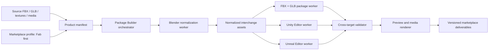

# Package Builder — Product and Implementation Plan

## 1. Objective

Build a Windows desktop tool named **Package Builder** that converts prepared 3D source files into consistent, validated engine and marketplace deliverables. **Fab is the first marketplace profile**, but marketplace-specific rules are kept outside the core so additional platforms can be added later without redesigning the product.

1. A renamed and organized FBX package.
2. A Unity `.unitypackage`.
3. An Unreal Engine project ZIP.
4. A GLB file when supplied or generated.
5. Product-specific documentation.
6. A 1920×1080 cover image and additional preview images.
7. A machine-readable validation report.

The tool supports five product cases:

1. Static model: no rig and no animation.
2. Rigged model: rig but no animation.
3. Animated model: rig and one or more animations.
4. Item set: related items intended to be used together, such as armor, helmet, gloves, and boots.
5. Item collection: multiple independent items, such as a collection of twelve swords.

The publisher root is configurable. `AvivPeretsFBX` is the default, but another publisher can create a profile with a different root, copyright, support text, and naming policy.

## 2. Guiding Principles

- Use Blender, Unity, and Unreal through their native APIs. Do not automate editor mouse clicks.
- Never modify the original download. Build inside an isolated staging directory.
- Detect as much as possible, but allow explicit overrides for decisions that cannot be inferred safely.
- Fail before packaging if there are missing references, invalid materials, broken animation, or engine errors.
- Reimport final outputs into clean test projects before reporting success.
- Keep one manifest for each product so the build can be repeated exactly.
- Generate only relevant files. Do not include templates, caches, duplicated assets, or unused files.
- Do not upload or submit listings automatically in version 1. Publishing remains a deliberate user action.
- Keep engine targets and marketplace targets independent. Unity, Unreal, FBX, and GLB describe deliverables; Fab and future stores describe packaging, media, documentation, and listing rules.
- Keep all project files, managed tools, downloads, logs, runtime data, caches, and generated artifacts beneath `C:\Dev\PackageBuilder`; no sibling data root or user-profile fallback is permitted.
- Require a no-cost development path using Visual Studio Code and command-line tooling. Paid Visual Studio, paid software editions, paid subscriptions, and paid hosted services are not prerequisites.
- Treat `docs/QUALITY_AND_RELEASE_GATES.md` as the normative source for the exact 68 stable user-experience, testing, performance, security, installation, engineering, and release requirements; other documents reference rather than redefine those requirement IDs.
- The canonical release blockers are REL-001 through REL-008 in `docs/QUALITY_AND_RELEASE_GATES.md`; missing, stale, unreadable, contradictory, or failing evidence blocks release.
- Keep staging, commits, pushes, merges, pull requests, tags, and releases under explicit user control as required by `AGENTS.md`; product automation must never perform them automatically.
- Use a consistent accessible desktop design system with keyboard-only operation, screen-reader support, high contrast, scalable text, clear focus, guided defaults, progressive disclosure, and deterministic UI tests for critical workflows.
- Preview planned file and package changes before execution; preserve reviewed input after failure; show stage, progress, elapsed time, cancellation, actionable errors, and safe retry without presenting raw stack traces as the primary user-facing error.
- Maintain requirement-to-test traceability across every PB acceptance criterion, all five product cases, and all applicable targets. Coverage, mutation, benchmark, accessibility, security, installation, and package-integrity evidence are release inputs rather than optional metrics.
- Define measured time, memory, disk, and regression budgets for representative fixture sizes; stream large data, bound concurrency, and optimize only from reproducible evidence.
- Maintain a threat model, verify downloads and dependencies, prevent path traversal, archive bombs, unsafe scripts, and unsafe process behavior, redact sensitive data, generate an SBOM, and require explicit consent before telemetry, uploads, or other external communication.
- Fail closed at release time when required quality evidence is missing, stale, contradictory, or outside an approved threshold.

## 3. High-Level Architecture



### 3.1 Desktop Orchestrator

A .NET desktop application provides the user interface and command-line mode. It:

- Creates and edits product manifests.
- Locates installed Blender, Unity, and Unreal versions.
- Starts engine workers in batch/headless mode.
- Streams progress and logs.
- Displays validation failures with suggested fixes.
- Keeps build history and output versions.

The CLI uses the same build engine so batches can be automated later.

### 3.2 Blender Worker

A versioned Blender Python module performs source normalization:

- Imports FBX or GLB.
- Extracts embedded textures when necessary.
- Detects meshes, armatures, bones, skins, actions, materials, UVs, and units.
- Normalizes object and animation names.
- Applies the configured axis, scale, and pivot policy.
- Removes cameras, lights, helpers, and orphaned data unless explicitly retained.
- Preserves skin weights, bind poses, material assignments, and animation curves.
- Produces normalized FBX and GLB files.
- Generates technical metadata: dimensions, triangle count, material count, skeleton count, bone count, and animation table.

### 3.3 Unity Worker

A Unity Editor assembly is executed either from its Editor window or with `-batchmode -executeMethod`. It:

- Imports normalized sources.
- Configures texture and model importers.
- Builds correct URP materials.
- Creates meshes, prefabs, rigs, clips, and Animator Controllers as required.
- Generates an overview/demo scene from a controlled template.
- Captures preview images.
- Validates the package in the Editor.
- Exports the exact intended paths as a `.unitypackage`.

The initial target is the installed Unity `6000.3.10f1` project using URP `17.3.0`. Engine and pipeline versions remain configurable.

### 3.4 Unreal Worker

An Unreal Python/Editor Utility module runs inside a clean product project. It:

- Imports static or skeletal FBX assets.
- Creates texture, material, skeleton, animation, and optional Animation Blueprint assets.
- Generates an overview map and product-specific presentation actors.
- Builds lighting where required.
- Fixes redirectors and removes unused assets.
- Checks the output log for errors and consequential warnings.
- Produces a clean project ZIP without `Saved`, `Intermediate`, `DerivedDataCache`, or other generated directories.

Unreal output is a separate engine-native pipeline. Unity cannot create reliable `.uasset` files.

### 3.5 Validator

The validator runs at three levels:

1. **Source preflight** — checks inputs before any engine work.
2. **Target validation** — checks Unity, Unreal, and portable outputs.
3. **Clean reimport** — imports final packages into clean temporary projects and verifies them again.

### 3.6 Marketplace Adapter Layer

Marketplace adapters do not create meshes, materials, rigs, or engine assets. They define how already validated target deliverables must be presented and packaged for a store.

The first adapter is `Fab`. It defines:

- Accepted deliverables and archive structure.
- Required media dimensions, formats, and file-size limits.
- Fab-specific documentation and disclosure sections.
- Unity and Unreal project structure checks required by Fab.
- Listing metadata validation and a manual-upload checklist.

Future adapters can include Unity Asset Store, direct-store downloads, CGTrader, Sketchfab, itch.io, or another platform. Each adapter has a versioned requirements profile, because marketplace rules can change independently of Package Builder releases.

## 4. Product Manifest

Every build is driven by a JSON manifest. The UI creates this file, so users normally do not edit JSON manually.

```json
{
  "schemaVersion": 1,
  "publisherProfile": "AvivPeretsFBX",
  "product": {
    "displayName": "Silverwing Talonbow",
    "assetId": "SilverwingTalonbow",
    "folderName": "Silverwing_Talonbow",
    "case": "rigged_animated",
    "version": "1.0.0"
  },
  "source": {
    "fbx": "SilverwingTalonbow.fbx",
    "glb": "Silverwing_Talonbow_rigged.glb",
    "unit": "meter",
    "frontAxis": "-Z",
    "upAxis": "Y",
    "normalConvention": "auto"
  },
  "material": {
    "surface": "opaque",
    "workflow": "metallic",
    "doubleSided": false
  },
  "animations": [
    {
      "sourceName": "BowRig|Bow_Shot",
      "outputName": "Bow_Shot",
      "loop": false
    }
  ],
  "preview": {
    "heroView": "front_right",
    "additionalViews": ["front", "back", "left", "right"],
    "background": "dark_studio"
  },
  "targets": ["fbx", "glb", "unity", "unreal"]
}
```

### Required User Decisions

The builder can detect rig and animation presence, but the following remain visible and overridable:

- Product display name and internal asset ID.
- Static, rigged, animated, set, or collection classification.
- Real-world scale and intended forward direction.
- Opaque, alpha-cutout, or transparent surface mode.
- Animation names and loop behavior.
- Item membership and ordering for sets and collections.
- Preferred hero view.
- Whether automatic simple collision should be generated.

## 5. Configurable Publisher Profiles

A publisher profile contains:

- `rootName`, for example `AvivPeretsFBX`.
- Publisher display name.
- Copyright holder and year policy.
- Support URL or email.
- Documentation boilerplate.
- AI-assistance disclosure text.
- Default Unity namespace and assembly name.
- Default Unreal project/pack prefix.
- Default render pipeline, engine versions, and preview theme.
- Optional logo and media watermark settings.

Changing profile creates a different top-level package root without modifying the program.

PB-0107 implements the approved shared Domain subset as immutable publisher and generic
marketplace profile values. Publisher identity contains a configurable `PublisherRoot`, validated
Unicode display name, syntactically validated support email or credential-free HTTPS URL,
copyright holder and explicit year policy, explicit AI-disclosure state with optional consistent
caller-authored text, and optional image-backed logo/watermark declarations. Marketplace identity
is a separate pair of extensible ordinal marketplace and profile identifiers; it contains no Fab
listing rules.

The approved copyright policies are single year, explicit year range, and explicit publication
year. Every year is supplied by the caller; Domain validation never reads the system clock. AI
disclosure is explicitly undeclared, no-AI-assistance, or AI-assisted. Undeclared disclosure
forbids text so prose cannot silently fabricate a claim.

Documentation boilerplate, Unity namespace/assembly defaults, Unreal project/pack prefixes,
render-pipeline and engine defaults, preview themes, schema representation, persistence, and
profile resolution remain deferred to their documented PB owners. PB-0107 does not invent
unapproved defaults for those fields.

Example Unity roots:

```text
Assets/AvivPeretsFBX/...
Assets/BrothersPublisherName/...
```

For Unreal's Fab marketplace mode, the project and its single top-level Content pack directory share a generated name:

```text
AvivPeretsFBX_SilverwingTalonbow.uproject
Content/AvivPeretsFBX_SilverwingTalonbow/...
```

## 6. Naming System

Names are generated from three distinct values:

- `displayName`: human-readable listing name, such as `Silverwing Talonbow`.
- `assetId`: compact identifier, such as `SilverwingTalonbow`.
- `folderName`: filesystem-friendly product folder, such as `Silverwing_Talonbow`.

`Albedo` is the canonical spelling. The existing `Albeado` spelling is not carried forward.

### Portable/FBX Profile

```text
Silverwing_Talonbow_fbx/
├── SilverwingTalonbow.fbx
├── T_SilverwingTalonbow_Albedo.png
├── T_SilverwingTalonbow_Emission.png
├── T_SilverwingTalonbow_Metallic.png
├── T_SilverwingTalonbow_Normal.png
├── T_SilverwingTalonbow_Roughness.png
└── README_SilverwingTalonbow.txt
```

### Unity Profile

- `MS_` — standalone mesh asset where extracting one is safe and useful.
- `M_..._URP` — URP material.
- `T_` — texture.
- `P_` — prefab asset.
- `SKEL_` — skeleton metadata asset when needed.
- `A_` — animation clip.
- `AC_` — Animator Controller.
- `SC_` — scene.

The prefab file is `P_SilverwingTalonbow.prefab`. Its root object is `SilverwingTalonbow`; its normalized model child is `P_Model`.

### Unreal Profile

- `SM_` — static mesh.
- `SK_` — skeletal mesh.
- `SKEL_` — skeleton.
- `M_` / `MI_` — material and material instance.
- `T_` — texture.
- `A_` — animation sequence.
- `ABP_` — Animation Blueprint.
- `BP_` — Blueprint.
- `LV_` — map/level.

## 7. Material and Texture Processing

### Source Texture Classification

The classifier recognizes common Meshy and DCC names for:

- Base Color / Albedo / Diffuse.
- Normal.
- Metallic / Metalness.
- Roughness.
- Emission / Emissive.
- Ambient Occlusion.
- Opacity / Alpha.
- Height / Displacement.

Ambiguous matches stop the build or require a user selection; the system does not silently put roughness into a height slot.

### Colour Space

- Albedo and emission are imported as sRGB.
- Normal, metallic, roughness, AO, height, opacity masks, and packed masks are imported as linear data.
- Normal textures are marked as normal maps in each engine.
- OpenGL versus DirectX normal-map orientation is detected where possible and can be overridden.

### Unity URP Packing

For URP/Lit metallic workflow, the builder creates:

```text
T_<AssetId>_MetallicSmoothness.png
```

- Red: metallic.
- Alpha: smoothness, calculated as `1 - roughness`.

The material is configured through code, including required shader keywords. Alpha clipping is enabled only when the product manifest declares a cutout material or a verified opacity mask exists.

### Unreal and GLB Packing

The builder creates an ORM texture where appropriate:

- Red: ambient occlusion, or white if AO is unavailable.
- Green: roughness.
- Blue: metallic.

The original separate maps can remain in the portable FBX package, while engine packages receive optimized target-specific maps.

## 8. Target Folder Structures

### 8.1 Portable Product Output

```text
Silverwing_Talonbow/
├── Silverwing_Talonbow_FBX.zip
├── Silverwing_Talonbow_rigged.glb
├── README_Silverwing_Talonbow.txt
└── Media/
    ├── Silverwing_Talonbow_Cover.jpg
    ├── Silverwing_Talonbow_Front.jpg
    ├── Silverwing_Talonbow_Back.jpg
    ├── Silverwing_Talonbow_Left.jpg
    └── Silverwing_Talonbow_Right.jpg
```

### 8.2 Unity Package Root

```text
Assets/<PublisherRoot>/
├── <ProductId>/
│   ├── Source/
│   │   └── <ProductId>.fbx
│   ├── Meshes/
│   ├── Materials/
│   ├── Textures/
│   ├── Prefabs/
│   ├── Animations/       # only when needed
│   └── Controllers/      # only when needed
├── Documentation/
│   └── README_<ProductId>.txt
├── Scenes/
│   └── SC_<ProductId>_Overview.unity
└── Scripts/
    └── Runtime/
        └── ModelPreviewController.cs
```

Rules:

- `_Template` is never included in the exported package.
- Textures, materials, and meshes are moved to their final locations rather than copied twice.
- The `Source` folder contains the FBX and only genuinely necessary source-side files.
- One publisher root contains the complete package.
- Only the product, documentation, scene, and required runtime scripts are exported.

### 8.3 Unreal Project

```text
<PackName>.uproject
Content/<PackName>/
├── Meshes/
├── SkeletalMeshes/       # only when needed
├── Skeletons/            # only when needed
├── Animations/           # only when needed
├── Materials/
├── Textures/
├── Blueprints/           # only when needed
├── Maps/
│   └── LV_<ProductId>_Overview.umap
└── Documentation/
```

The ZIP excludes generated Unreal directories and contains exactly one project.

## 9. Case-Specific Build Rules

### Case 1 — Static Model

Detection:

- Meshes exist.
- No deforming armature is required.
- No animation stacks contain meaningful transforms.

Unity:

- `ModelImporter.animationType = None`.
- Animation import disabled.
- MeshRenderer/MeshFilter prefab.
- Optional collider generation is explicit, not automatic by default.
- No Animator or animation folders.

Unreal:

- Static Mesh assets.
- Optional simple collision.
- Static overview actor.

Documentation explicitly states that no rig or animation is included.

### Case 2 — Rigged, No Animation

Detection:

- At least one skinned mesh and valid armature.
- No meaningful animation clips.

Unity:

- Generic rig by default; Humanoid only when explicitly selected and validated.
- SkinnedMeshRenderer prefab.
- Skeleton hierarchy and weights validated.
- No Animator Controller unless a runtime pose controller is requested.

Unreal:

- Skeletal Mesh and Skeleton assets.
- Reference-pose validation.
- No empty animation assets.

Documentation includes bone count, rig type, root bone, and pose information.

### Case 3 — Rigged and Animated

Detection:

- Valid skinned mesh and armature.
- One or more animation stacks with changing transforms.

Unity:

- Generic or explicitly validated Humanoid rig.
- Named clips extracted or defined from the manifest.
- Loop settings applied per clip.
- Animator Controller with one state per clip.
- One-shot clips such as attacks and bow shots do not loop.
- Preview UI can select and replay clips.

Unreal:

- Skeletal Mesh, Skeleton, and Animation Sequence assets.
- Optional Animation Blueprint for preview and demonstration.
- Clip duration, frame rate, root motion, and curve integrity checks.

Documentation contains an animation table with name, frame range, duration, FPS, loop behavior, and root-motion status.

### Case 4 — Item Set

Definition:

Items are related and expected to be used together, such as an armor set.

Output:

- One prefab/Blueprint per item.
- One assembled-set prefab/Blueprint.
- Shared materials are deduplicated.
- Manifest declares attachment points, body slots, or skeleton compatibility where applicable.
- Overview scene shows the complete set and permits individual-item visibility.
- Media contains one full-set hero image and useful individual views.

Documentation includes the item list, compatibility information, attachment instructions, and shared dependencies.

### Case 5 — Item Collection

Definition:

Items are independent products bundled together, such as twelve swords.

Output:

- Unique mesh/material/prefab per item.
- Optional shared master material.
- Overview scene lays out all items clearly.
- Preview selector shows one item at a time without changing the source prefab.
- Media contains a collection cover, overview image, and representative item images.
- A CSV or documentation table records item names, dimensions, triangle counts, materials, and textures.

No combined runtime prefab is generated unless explicitly requested.

## 10. Documentation Generator

Every target receives documentation generated from the manifest and inspection data.

### Shared Sections

- Product title and publisher.
- Contents and formats.
- Engine and render-pipeline versions.
- Installation and usage.
- Scale, dimensions, pivot, and axis information.
- Mesh and texture specifications.
- Dependencies.
- Preview scene instructions.
- AI-assistance disclosure.
- Support and copyright.

### Conditional Sections

- Static: explicit no-rig/no-animation statement.
- Rigged: skeleton, bone count, pose, and compatibility.
- Animated: clip table and Animator/Animation Blueprint usage.
- Set: item slots, assembly, and compatibility.
- Collection: complete item inventory and naming table.

Documentation is generated from UTF-8 templates to prevent corrupted characters or hardcoded titles from earlier products.

## 11. Preview and Media System

### Presentation Goals

- Neutral studio lighting that reveals form and materials.
- Consistent framing across products.
- No clipped geometry or extreme perspective distortion.
- Honest scale and material representation.
- Repeatable camera positions.

### Static and Rigged Models

- Hero three-quarter view.
- Front, back, left, and right views.
- Optional detail shots based on configured focus points.
- Rigged models can include a clean rig-pose image without showing control bones in the consumer preview.

### Animated Models

- Hero image captured from a representative pose.
- Rest-pose image.
- One or more key animation-pose images.
- Optional turntable or short video produced separately from the required still images.

### Sets and Collections

- Overview image showing every item.
- Full-set assembled image for sets.
- Individual-item views with only one preview target visible.
- Consistent item scale between images.

### Technical Rules

- Output resolution: 1920×1080.
- JPEG or PNG.
- Each gallery image kept below 3MB.
- Gallery still images kept below the current Fab total-size limit.
- Camera distance is adjusted to fit bounds; the asset itself remains at scale `(1,1,1)`.
- Preview validation checks empty backgrounds, clipping, exposure, missing materials, and excessive transparent margins.

## 12. Validation Gates

### Source Gate

- Required source files exist and are readable.
- Archive is not encrypted or nested unexpectedly.
- File names can be normalized without collisions.
- Mesh contains usable vertices, polygons, normals, and UVs.
- Required texture roles are present or explicitly waived.
- Units and bounds are plausible.
- No missing external texture references.

### Rig Gate

- Single intended game skeleton, unless multiple skeletons are explicitly supported.
- Skinned meshes reference valid bones.
- No unweighted critical vertices.
- Bone names are unique.
- Bind pose remains stable after export/reimport.
- Animation case matches actual source data.

### Material Gate

- Every renderer has an assigned material.
- Texture colour spaces are correct.
- Normal maps are imported as normal maps.
- Roughness is never assigned to height.
- Smoothness inversion and channel packing are verified.
- Alpha clipping is enabled only when intended.
- No missing shader or pink material in Unity.
- No default checkerboard or missing texture in Unreal.

### Unity Gate

- Package imports into a clean project.
- No missing scripts or broken GUID references.
- Prefab root and `P_Model` transforms are reset.
- Preview scene opens and enters Play mode without errors.
- Rig and clips are present when required and absent when not required.
- Every animation causes expected transform or vertex movement.
- Console contains no package-caused errors or consequential warnings.
- Export contains no `_Template`, duplicate assets, or unrelated products.

### Unreal Gate

- Project opens in the configured engine version.
- Assets load and compile.
- Redirectors are fixed.
- Overview map exists and loads.
- Lighting is built where required.
- No missing materials, textures, skeletons, or animation references.
- Output log contains no package-caused errors or consequential warnings.
- ZIP contains one project and excludes generated directories.

### Media Gate

- Correct resolution and format.
- File-size limits met.
- Product visible and centered.
- No missing materials or unexpected helpers.
- Set/collection item count matches the manifest.

### Quality and Release Gate

- Every normative requirement and PB acceptance criterion maps to at least one passing test in the traceability matrix; approved manual or documentary evidence may supplement but never replace the required test.
- Required unit, contract, integration, end-to-end, UI, regression, installer, upgrade, failure-recovery, engine-fixture, and clean-reimport/reopen tests pass.
- Overall coverage is at least 90% line and 85% branch; security validation, path handling, naming, manifest validation, and package-integrity code maintain 100% branch coverage.
- Critical validation and security mutation thresholds pass, and every exclusion or surviving high-risk mutant has explicit user approval.
- Approved small, medium, and large fixture performance budgets pass and every build report contains duration and peak-resource evidence.
- No unapproved critical/high vulnerability, accessibility-critical failure, installation-lifecycle failure, or generated-package integrity/import failure remains.
- Missing, stale, unreadable, or contradictory evidence blocks release. A percentage alone never proves that a requirement is satisfied.

## 13. Build Output and Reporting

Each build produces:

```text
artifacts/Builds/<PublisherRoot>/<FolderName>/<Version>/
├── Portable/
├── Unity/
├── Unreal/
├── Media/
├── Reports/
│   ├── ValidationReport.html
│   ├── ValidationReport.json
│   ├── ResourceMetrics.json
│   ├── PackageIntegrity.json
│   └── BuildLog.txt
└── Manifest/
    └── product.json
```

Build status is one of:

- `Passed` — all requested deliverables validated.
- `PassedWithDisclosures` — only accepted, documented warnings remain.
- `Failed` — no release package is produced.

PB-0108 models the internal build lifecycle separately from this release-report status. A build
job begins Queued and follows the exact architecture state machine through preflight, inspection,
optional review, normalization, target building, preview rendering, validation, marketplace
packaging, and clean reimport before terminal completion, failure, or approved cancellation.
Immutable steps and artifacts retain typed logical ownership, ordering, UTC timing, completion
references, target association, and staged/validated/promoted lifecycle facts without performing
filesystem access, hashing, persistence, process execution, or engine work.

## 14. User Interface

### Interaction, Accessibility, and Recovery

- Use one documented desktop design system for layout, typography, spacing, colour, controls, state, validation, and destructive actions.
- Make critical workflows operable by keyboard and screen reader, with high-contrast support, scalable text, meaningful accessible names, predictable focus order, and clearly visible focus.
- Guide first-time users through setup, source inspection, configuration, dry run, build, validation, recovery, and result review with sensible defaults and progressive disclosure.
- Show a dry-run summary of affected assets, normalized names, contained paths, planned actions, requested outputs, warnings, and estimated resource use before a file-changing or generating operation begins.
- During work, show current stage, measurable progress, elapsed time, and safe cancellation. Preserve user input after recoverable failure and explain retry/resume scope.
- Errors identify the failed step, affected asset, consequence, and corrective action. Raw stack traces remain in redacted diagnostics rather than serving as the primary error.
- Validate critical workflows through deterministic UI/accessibility automation and representative first-time-user studies with approved success criteria.

### Main Screen

- Source folder or ZIP selector.
- Product name, asset ID, and folder-name preview.
- Publisher profile selector.
- Detected product case with override.
- FBX, GLB, Unity, and Unreal target checkboxes.
- Engine-version selectors.
- Build and Validate button.

### Material Review

- Thumbnail and role for every texture.
- Colour-space preview.
- Surface mode.
- Normal convention.
- Generated packing preview.

### Rig and Animation Review

- Skeleton and bone summary.
- Animation clip list.
- Rename and loop controls.
- Root-motion settings.
- Warnings for multiple rigs, unused bones, or missing weights.

### Set/Collection Editor

- Item list and order.
- Shared-material grouping.
- Set attachment slots or collection categories.
- Overview layout controls.

### Preview Review

- Live or rendered hero view.
- Camera-angle selection.
- Re-render controls.
- Approve media before final packaging.

## 15. Implementation Phases

### Repository and Runtime Locations

Package Builder uses one filesystem root. Source-controlled files and ignored project-owned state all live beneath:

```text
C:\Dev\PackageBuilder\
├── docs/                    # source-controlled plans and architecture
├── src/                     # source-controlled application code
├── scripts/                 # source-controlled developer and build scripts
├── tools/                   # ignored repository-local SDKs and engine tools
├── downloads/               # ignored verified installers, archives, and release metadata
├── logs/                    # ignored setup, application, job, and validation logs
├── runtime-data/            # ignored jobs, source snapshots, caches, temp, and local database
└── artifacts/               # ignored generated builds, reports, previews, and releases
```

No project operation may fall back to a sibling data directory, the user profile, or the system temporary directory. Runtime and generated directories remain outside Git through repository ignore rules, but they do not live outside the project root.

The supported development workflow uses the repository-local .NET SDK through PowerShell and `dotnet` commands in Visual Studio Code. Paid Visual Studio is optional and no required task may depend on its IDE, designer, test runner, or build system. Every required technology must have a no-cost local path; optional remote hosting and CI cannot be necessary for local builds.

The user-approved public GitHub repository is [https://github.com/avivperets26/3DModels-Package-Builder](https://github.com/avivperets26/3DModels-Package-Builder). The original planned repository name is `package-builder`; its difference from the actual repository name remains unresolved until the user makes a separate decision. Code namespaces begin with `PackageBuilder`; marketplace-specific modules use names such as `PackageBuilder.Marketplaces.Fab`.

### Phase 0 — Specification Lock

- Finalize publisher-profile fields.
- Finalize naming conventions.
- Create one verified source fixture for each of the five cases.
- Record required Unity and Unreal versions.
- Decide the default pivot, scale, collision, and normal-map policies.
- Assign stable quality requirement IDs, owners, test evidence, and release gates in the requirements-to-tests traceability matrix.
- Approve the initial threat model, fixture-size definitions, performance-budget method, accessibility-critical workflow list, and allowed network-integration test classification.

Exit condition: manifests for all five fixtures are approved.

### Phase 1 — Core, Portable FBX, and Static Unity MVP

- Create the .NET orchestrator and manifest schema.
- Create source discovery and deterministic naming.
- Implement Blender static-model normalization.
- Implement FBX ZIP and GLB outputs.
- Implement Unity case 1 importer, URP material, prefab, scene, README, media, and `.unitypackage` export.
- Implement clean Unity reimport validation.

Primary fixture: one static Meshy model.

### Phase 2 — Rigged and Animated Unity

- Add skeleton inspection and bind-pose checks.
- Add case 2 Generic rig flow.
- Add case 3 animation clip extraction and Animator Controller generation.
- Add animation preview controls and animation validation.

Primary fixture: `Silverwing_Talonbow` for the animated case.

### Phase 3 — Sets and Collections

- Add product item manifest editor.
- Add shared-asset deduplication.
- Add assembled-set prefabs.
- Add collection overview layout and item selector.
- Generate inventory tables and case-specific documentation.

Primary fixtures: one equipment set and one multi-weapon collection.

### Phase 4 — Media and Quality Hardening

- Add automatic hero and orthographic view selection.
- Add image size/quality optimization.
- Add visual regression captures.
- Add duplicate-file, path-length, naming, and dependency validators.
- Add HTML validation report.
- Test package import into clean Unity projects.
- Complete critical UI/accessibility automation and representative first-time-user validation.
- Establish coverage and mutation baselines, performance budgets, resource reporting, security scans, and fail-closed quality evidence aggregation.

### Phase 5 — Unreal Pipeline

- Create clean Unreal project template.
- Implement static, skeletal, and animation import.
- Implement Unreal material/ORM workflow.
- Generate overview maps for all cases.
- Add set and collection presentation Blueprints.
- Add clean project ZIP and re-open validation.

### Phase 6 — Productization

- Installer and engine-path detection.
- Portable distribution where technically practical, prerequisite checks, guided first run, repair, and redacted diagnostic export.
- Fresh-install, repair, upgrade, downgrade-prevention, interrupted-operation, uninstall, privilege, and retained-user-data validation.
- Publisher profile manager.
- Build history and versioning.
- Batch queue.
- Automatic tool update/migration handling.
- End-user documentation and recovery procedures.

## 16. Initial Acceptance Tests

### Cross-Cutting Quality Acceptance

- The traceability matrix maps every applicable product requirement and PB acceptance criterion to concrete evidence.
- Overall line/branch coverage and critical-code 100% branch thresholds pass with no unapproved exclusions.
- Critical security and validation mutation targets pass or have explicitly approved reviewed exceptions.
- Small, medium, and large fixture benchmarks remain inside approved time, memory, disk, temporary-space, and regression budgets.
- Keyboard-only, screen-reader, high-contrast, scalable-text, focus, dry-run, cancellation, failure-preservation, and safe-retry workflows pass automated and representative-user validation.
- Threat-model tests, warning-free release builds, SBOM generation, dependency/vulnerability/secret/static scans, and download signature/checksum checks pass.
- Installer/portable, prerequisites, first run, repair, upgrade, downgrade prevention, uninstall, diagnostic export, user-data preservation, containment, and free Visual Studio Code workflows pass.

### Static Fixture

- Produces a correctly named FBX ZIP.
- Produces a Unity package with no rig or animation assets.
- URP material is visually correct.
- Prefab and scene load without errors.
- Media and README describe a static model accurately.

### Rigged Fixture

- Produces one valid game skeleton.
- Skin weights and bind pose survive FBX and engine reimport.
- No empty animation/controller assets are generated.

### Animated Fixture

- Imports `Silverwing_Talonbow` with a Generic rig.
- Both bow and string deformation play in Unity and Unreal.
- Animation is present, correctly named, and non-looping.
- Preview can replay the shot.

### Set Fixture

- Every item has an individual prefab/Blueprint.
- The assembled set is complete.
- Documentation lists all slots and compatibility requirements.

### Collection Fixture

- All twelve example items are unique and named consistently.
- Overview scene/map contains every item.
- Item selector shows one item at a time.
- Inventory report matches the source count.

## 17. Definition of Done

Package Builder version 1 is complete when:

- All five product cases pass their fixtures.
- Publisher root changes correctly in every folder, namespace, README, scene, and package.
- Portable FBX/GLB, Unity, and Unreal outputs can be built from one manifest.
- Final engine outputs are clean-reimported successfully.
- Materials match the normalized source visually.
- Rigging and animation survive reimport.
- Generated documentation contains no stale product names or engine versions.
- Preview images satisfy current Fab media constraints.
- No source file is modified.
- A failed validation cannot be mislabeled as a successful release build.
- All tools, downloads, logs, runtime data, caches, and generated artifacts remain beneath the single project root.
- A clean workstation can develop, build, test, and run the project with Visual Studio Code and no paid software, subscription, or hosted-service requirement.
- Every normative requirement and PB acceptance criterion has current passing evidence in the requirements-to-tests traceability matrix.
- Required test layers, five-case target fixtures, coverage thresholds, mutation thresholds, accessibility validation, security checks, approved performance budgets, installation lifecycle tests, SBOM, and package-integrity/clean-import gates pass.
- Every build report includes stage/total durations, peak process memory, peak contained project-disk and temporary-space use, and byte-transfer metrics.
- The release evidence bundle contains no missing, stale, unreadable, contradictory, or unapproved result, vulnerability, exclusion, or exception.
- Product and release claims are limited to what the retained evidence demonstrates.

## 18. Standards References

- [Fab asset file format and structure requirements](https://dev.epicgames.com/documentation/en-us/fab/asset-file-format-and-structure-requirements-in-fab)
- [Fab publishing workflow](https://dev.epicgames.com/documentation/en-us/fab/publishing-assets-for-sale-or-free-download-in-fab)
- [Unity Asset Store submission guidelines](https://assetstore.unity.com/publishing/submission-guidelines)
- [Unity model importing documentation](https://docs.unity3d.com/6000.0/Documentation/Manual/ImportingModelFiles.html)

These rules can change. The builder should version its requirements profile and include a maintenance checklist rather than hardcoding marketplace assumptions permanently.
