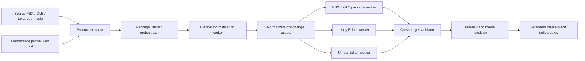

# Package Builder — Product and Implementation Plan

## 1. Objective

Build a Windows desktop tool named **Package Builder** that converts prepared 3D source files into consistent, validated engine and marketplace deliverables. **Fab is the first marketplace profile**, but marketplace-specific rules are kept outside the core so additional platforms can be added later without redesigning the product.

1. A renamed and organized FBX package.
2. A Unity `.unitypackage`.
3. An Unreal Engine project ZIP.
4. A GLB file when supplied or generated.
5. Product-specific documentation.
6. A 1920×1080 cover image and additional preview images.
7. A machine-readable validation report.

The tool supports five product cases:

1. Static model: no rig and no animation.
2. Rigged model: rig but no animation.
3. Animated model: rig and one or more animations.
4. Item set: related items intended to be used together, such as armor, helmet, gloves, and boots.
5. Item collection: multiple independent items, such as a collection of twelve swords.

The publisher root is configurable. `AvivPeretsFBX` is the default, but another publisher can create a profile with a different root, copyright, support text, and naming policy.

## 2. Guiding Principles

- Use Blender, Unity, and Unreal through their native APIs. Do not automate editor mouse clicks.
- Never modify the original download. Build inside an isolated staging directory.
- Detect as much as possible, but allow explicit overrides for decisions that cannot be inferred safely.
- Fail before packaging if there are missing references, invalid materials, broken animation, or engine errors.
- Reimport final outputs into clean test projects before reporting success.
- Keep one manifest for each product so the build can be repeated exactly.
- Generate only relevant files. Do not include templates, caches, duplicated assets, or unused files.
- Do not upload or submit listings automatically in version 1. Publishing remains a deliberate user action.
- Keep engine targets and marketplace targets independent. Unity, Unreal, FBX, and GLB describe deliverables; Fab and future stores describe packaging, media, documentation, and listing rules.
- Keep all project files, managed tools, downloads, logs, runtime data, caches, and generated artifacts beneath `C:\Dev\PackageBuilder`; no sibling data root or user-profile fallback is permitted.
- Require a no-cost development path using Visual Studio Code and command-line tooling. Paid Visual Studio, paid software editions, paid subscriptions, and paid hosted services are not prerequisites.
- Treat `docs/QUALITY_AND_RELEASE_GATES.md` as the normative source for the exact 68 stable user-experience, testing, performance, security, installation, engineering, and release requirements; other documents reference rather than redefine those requirement IDs.
- The canonical release blockers are REL-001 through REL-008 in `docs/QUALITY_AND_RELEASE_GATES.md`; missing, stale, unreadable, contradictory, or failing evidence blocks release.
- Keep staging, commits, pushes, merges, pull requests, tags, and releases under explicit user control as required by `AGENTS.md`; product automation must never perform them automatically.
- Use a consistent accessible desktop design system with keyboard-only operation, screen-reader support, high contrast, scalable text, clear focus, guided defaults, progressive disclosure, and deterministic UI tests for critical workflows.
- Preview planned file and package changes before execution; preserve reviewed input after failure; show stage, progress, elapsed time, cancellation, actionable errors, and safe retry without presenting raw stack traces as the primary user-facing error.
- Maintain requirement-to-test traceability across every PB acceptance criterion, all five product cases, and all applicable targets. Coverage, mutation, benchmark, accessibility, security, installation, and package-integrity evidence are release inputs rather than optional metrics.
- Define measured time, memory, disk, and regression budgets for representative fixture sizes; stream large data, bound concurrency, and optimize only from reproducible evidence.
- Maintain a threat model, verify downloads and dependencies, prevent path traversal, archive bombs, unsafe scripts, and unsafe process behavior, redact sensitive data, generate an SBOM, and require explicit consent before telemetry, uploads, or other external communication.
- Fail closed at release time when required quality evidence is missing, stale, contradictory, or outside an approved threshold.

## 3. High-Level Architecture


```mermaid
flowchart LR
    Input["Source FBX / GLB / textures / media"] --> Manifest["Product manifest"]
    Market["Marketplace profile: Fab first"] --> Manifest["Product manifest"]
    Manifest --> Core["Package Builder orchestrator"]
    Core --> Blender["Blender normalization worker"]
    Blender --> Normalized["Normalized interchange assets"]
    Normalized --> Portable["FBX + GLB package worker"]
    Normalized --> Unity["Unity Editor worker"]
    Normalized --> Unreal["Unreal Editor worker"]
    Portable --> Validate["Cross-target validator"]
    Unity --> Validate
    Unreal --> Validate
    Validate --> Preview["Preview and media renderer"]
    Preview --> Output["Versioned marketplace deliverables"]
```

### 3.1 Desktop Orchestrator

A .NET desktop application provides the user interface and command-line mode. It:

- Creates and edits product manifests.
- Locates installed Blender, Unity, and Unreal versions.
- Starts engine workers in batch/headless mode.
- Streams progress and logs.
- Displays validation failures with suggested fixes.
- Keeps build history and output versions.

The CLI uses the same build engine so batches can be automated later.

### 3.2 Blender Worker

A versioned Blender Python module performs source normalization:

- Imports FBX or GLB.
- Extracts embedded textures when necessary.
- Detects meshes, armatures, bones, skins, actions, materials, UVs, and units.
- Normalizes object and animation names.
- Applies the configured axis, scale, and pivot policy.
- Removes cameras, lights, helpers, and orphaned data unless explicitly retained.
- Preserves skin weights, bind poses, material assignments, and animation curves.
- Produces normalized FBX and GLB files.
- Generates technical metadata: dimensions, triangle count, material count, skeleton count, bone count, and animation table.

PB-0401 establishes the worker package and process entrypoint without implementing those scene
operations. The selected contained Blender executable loads `workers/blender/entrypoint.py`, the
worker consumes one bounded protocol-v1 request file, emits compact JSON Lines on standard output,
and atomically writes the shared protocol-v1 result. Its `probe-blender-worker` operation verifies
the shell and exact runtime version; all asset-processing operations fail as unsupported until
their owning PB-0402+ tasks implement them. Stable exit codes distinguish invocation, request,
operation, execution, and result-write failures, while standard error contains only sanitized
diagnostic codes.

PB-0402 adds context-independent scene reset and operation-scoped temporary data ownership. The
worker passes only `bpy.data` into these utilities: it removes object data-blocks with
`BlendData.batch_remove`, purges local orphans recursively while retaining linked orphaned data,
and disposes unique temporary data-blocks in a deterministic batch even when processing fails.
The utilities never consult selection, active object, editor area, or interaction mode. Removed
Blender references must not be accessed afterward. Import and asset-specific processing remain
owned by PB-0403 and later tasks.

PB-0403 adds the bounded FBX import adapter. It accepts one canonical non-link `.fbx` source beneath
the job input root, resets the scene, and invokes Blender's official `import_scene.fbx` operator
with explicit manual axes, global scale, normals, colour, animation, armature, property, image-search,
and transform choices. The adapter records the source filename, exact axis/scale settings, and
object/mesh/armature counts. Invalid sources, invalid settings, Blender exceptions, cancelled or
empty imports, unreadable results, and failed partial cleanup become stable sanitized findings.
Detailed geometry, material, texture, rig, weight, and animation inspection is owned by PB-0405
through PB-0408.

PB-0404 adds the bounded single-file GLB import adapter through Blender 5.0's official
`import_scene.gltf` operator. It accepts one canonical non-link `.glb` source beneath the job input
root, resets the scene, packs imported images, preserves normals/material slots/skins/animations,
and disables UI selection, helper bone shapes, scene collection wrapping, and untrusted scene
extras. Its report counts only newly created objects, meshes, materials, images, packed images,
armatures, skinned meshes, and actions. Separate `.gltf` dependency graphs remain rejected until a
bounded contained-reference preflight is explicitly planned; PB-0404 never follows unvalidated
external buffer or image references.

PB-0405 adds deterministic direct-data geometry inspection after either supported import path.
It reports every object's name, Blender type, decomposed world transform, and each mesh's vertex,
polygon, loop-triangle, UV, face-corner normal, tangent, material-slot, world-bound, dimension, and
16/32-bit index requirements. Scene totals and world bounds are deterministic. The inspector does
not depend on UI state, does not modify the source, releases calculated tangent data promptly, and
maps unreadable, inconsistent, duplicate, missing, or non-finite Blender data to stable sanitized
blocking findings. Evaluated modifiers and detailed texture, rig, animation, normalization, export,
and reimport behavior remain later Blender tasks.

PB-0406 through PB-0408 add the remaining read-only source-inspection boundaries. PB-0406 reports
packed/external/generated images, dimensions, formats, colour spaces, material-node connectivity,
and conservative probable roles without extracting or relinking files. PB-0407 reports armature
hierarchies, roots, bones, deform flags, rest matrices, skinned meshes, parent-inverse context,
missing/unmatched groups, and unweighted vertices. PB-0408 reports Blender 5 layered and legacy
Actions, clip ranges, FPS, slot/layer/strip channel provenance, motion, and conservative loop
likelihood. These tasks never repair, normalize, pose, play, or modify the source scene.

The user approved one combined publication cycle for PB-0406, PB-0407, and PB-0408 on
`feat/PB-0406-texture-inspection` on 2026-08-05. This changes only their Git publication topology;
each task retains separate requirements, evidence, validation, lifecycle, and completion records,
and the exception creates no precedent.

PB-0409 through PB-0411 add deterministic case inference, collision-safe manifest naming, and
transactional unit/axis/pivot normalization. Static, complete-rig, and motion-backed animated cases
are inferred while set/collection grouping requires the manifest. Every Blender ID namespace and
export filename is owned explicitly, and raw rig/weight/Action deformation inputs are fingerprinted
across world-transform normalization. Their completed shared publication exception changed only Git
topology and created no precedent.

PB-0412 through PB-0415 form the normalized FBX boundary. PB-0412 removes non-manifest cameras,
lights, hidden backups, helpers, and local orphans from the disposable copy while guarding/restoring
exact Blender selection state. PB-0413 retains separate canonical texture maps, normalizes relative
references and color spaces, and blocks ambiguous roles unless explicitly reviewed in the manifest.
PB-0414 applies canonical skeleton/Action names and a deform-bone, visual-keyed, boundary-preserving
Blender 5 bake policy. PB-0415 validates static, rigged, and animated content inventories and exports
only selected meshes/armatures with reviewed non-experimental FBX settings and partial-output
cleanup. The user explicitly approved one publication cycle for these four independent tasks on
`feat/PB-0412-scene-cleanup` on 2026-08-06; it creates no precedent.

PB-0416 through PB-0418 form the GLB and clean-reimport validation boundary. PB-0416 applies exact
manifest-owned object, material, connected-image, rig, and Action inventory to Blender 5 glTF
Binary export, verifies the GLB container, and removes partial output. PB-0417 compares exact counts,
bounds, and representative deformation from one independently empty-process observation per FBX or
GLB. PB-0418 maps the approved corrupt, missing-image, multiple-rig, no-UV, unsupported-data, and
invalid-animation fixture facts to stable sanitized findings. The user approved one publication
cycle for these three independent tasks on `feat/PB-0416-normalized-glb-export` on 2026-08-06; it
creates no precedent. Strict doubles prove policy and failure boundaries. A user-authorized,
checksum- and signature-verified contained Blender 5.0.0 run additionally exported static, rigged,
and animated GLBs 3/3, clean-reimported them in three distinct empty processes 3/3, and executed the
seven regression cases 7/7. The retained `.blend` and `.glb` files now support supplementary visual
review; later fixture/version-matrix tasks still own broader engine acceptance.

### 3.3 Unity Worker

A Unity Editor assembly is executed either from its Editor window or with `-batchmode -executeMethod`. It:

- Imports normalized sources.
- Configures texture and model importers.
- Builds correct URP materials.
- Creates meshes, prefabs, rigs, clips, and Animator Controllers as required.
- Generates an overview/demo scene from a controlled template.
- Captures preview images.
- Validates the package in the Editor.
- Exports the exact intended paths as a `.unitypackage`.

The initial target is the installed Unity `6000.3.10f1` project using URP `17.3.0`. Engine and pipeline versions remain configurable. The tracked `engine-templates/unity/6000.3` foundation contains only required URP settings beneath `Assets`, the pinned package manifest and dependency-free Editor-only `com.packagebuilder.worker` beneath `Packages`, and versioned `ProjectSettings`; workers always clone it before Unity is allowed to create caches or generated state.

The first worker foundation reads one bounded protocol-v1 request, emits JSON Lines progress and
metrics, writes the final result atomically, saves generated assets, honors the project-contained
cancellation-file signal, and uses stable process exit codes. Each execution holds an exclusive
lock on a job-specific isolated clone. Clone completion explicitly selects delete-always,
retain-on-failure, or retain-always behavior so diagnosis never depends on an implicit cleanup
choice. This foundation proves compilation and batch communication with a probe asset; product
folders, importers, materials, prefabs, scenes, `.unitypackage` export, and clean reimport remain
owned by PB-0605 and later tasks.

The PB-0605/PB-0606 product-intake boundary creates
`Assets/<PublisherRoot>/<ProductFolder>` directly through Unity's AssetDatabase. Every case receives
Source, Meshes, Materials, Textures, Prefabs, Documentation, Scenes, and Scripts; only the animated
case adds Animations and Controllers. No `_Template` directory is copied to customer output.
Texture import is explicit: Albedo and Emission are sRGB, data maps are linear, Normal uses Unity's
Normal Map type, and alpha handling is role-specific. Real Editor integration tests verify the
saved importer values in an isolated clone before later material and prefab work consumes them.
Retained clones use a short project-contained path compatible with Unity's legacy package-assembly
APIs, and the populated clone is reopened in a second clean process before it is offered for manual
inspection.

### 3.4 Unreal Worker

An Unreal Python/Editor Utility module runs inside a clean product project. It:

- Imports static or skeletal FBX assets.
- Creates texture, material, skeleton, animation, and optional Animation Blueprint assets.
- Generates an overview map and product-specific presentation actors.
- Builds lighting where required.
- Fixes redirectors and removes unused assets.
- Checks the output log for errors and consequential warnings.
- Produces a clean project ZIP without `Saved`, `Intermediate`, `DerivedDataCache`, or other generated directories.

Unreal output is a separate engine-native pipeline. Unity cannot create reliable `.uasset` files.

### 3.5 Validator

The validator runs at three levels:

1. **Source preflight** — checks inputs before any engine work.
2. **Target validation** — checks Unity, Unreal, and portable outputs.
3. **Clean reimport** — imports final packages into clean temporary projects and verifies them again.

### 3.6 Marketplace Adapter Layer

Marketplace adapters do not create meshes, materials, rigs, or engine assets. They define how already validated target deliverables must be presented and packaged for a store.

The first adapter is `Fab`. It defines:

- Accepted deliverables and archive structure.
- Required media dimensions, formats, and file-size limits.
- Fab-specific documentation and disclosure sections.
- Unity and Unreal project structure checks required by Fab.
- Listing metadata validation and a manual-upload checklist.

Future adapters can include Unity Asset Store, direct-store downloads, CGTrader, Sketchfab, itch.io, or another platform. Each adapter has a versioned requirements profile, because marketplace rules can change independently of Package Builder releases.

## 4. Product Manifest

Every build is driven by a JSON manifest. The UI creates this file, so users normally do not edit JSON manually.

```json
{
  "schemaVersion": 1,
  "publisherProfileReference": "AvivPeretsFBX",
  "product": {
    "displayName": "Stone Arch",
    "assetId": "StoneArch",
    "folderName": "Stone_Arch",
    "case": "static",
    "version": "1.0.0"
  },
  "targets": ["portable", "unity", "unreal"],
  "sourceAssets": [
    {
      "kind": "fbx",
      "logicalReference": "models/stone-arch.fbx",
      "originalFileName": "stone-arch.fbx"
    }
  ],
  "materials": [],
  "animations": []
}
```

Schema version 1 uses the exact case tokens `static`, `rigged`, `rigged-animated`, `item-set`,
and `item-collection`, and the exact target tokens `portable`, `unity`, and `unreal`. Rigged,
animated, set, and collection manifests add their corresponding strictly validated section.
Unknown properties, null required values, wrong JSON types, incomplete sections, contradictory
case sections, duplicate identities, and unresolved source references are rejected.

### Required User Decisions

The builder can detect rig and animation presence, but the following remain visible and overridable:

- Product display name and internal asset ID.
- Static, rigged, animated, set, or collection classification.
- Real-world scale and intended forward direction.
- Opaque, alpha-cutout, or transparent surface mode.
- Animation names and loop behavior.
- Item membership and ordering for sets and collections.
- Preferred hero view.
- Whether automatic simple collision should be generated.

## 5. Configurable Publisher Profiles

A publisher profile contains:

- `rootName`, for example `AvivPeretsFBX`.
- Publisher display name.
- Copyright holder and year policy.
- Support URL or email.
- Documentation boilerplate.
- AI-assistance disclosure text.
- Default Unity namespace and assembly name.
- Default Unreal project/pack prefix.
- Default render pipeline, engine versions, and preview theme.
- Optional logo and media watermark settings.

Changing profile creates a different top-level package root without modifying the program.

PB-0107 implements the approved shared Domain subset as immutable publisher and generic
marketplace profile values. Publisher identity contains a configurable `PublisherRoot`, validated
Unicode display name, syntactically validated support email or credential-free HTTPS URL,
copyright holder and explicit year policy, explicit AI-disclosure state with optional consistent
caller-authored text, and optional image-backed logo/watermark declarations. Marketplace identity
is a separate pair of extensible ordinal marketplace and profile identifiers; it contains no Fab
listing rules.

The approved copyright policies are single year, explicit year range, and explicit publication
year. Every year is supplied by the caller; Domain validation never reads the system clock. AI
disclosure is explicitly undeclared, no-AI-assistance, or AI-assisted. Undeclared disclosure
forbids text so prose cannot silently fabricate a claim.

Documentation boilerplate, Unity namespace/assembly defaults, Unreal project/pack prefixes,
render-pipeline and engine defaults, preview themes, schema representation, persistence, and
profile resolution remain deferred to their documented PB owners. PB-0107 does not invent
unapproved defaults for those fields.

PB-0111 defines schema version 1 publisher and generic marketplace identity profiles using JSON
Schema Draft 2020-12 and strict deterministic Contracts serialization. Publisher JSON contains
`schemaVersion`, `root`, `displayName`, typed `supportContact`, `copyright` with a conditional
`yearPolicy`, `aiDisclosure`, and optional `branding.images`. Marketplace JSON contains only
`schemaVersion`, `marketplace`, and `profile`; the retained Fab example is identity configuration,
not the independently versioned Fab requirements profile owned by PB-1001.

The public `AvivPeretsFBX` example uses a reserved `example.com` support URL, an explicitly
review-labelled copyright holder placeholder, and the `undeclared` AI state. These values require
user review before real publication and are never replaced automatically. No logo binary,
credential, personal contact, private path, marketplace rule, or final publication claim is
included.

PB-0112 defines protocol version 1 worker request, individual JSON Lines event, and result
contracts. Requests use existing build-job identity, an extensible operation token, logical
manifest/input/output/result references, and optional target and engine-version identity. Events
are exactly `progress`, `finding`, or `metric`; progress percent is optional for indeterminate
work, findings reuse PB-0109 unchanged, and metrics use finite values with explicit units. Results
are exactly `success`, `failure`, or `cancelled`, retain typed artifact ownership, findings,
metrics, safe logical log references, retry safety, and first-class cancellation details. These
contracts perform no filesystem, process, networking, hashing, retry, or cancellation-signalling
work. PB-0201, PB-0204, PB-0207, PB-0208, PB-0209, and PB-0213 retain those responsibilities.

PB-0113 adds a renderer- and filesystem-independent migration boundary for product manifests,
publisher profiles, and generic marketplace identity profiles. It detects family and validated
positive schema version deterministically, reuses the strict JSON size, depth, duplicate-property,
and parsing safeguards, and reports current, available, migrated, invalid, unsupported, missing,
ambiguous, or failed outcomes without silently choosing a path. An explicit immutable registry
accepts only unique contiguous forward steps; every step returns a deterministic additions,
removals, renames, defaults, conversions, warnings, and review ledger, and structural comparison
rejects any unrecorded data loss or transformation. The exact original input is retained for
audit, while diagnostics contain stable codes rather than raw JSON.

Repository evidence confirms that the public production manifest and both profile families begin
at version 1. No approved pre-version-1 production contract exists, so the production migration
registry is intentionally empty and version-1 documents require no migration. The generic
framework is tested through retained internal-only representative version 1 → 2 → 3 fixtures;
these fixtures are not a public schema. Final migrated production JSON must pass the current
strict schema, current Domain semantic validation, and existing canonical serializer. PB-0113
does not change production schemas to version 2, fabricate legacy data, access files, migrate
SQLite or engine templates, migrate marketplace-requirements profiles, communicate over a
network, or add UI.

Example Unity roots:

```text
Assets/AvivPeretsFBX/...
Assets/BrothersPublisherName/...
```

For Unreal's Fab marketplace mode, the project and its single top-level Content pack directory share a generated name:

```text
AvivPeretsFBX_SilverwingTalonbow.uproject
Content/AvivPeretsFBX_SilverwingTalonbow/...
```

## 6. Naming System

Names are generated from three distinct values:

- `displayName`: human-readable listing name, such as `Silverwing Talonbow`.
- `assetId`: compact identifier, such as `SilverwingTalonbow`.
- `folderName`: filesystem-friendly product folder, such as `Silverwing_Talonbow`.

`Albedo` is the canonical spelling. The existing `Albeado` spelling is not carried forward.

### Portable/FBX Profile

```text
Silverwing_Talonbow_fbx/
├── SilverwingTalonbow.fbx
├── T_SilverwingTalonbow_Albedo.png
├── T_SilverwingTalonbow_AO.png
├── T_SilverwingTalonbow_Emission.png
├── T_SilverwingTalonbow_Metallic.png
├── T_SilverwingTalonbow_Normal.png
├── T_SilverwingTalonbow_Roughness.png
└── README_SilverwingTalonbow.txt
```

PB-0501 composes these names from the typed `assetId` and `folderName`; it never derives them from
source filenames. The six portable separate-map tokens are exactly `Albedo`, `Normal`, `Metallic`,
`Roughness`, `Emission`, and `AO`. A standard static GLB is `<FolderName>.glb`; a rigged or animated
GLB is `<FolderName>_rigged.glb`. Output extensions are explicit lowercase format identities so
PB-0503 can preserve or intentionally convert bytes without silently changing a suffix.

PB-0503 verifies the normalized texture artifact's declared length and SHA-256, validates PNG or
JPEG structure and bounded dimensions, and streams the exact bytes to the canonical PB-0501 name.
`.jpeg` may normalize to `.jpg` without changing bytes. A requested PNG/JPEG format change blocks
until an approved encoder exists; changing only the suffix is never treated as conversion.

PB-0507 supplies the first complete static portable vertical slice. A repository-authored FBX and
typed manifest pass through persisted orchestration, artifact staging, README/layout composition,
deterministic ZIP creation, fail-closed validation, correlated logging, and atomic promotion. The
promoted ZIP plus JSON validation report and JSONL job log can be retained and inspected through a
project-contained manual command. A blocking validation result writes failure evidence but never
creates a release. This checkpoint proves the portable pipeline with a simple untextured cube; the
WPF-driven arbitrary-model workflow and broader golden-fixture matrix remain later tasks.

### Unity Profile

- `MS_` — standalone mesh asset where extracting one is safe and useful.
- `M_..._URP` — URP material.
- `T_` — texture.
- `P_` — prefab asset.
- `SKEL_` — skeleton metadata asset when needed.
- `A_` — animation clip.
- `AC_` — Animator Controller.
- `SC_` — scene.

The prefab file is `P_SilverwingTalonbow.prefab`. Its root object is `SilverwingTalonbow`; its normalized model child is `P_Model`.

### Unreal Profile

- `SM_` — static mesh.
- `SK_` — skeletal mesh.
- `SKEL_` — skeleton.
- `M_` / `MI_` — material and material instance.
- `T_` — texture.
- `A_` — animation sequence.
- `ABP_` — Animation Blueprint.
- `BP_` — Blueprint.
- `LV_` — map/level.

## 7. Material and Texture Processing

### Source Texture Classification

The classifier recognizes common Meshy and DCC names for:

- Base Color / Albedo / Diffuse.
- Normal.
- Metallic / Metalness.
- Roughness.
- Emission / Emissive.
- Ambient Occlusion.
- Opacity / Alpha.
- Height / Displacement.

Ambiguous matches stop the build or require a user selection; the system does not silently put roughness into a height slot.

### Colour Space

- Albedo and emission are imported as sRGB.
- Normal, metallic, roughness, AO, height, opacity masks, and packed masks are imported as linear data.
- Normal textures are marked as normal maps in each engine.
- OpenGL versus DirectX normal-map orientation is detected where possible and can be overridden.

### Unity URP Packing

For URP/Lit metallic workflow, the builder creates:

```text
T_<AssetId>_MetallicSmoothness.png
```

- Red: metallic.
- Alpha: smoothness, calculated as `1 - roughness`.

PB-0607 performs this packing from separate linear inputs, checks matching dimensions, restores
source importer settings, and verifies exact output bytes. PB-0608 configures the material through
code using the pinned URP/Lit Editor canonicalizers, including Base, Normal, MetallicSmoothness,
Emission, AO, culling, surface mode, render queue, and required shader keywords. Alpha clipping is
enabled only when the product manifest declares a cutout material or a verified opacity mask
exists. Opaque, Cutout, and Transparent material states must already be Inspector-consistent after
generation; an additional URP canonicalization pass must make no change.

### Unreal and GLB Packing

The builder creates an ORM texture where appropriate:

- Red: ambient occlusion, or white if AO is unavailable.
- Green: roughness.
- Blue: metallic.

The original separate maps can remain in the portable FBX package, while engine packages receive optimized target-specific maps.

## 8. Target Folder Structures

### 8.1 Portable Product Output

```text
Silverwing_Talonbow/
├── Silverwing_Talonbow_FBX.zip
├── Silverwing_Talonbow_rigged.glb
├── README_Silverwing_Talonbow.txt
└── Media/
    ├── Silverwing_Talonbow_Cover.jpg
    ├── Silverwing_Talonbow_Front.jpg
    ├── Silverwing_Talonbow_Back.jpg
    ├── Silverwing_Talonbow_Left.jpg
    └── Silverwing_Talonbow_Right.jpg
```

PB-0502 produces this structure as a deterministic logical plan from explicitly qualified,
validated PB-0205 artifact records. It does not copy bytes: PB-0503 supplies canonical texture
artifacts, PB-0504 supplies README artifacts, and PB-0505 creates the FBX archive. Required FBX,
archive, and both README slots must appear once; GLB, textures, and media are optional, but any
present artifact must have the exact portable target/role and a unique case-insensitive identity.
No unqualified or unrelated artifact can enter the plan.

PB-0504 generates both portable README contents from typed manifest, publisher, naming, dimension,
GLB, and texture-receipt data. Its deterministic LF UTF-8 output covers the product case, delivered
formats, texture metadata, dimensions, materials, rig, animations, item inventory, usage, AI
disclosure, support, and copyright without guessing absent data.

PB-0505 materializes the exact flat-FBX plan into a deterministic ZIP. Entry order, names,
timestamps, attributes, byte lengths, and SHA-256 values are controlled, and the receipt exposes
both exact archive identity and a compression-independent logical identity. PB-0506 then validates
the actual archive plus FBX, intended GLB, textures, README, naming, references, and PB-0417
clean-reimport results. Every invalid category produces a blocking PB-0109 finding.

### 8.2 Unity Package Root

```text
Assets/<PublisherRoot>/
├── <ProductId>/
│   ├── Source/
│   │   └── <ProductId>.fbx
│   ├── Meshes/
│   ├── Materials/
│   ├── Textures/
│   ├── Prefabs/
│   ├── Animations/       # only when needed
│   └── Controllers/      # only when needed
├── Documentation/
│   └── README_<ProductId>.txt
├── Scenes/
│   └── SC_<ProductId>_Overview.unity
└── Scripts/
    └── Runtime/
        └── ModelPreviewController.cs
```

Rules:

- `_Template` is never included in the exported package.
- Textures, materials, and meshes are moved to their final locations rather than copied twice.
- The `Source` folder contains the FBX and only genuinely necessary source-side files.
- One publisher root contains the complete package.
- Only the product, documentation, scene, and required runtime scripts are exported.

### 8.3 Unreal Project

```text
<PackName>.uproject
Content/<PackName>/
├── Meshes/
├── SkeletalMeshes/       # only when needed
├── Skeletons/            # only when needed
├── Animations/           # only when needed
├── Materials/
├── Textures/
├── Blueprints/           # only when needed
├── Maps/
│   └── LV_<ProductId>_Overview.umap
└── Documentation/
```

The ZIP excludes generated Unreal directories and contains exactly one project.

## 9. Case-Specific Build Rules

### Case 1 — Static Model

Detection:

- Meshes exist.
- No deforming armature is required.
- No animation stacks contain meaningful transforms.

Unity:

- `ModelImporter.animationType = None`.
- Animation import disabled.
- MeshRenderer/MeshFilter prefab.
- Optional collider generation is explicit, not automatic by default.
- No Animator or animation folders.

Unreal:

- Static Mesh assets.
- Optional simple collision.
- Static overview actor.

Documentation explicitly states that no rig or animation is included.

### Case 2 — Rigged, No Animation

Detection:

- At least one skinned mesh and valid armature.
- No meaningful animation clips.

Unity:

- Generic rig by default; Humanoid only when explicitly selected and validated.
- SkinnedMeshRenderer prefab.
- Skeleton hierarchy and weights validated.
- No Animator Controller unless a runtime pose controller is requested.

Unreal:

- Skeletal Mesh and Skeleton assets.
- Reference-pose validation.
- No empty animation assets.

Documentation includes bone count, rig type, root bone, and pose information.

### Case 3 — Rigged and Animated

Detection:

- Valid skinned mesh and armature.
- One or more animation stacks with changing transforms.

Unity:

- Generic or explicitly validated Humanoid rig.
- Named clips extracted or defined from the manifest.
- Loop settings applied per clip.
- Animator Controller with one state per clip.
- One-shot clips such as attacks and bow shots do not loop.
- Preview UI can select and replay clips.

Unreal:

- Skeletal Mesh, Skeleton, and Animation Sequence assets.
- Optional Animation Blueprint for preview and demonstration.
- Clip duration, frame rate, root motion, and curve integrity checks.

Documentation contains an animation table with name, frame range, duration, FPS, loop behavior, and root-motion status.

### Case 4 — Item Set

Definition:

Items are related and expected to be used together, such as an armor set.

Output:

- One prefab/Blueprint per item.
- One assembled-set prefab/Blueprint.
- Shared materials are deduplicated.
- Manifest declares attachment points, body slots, or skeleton compatibility where applicable.
- Overview scene shows the complete set and permits individual-item visibility.
- Media contains one full-set hero image and useful individual views.

Documentation includes the item list, compatibility information, attachment instructions, and shared dependencies.

### Case 5 — Item Collection

Definition:

Items are independent products bundled together, such as twelve swords.

Output:

- Unique mesh/material/prefab per item.
- Optional shared master material.
- Overview scene lays out all items clearly.
- Preview selector shows one item at a time without changing the source prefab.
- Media contains a collection cover, overview image, and representative item images.
- A CSV or documentation table records item names, dimensions, triangle counts, materials, and textures.

No combined runtime prefab is generated unless explicitly requested.

## 10. Documentation Generator

Every target receives documentation generated from the manifest and inspection data.

### Shared Sections

- Product title and publisher.
- Contents and formats.
- Engine and render-pipeline versions.
- Installation and usage.
- Scale, dimensions, pivot, and axis information.
- Mesh and texture specifications.
- Dependencies.
- Preview scene instructions.
- AI-assistance disclosure.
- Support and copyright.

### Conditional Sections

- Static: explicit no-rig/no-animation statement.
- Rigged: skeleton, bone count, pose, and compatibility.
- Animated: clip table and Animator/Animation Blueprint usage.
- Set: item slots, assembly, and compatibility.
- Collection: complete item inventory and naming table.

Documentation is generated from UTF-8 templates to prevent corrupted characters or hardcoded titles from earlier products.

## 11. Preview and Media System

### Presentation Goals

- Neutral studio lighting that reveals form and materials.
- Consistent framing across products.
- No clipped geometry or extreme perspective distortion.
- Honest scale and material representation.
- Repeatable camera positions.

### Static and Rigged Models

- Hero three-quarter view.
- Front, back, left, and right views.
- Optional detail shots based on configured focus points.
- Rigged models can include a clean rig-pose image without showing control bones in the consumer preview.

### Animated Models

- Hero image captured from a representative pose.
- Rest-pose image.
- One or more key animation-pose images.
- Optional turntable or short video produced separately from the required still images.

### Sets and Collections

- Overview image showing every item.
- Full-set assembled image for sets.
- Individual-item views with only one preview target visible.
- Consistent item scale between images.

### Technical Rules

- Output resolution: 1920×1080.
- JPEG or PNG.
- Each gallery image kept below 3MB.
- Gallery still images kept below the current Fab total-size limit.
- Camera distance is adjusted to fit bounds; the asset itself remains at scale `(1,1,1)`.
- Preview validation checks empty backgrounds, clipping, exposure, missing materials, and excessive transparent margins.

## 12. Validation Gates

### Source Gate

- Required source files exist and are readable.
- Archive is not encrypted or nested unexpectedly.
- File names can be normalized without collisions.
- Mesh contains usable vertices, polygons, normals, and UVs.
- Required texture roles are present or explicitly waived.
- Units and bounds are plausible.
- No missing external texture references.

### Rig Gate

- Single intended game skeleton, unless multiple skeletons are explicitly supported.
- Skinned meshes reference valid bones.
- No unweighted critical vertices.
- Bone names are unique.
- Bind pose remains stable after export/reimport.
- Animation case matches actual source data.

### Material Gate

- Every renderer has an assigned material.
- Texture colour spaces are correct.
- Normal maps are imported as normal maps.
- Roughness is never assigned to height.
- Smoothness inversion and channel packing are verified.
- Alpha clipping is enabled only when intended.
- No missing shader or pink material in Unity.
- No default checkerboard or missing texture in Unreal.

### Unity Gate

- Package imports into a clean project.
- No missing scripts or broken GUID references.
- Prefab root and `P_Model` transforms are reset.
- Preview scene opens and enters Play mode without errors.
- Rig and clips are present when required and absent when not required.
- Every animation causes expected transform or vertex movement.
- Console contains no package-caused errors or consequential warnings.
- Export contains no `_Template`, duplicate assets, or unrelated products.

### Unreal Gate

- Project opens in the configured engine version.
- Assets load and compile.
- Redirectors are fixed.
- Overview map exists and loads.
- Lighting is built where required.
- No missing materials, textures, skeletons, or animation references.
- Output log contains no package-caused errors or consequential warnings.
- ZIP contains one project and excludes generated directories.

### Media Gate

- Correct resolution and format.
- File-size limits met.
- Product visible and centered.
- No missing materials or unexpected helpers.
- Set/collection item count matches the manifest.

### Quality and Release Gate

- Every normative requirement and PB acceptance criterion maps to at least one passing test in the traceability matrix; approved manual or documentary evidence may supplement but never replace the required test.
- Required unit, contract, integration, end-to-end, UI, regression, installer, upgrade, failure-recovery, engine-fixture, and clean-reimport/reopen tests pass.
- Overall coverage is at least 90% line and 85% branch; security validation, path handling, naming, manifest validation, and package-integrity code maintain 100% branch coverage.
- Critical validation and security mutation thresholds pass, and every exclusion or surviving high-risk mutant has explicit user approval.
- Approved small, medium, and large fixture performance budgets pass and every build report contains duration and peak-resource evidence.
- No unapproved critical/high vulnerability, accessibility-critical failure, installation-lifecycle failure, or generated-package integrity/import failure remains.
- Missing, stale, unreadable, or contradictory evidence blocks release. A percentage alone never proves that a requirement is satisfied.

## 13. Build Output and Reporting

Each build produces:

```text
artifacts/Builds/<PublisherRoot>/<FolderName>/<Version>/
├── Portable/
├── Unity/
├── Unreal/
├── Media/
├── Reports/
│   ├── ValidationReport.html
│   ├── ValidationReport.json
│   ├── ResourceMetrics.json
│   ├── PackageIntegrity.json
│   └── BuildLog.txt
└── Manifest/
    └── product.json
```

Build status is one of:

- `Passed` — all requested deliverables validated.
- `PassedWithDisclosures` — only accepted, documented warnings remain.
- `Failed` — no release package is produced.

PB-0108 models the internal build lifecycle separately from this release-report status. A build
job begins Queued and follows the exact architecture state machine through preflight, inspection,
optional review, normalization, target building, preview rendering, validation, marketplace
packaging, and clean reimport before terminal completion, failure, or approved cancellation.
Immutable steps and artifacts retain typed logical ownership, ordering, UTC timing, completion
references, target association, and staged/validated/promoted lifecycle facts without performing
filesystem access, hashing, persistence, process execution, or engine work.

PB-0109 models each finding as immutable stable code, one of Info/Warning/Error/Fatal, explicit
release-blocking state, extensible source component, human-readable explanation, optional related
PB-0108 artifact identity, and optional corrective action. Severity does not silently determine
blocking. Stable codes use uppercase ASCII letter-led alphanumeric segments separated by single
underscores; human text remains separate so filenames, user data, timestamps, GUIDs, paths, and
changing prose cannot destabilize machine identity. The standalone finding JSON contract is owned
by Contracts; PB-0910 remains the owner of complete validation reports.

## 14. User Interface

### Interaction, Accessibility, and Recovery

- Use one documented desktop design system for layout, typography, spacing, colour, controls, state, validation, and destructive actions.
- Make critical workflows operable by keyboard and screen reader, with high-contrast support, scalable text, meaningful accessible names, predictable focus order, and clearly visible focus.
- Guide first-time users through setup, source inspection, configuration, dry run, build, validation, recovery, and result review with sensible defaults and progressive disclosure.
- Show a dry-run summary of affected assets, normalized names, contained paths, planned actions, requested outputs, warnings, and estimated resource use before a file-changing or generating operation begins.
- During work, show current stage, measurable progress, elapsed time, and safe cancellation. Preserve user input after recoverable failure and explain retry/resume scope.
- Errors identify the failed step, affected asset, consequence, and corrective action. Raw stack traces remain in redacted diagnostics rather than serving as the primary error.
- Validate critical workflows through deterministic UI/accessibility automation and representative first-time-user studies with approved success criteria.

### Main Screen

- Source folder or ZIP selector.
- Product name, asset ID, and folder-name preview.
- Publisher profile selector.
- Detected product case with override.
- FBX, GLB, Unity, and Unreal target checkboxes.
- Engine-version selectors.
- Build and Validate button.

### Material Review

- Thumbnail and role for every texture.
- Colour-space preview.
- Surface mode.
- Normal convention.
- Generated packing preview.

### Rig and Animation Review

- Skeleton and bone summary.
- Animation clip list.
- Rename and loop controls.
- Root-motion settings.
- Warnings for multiple rigs, unused bones, or missing weights.

### Set/Collection Editor

- Item list and order.
- Shared-material grouping.
- Set attachment slots or collection categories.
- Overview layout controls.

### Preview Review

- Live or rendered hero view.
- Camera-angle selection.
- Re-render controls.
- Approve media before final packaging.

## 15. Implementation Phases

### Repository and Runtime Locations

Package Builder uses one filesystem root. Source-controlled files and ignored project-owned state all live beneath:

```text
C:\Dev\PackageBuilder\
├── docs/                    # source-controlled plans and architecture
├── src/                     # source-controlled application code
├── scripts/                 # source-controlled developer and build scripts
├── tools/                   # ignored repository-local SDKs and engine tools
├── downloads/               # ignored verified installers, archives, and release metadata
├── logs/                    # ignored setup, application, job, and validation logs
├── runtime-data/            # ignored jobs, source snapshots, caches, temp, and local database
└── artifacts/               # ignored generated builds, reports, previews, and releases
```

No project operation may fall back to a sibling data directory, the user profile, or the system temporary directory. Runtime and generated directories remain outside Git through repository ignore rules, but they do not live outside the project root.

PB-0201 makes these locations explicit in the repository-root
`packagebuilder.paths.json` schema-version-1 file. The file has no environment or machine-level
override precedence: relative roots resolve against `C:\Dev\PackageBuilder`, and all roots are
validated without creating or repairing directories. The configured mapping is repository
(`C:\Dev\PackageBuilder`), tools (`tools`), downloads (`downloads`), data (`runtime-data`),
source assets (`runtime-data/source-assets`), jobs (`runtime-data/jobs`), cache
(`runtime-data/engine-caches`), temp (`runtime-data/temp`), templates
(`runtime-data/engine-templates`), builds (`artifacts/Builds`), artifacts (`artifacts`), and logs
(`logs`). Physical reparse-point inspection is separate from pure configuration/path semantics,
and point-in-time validation does not claim to eliminate later filesystem replacement races.

PB-0202 adds the contained ZIP intake boundary. Callers must supply explicit archive, entry-count,
path-depth, expanded-size, expansion-ratio, and extension policies. The system completes a
streaming preflight before creating a new dedicated destination, rejects traversal, rooted paths,
links/reparse metadata, duplicate or colliding targets, unsafe Windows names, unexpected content,
corrupt data, and quota violations, then extracts from the same locked source using bounded
create-new writes. It does not execute archive content or modify the source. Product-specific
defaults, immutable snapshots/hashes, cleanup, and atomic promotion remain owned by their later
planned tasks.

PB-0206 adds the contained atomic publication boundary. Only a PB-0205 artifact whose persisted
bytes/hash revalidate and whose lifecycle is `validated` may begin promotion into
`artifacts/Builds`. Bytes are streamed into a hidden artifact-root same-volume partial outside the
Builds release tree, rehashed, and made
visible only through a non-overwriting atomic rename. Existing names are preserved and receive
deterministic `Name (2).ext` collision versions through a bounded search. A strict persisted
journal resumes interruption before or after rename without exposing an incomplete release or
creating a duplicate, after which the artifact lifecycle advances to `promoted`.

PB-0207 adds the shell-free external-tool execution boundary. Executables, working directories,
and tool-owned temporary/cache/log roots must be existing canonical reparse-free descendants of
the project root. Literal arguments use the platform argument list rather than a shell command;
the child receives an explicit isolated environment. The resulting receipt records executable
identity, exit code, and separately bounded stdout/stderr captures. Cancellation, timeout,
process-tree termination, cleanup, JSON Lines framing, orchestration, and user-facing progress
remain assigned to their later planned tasks.

PB-0208 adds bounded process lifecycle control. Requests define startup, idle, total, and graceful
shutdown intervals; caller cancellation is cooperative first and escalates to complete process-tree
termination only after the grace period. Cancellation markers stay beneath the job-owned temporary
root, exact marker ownership controls cleanup, and complete stdout/stderr files remain beneath the
contained log root even when bounded receipt captures truncate. JSON Lines framing, structured
redaction, persisted orchestration, retry/resume, and user-facing cancellation remain assigned to
their later planned tasks.

PB-0209 adds bounded JSON Lines framing for PB-0112 worker progress. The asynchronous reader
supports LF, CRLF, and a final unterminated record; reports one-based physical line numbers; and
returns typed progress, finding, or metric events. Empty, malformed, duplicate-property,
schema-invalid, domain-invalid, and oversized lines produce structured failures without stopping
later records. Retained content is capped at the approved 65,536-character event limit plus the
single CR needed for exact-limit CRLF framing, and rejected raw content is neither returned nor
repeated. Process execution, redaction, persistence, retry, orchestration, and UI remain assigned
to their existing later tasks.

PB-0212 adds persistence-neutral structured log events plus deterministic contained UTF-8 JSON
Lines sinks. Application records use `logs/application.log`; per-job records use a SHA-256-derived
job folder and `job.log`. Every record carries a caller-supplied UTC timestamp, correlation ID,
component, step, severity, message, and ordinally sorted properties. Credential-like property names,
common inline authorization/secret assignments, and Windows user-profile prefixes are redacted
before persistence. Writes are serialized, cancellation-aware, reparse-checked, sanitized on
expected failure, and never fall back to user-profile, system-log, system-temporary, telemetry, or
network destinations. Persisted orchestration remains PB-0213 and support bundles remain PB-0912.

PB-0213 adds the persistence-neutral application orchestrator and deterministic fake-worker vertical
slice. It creates the queued record before execution, advances only through optimistic persisted
domain transitions, logs before every stage, pauses explicitly for review, and resumes from the exact
stored state after restart without replaying completed work. Release promotion is gated behind a
successful `CleanReimport`; failed, cancelled, interrupted, review-paused, or invalid worker outcomes
cannot complete or claim promotion. This backend checkpoint satisfies PB-1301's final dependency and
therefore unlocks the first launchable WPF shell without coupling the UI to worker implementations.

PB-1301 implements that first launchable shell. A local generic host composes the WPF presentation,
an MVVM navigation service exposes Overview, Products, Build queue, Validation, and Settings, and a
sanitized fatal-startup window prevents raw exception details from reaching the operator. The shell
is deliberately honest: later product, audit, queue, report, and settings workflows are visible only
as clearly labelled previews until their owning tasks implement them. It is the first checkpoint the
user can run and inspect visually; it does not yet import, render, build, or publish a model package.

PB-0301 begins the tool-discovery milestone with a renderer-independent Domain model. It represents
.NET, Blender, Unity, and Unreal versions using their vendor grammars and semantic numeric ordering,
derives stable or preview channels, and distinguishes contained from external installations. An
external detection may be reported, but only an installation beneath the configured project
`tools` root may be selected. Discovery, executable verification, download catalogs, version
approval, persistence, and UI remain assigned to their later planned tasks.

PB-0302 implements the first engine-specific locator. Explicit configured Blender executable paths
and portable `blender.exe` files found through a bounded, deterministic scan beneath
`tools\blender` become candidates. The scan skips reparse-point files and directories, limits depth,
directory count, and candidate count, and performs no network or registry lookup. A configured
executable outside the approved tools root is retained only as an informational detection; it is
never executed and cannot become a selectable `ToolInstallation`.

Each contained candidate is verified through PB-0207's shell-free process boundary using the
official `--version` argument, explicit contained working/temp/cache/log roots, bounded capture,
and startup, idle, total, and graceful-shutdown timeouts. Only a normal zero exit whose first
non-empty output line is `Blender <canonical-version>` creates an unselected contained
`ToolInstallation`. Missing files, unsafe paths, reparse boundaries, abnormal process completion,
nonzero exit, truncated output, and invalid versions remain explicit deterministic detection
outcomes. Downloading, installation, external execution, selection policy, persistence, and UI
remain assigned to later tasks.

PB-0303 adds the corresponding Unity Editor locator without invoking Unity Hub or reading state
outside the project. It scans the conventional contained `tools\unity\Hub\Editor` root plus
explicit contained Hub editor roots, and it accepts explicit configured `Unity.exe` paths. Hub
enumeration is deterministic and bounded to 32 unique roots, 256 direct editor directories, and
256 executable candidates. Configured editors outside the approved tools root remain
informational-only; external Hub roots are never enumerated; and reparse-point boundaries fail
closed.

Candidates must use Unity's `<version>\Editor\Unity.exe` layout. Callers provide typed, traversal-
free relative file or directory markers for the modules required by their target. Every marker
must exist beneath the editor installation without crossing a reparse point before the editor is
executed. A contained candidate is then verified through PB-0207 using Unity's official
`-version` argument and the same contained process roots, bounded capture, and timeout policy as
Blender discovery. Only canonical PB-0301 Unity version output creates an unselected contained
`ToolInstallation`. The locator performs no download, installation, licence acceptance, Hub
execution, registry lookup, network request, selection, persistence, or UI work.

PB-0304 adds offline Unreal Engine discovery through explicit configured roots, explicitly supplied
source-build roots, contained cached Epic launcher manifests, caller-supplied registry and standard-
path detections, and the conventional contained `tools\unreal` root. Discovery is deterministic and
bounded to 32 unique launcher manifests, 1 MiB per manifest, 512 launcher entries, 256 direct
contained directories, and 256 unique installation candidates. Launcher JSON rejects excessive
depth, duplicate properties, malformed Unreal entries, traversal/noncanonical locations, external
manifest files, and reparse boundaries. Non-Unreal launcher entries are ignored.

Only a candidate strictly beneath the approved tools root is inspected as selectable. It must have
the documented Unreal engine layout, `Engine\Binaries\Win64\UnrealEditor-Cmd.exe`, and canonical
`Engine\Build\Build.version` metadata containing nonnegative major, minor, and patch numbers. The
metadata becomes the PB-0301 Unreal version, and every root, directory, executable, and metadata
path is checked for reparse boundaries. External configured, registry, standard-path, and launcher
detections remain informational and their engine files are not opened. Discovery never launches
Unreal Editor or the Epic Games Launcher, downloads or installs an engine, accepts terms, contacts a
network, selects or persists an installation, or adds UI.

PB-0309 composes PB-0305 catalog snapshots with the verified contained installations to report
whether Blender, Unity, and Unreal are up to date, missing, or have a newer stable candidate.
Checks are cache-only unless the user explicitly requests a network refresh. Installation guidance
opens only an official vendor HTTPS page after separate confirmation and supplies the intended
contained `tools\<engine>\<version>` destination. Package Builder never downloads an engine, runs
the vendor installer or launcher, accepts licence terms, chooses a subscription or modules, assumes
a paid tier, or determines the user's Unity or Unreal eligibility, seat, or royalty obligations.
The user completes the vendor flow and the corresponding locator must verify the result before use.

PB-0310 adds the candidate compatibility-suite gate. A configured run must cover all five product
fixtures plus material/preview comparison, clean export/reimport, and marketplace-structure
validation. It records ordered outcomes and a deterministic SHA-256 evidence digest through the
persisted approval transition, promotes only when every check passes, and rejects safely on any
failure without changing the existing approved fallback. Cancellation and stale candidate
revisions produce no partial decision. The runner accepts injected check executors; actual
Blender/Unity/Unreal execution over the complete fixture portfolio remains owned by the applicable
E16 fixture and engine-CI tasks.

The supported development workflow uses the repository-local .NET SDK through PowerShell and `dotnet` commands in Visual Studio Code. Paid Visual Studio is optional and no required task may depend on its IDE, designer, test runner, or build system. Every required technology must have a no-cost local path; optional remote hosting and CI cannot be necessary for local builds.

The user-approved public GitHub repository is [https://github.com/avivperets26/3DModels-Package-Builder](https://github.com/avivperets26/3DModels-Package-Builder). The original planned repository name is `package-builder`; its difference from the actual repository name remains unresolved until the user makes a separate decision. Code namespaces begin with `PackageBuilder`; marketplace-specific modules use names such as `PackageBuilder.Marketplaces.Fab`.

### Phase 0 — Specification Lock

- Finalize publisher-profile fields.
- Finalize naming conventions.
- Create one verified source fixture for each of the five cases.
- Record required Unity and Unreal versions.
- Decide the default pivot, scale, collision, and normal-map policies.
- Assign stable quality requirement IDs, owners, test evidence, and release gates in the requirements-to-tests traceability matrix.
- Approve the initial threat model, fixture-size definitions, performance-budget method, accessibility-critical workflow list, and allowed network-integration test classification.

Exit condition: manifests for all five fixtures are approved.

### Phase 1 — Core, Portable FBX, and Static Unity MVP

- Create the .NET orchestrator and manifest schema.
- Create source discovery and deterministic naming.
- Implement Blender static-model normalization.
- Implement FBX ZIP and GLB outputs.
- Implement Unity case 1 importer, URP material, prefab, scene, README, media, and `.unitypackage` export.
- Implement clean Unity reimport validation.

Primary fixture: one static Meshy model.

### Phase 2 — Rigged and Animated Unity

- Add skeleton inspection and bind-pose checks.
- Add case 2 Generic rig flow.
- Add case 3 animation clip extraction and Animator Controller generation.
- Add animation preview controls and animation validation.

Primary fixture: `Silverwing_Talonbow` for the animated case.

### Phase 3 — Sets and Collections

- Add product item manifest editor.
- Add shared-asset deduplication.
- Add assembled-set prefabs.
- Add collection overview layout and item selector.
- Generate inventory tables and case-specific documentation.

Primary fixtures: one equipment set and one multi-weapon collection.

### Phase 4 — Media and Quality Hardening

- Add automatic hero and orthographic view selection.
- Add image size/quality optimization.
- Add visual regression captures.
- Add duplicate-file, path-length, naming, and dependency validators.
- Add HTML validation report.
- Test package import into clean Unity projects.
- Complete critical UI/accessibility automation and representative first-time-user validation.
- Establish coverage and mutation baselines, performance budgets, resource reporting, security scans, and fail-closed quality evidence aggregation.

### Phase 5 — Unreal Pipeline

- Create clean Unreal project template.
- Implement static, skeletal, and animation import.
- Implement Unreal material/ORM workflow.
- Generate overview maps for all cases.
- Add set and collection presentation Blueprints.
- Add clean project ZIP and re-open validation.

### Phase 6 — Productization

- Installer and engine-path detection.
- Portable distribution where technically practical, prerequisite checks, guided first run, repair, and redacted diagnostic export.
- Fresh-install, repair, upgrade, downgrade-prevention, interrupted-operation, uninstall, privilege, and retained-user-data validation.
- Publisher profile manager.
- Build history and versioning.
- Batch queue.
- Automatic tool update/migration handling.
- End-user documentation and recovery procedures.

## 16. Initial Acceptance Tests

### Cross-Cutting Quality Acceptance

- The traceability matrix maps every applicable product requirement and PB acceptance criterion to concrete evidence.
- Overall line/branch coverage and critical-code 100% branch thresholds pass with no unapproved exclusions.
- Critical security and validation mutation targets pass or have explicitly approved reviewed exceptions.
- Small, medium, and large fixture benchmarks remain inside approved time, memory, disk, temporary-space, and regression budgets.
- Keyboard-only, screen-reader, high-contrast, scalable-text, focus, dry-run, cancellation, failure-preservation, and safe-retry workflows pass automated and representative-user validation.
- Threat-model tests, warning-free release builds, SBOM generation, dependency/vulnerability/secret/static scans, and download signature/checksum checks pass.
- Installer/portable, prerequisites, first run, repair, upgrade, downgrade prevention, uninstall, diagnostic export, user-data preservation, containment, and free Visual Studio Code workflows pass.

### Static Fixture

- Produces a correctly named FBX ZIP.
- Produces a Unity package with no rig or animation assets.
- URP material is visually correct.
- Prefab and scene load without errors.
- Media and README describe a static model accurately.

### Rigged Fixture

- Produces one valid game skeleton.
- Skin weights and bind pose survive FBX and engine reimport.
- No empty animation/controller assets are generated.

### Animated Fixture

- Imports `Silverwing_Talonbow` with a Generic rig.
- Both bow and string deformation play in Unity and Unreal.
- Animation is present, correctly named, and non-looping.
- Preview can replay the shot.

### Set Fixture

- Every item has an individual prefab/Blueprint.
- The assembled set is complete.
- Documentation lists all slots and compatibility requirements.

### Collection Fixture

- All twelve example items are unique and named consistently.
- Overview scene/map contains every item.
- Item selector shows one item at a time.
- Inventory report matches the source count.

## 17. Definition of Done

Package Builder version 1 is complete when:

- All five product cases pass their fixtures.
- Publisher root changes correctly in every folder, namespace, README, scene, and package.
- Portable FBX/GLB, Unity, and Unreal outputs can be built from one manifest.
- Final engine outputs are clean-reimported successfully.
- Materials match the normalized source visually.
- Rigging and animation survive reimport.
- Generated documentation contains no stale product names or engine versions.
- Preview images satisfy current Fab media constraints.
- No source file is modified.
- A failed validation cannot be mislabeled as a successful release build.
- All tools, downloads, logs, runtime data, caches, and generated artifacts remain beneath the single project root.
- A clean workstation can develop, build, test, and run the project with Visual Studio Code and no paid software, subscription, or hosted-service requirement.
- Every normative requirement and PB acceptance criterion has current passing evidence in the requirements-to-tests traceability matrix.
- Required test layers, five-case target fixtures, coverage thresholds, mutation thresholds, accessibility validation, security checks, approved performance budgets, installation lifecycle tests, SBOM, and package-integrity/clean-import gates pass.
- Every build report includes stage/total durations, peak process memory, peak contained project-disk and temporary-space use, and byte-transfer metrics.
- The release evidence bundle contains no missing, stale, unreadable, contradictory, or unapproved result, vulnerability, exclusion, or exception.
- Product and release claims are limited to what the retained evidence demonstrates.

## 18. Standards References

- [Fab asset file format and structure requirements](https://dev.epicgames.com/documentation/en-us/fab/asset-file-format-and-structure-requirements-in-fab)
- [Fab publishing workflow](https://dev.epicgames.com/documentation/en-us/fab/publishing-assets-for-sale-or-free-download-in-fab)
- [Unity Asset Store submission guidelines](https://assetstore.unity.com/publishing/submission-guidelines)
- [Unity model importing documentation](https://docs.unity3d.com/6000.0/Documentation/Manual/ImportingModelFiles.html)

These rules can change. The builder should version its requirements profile and include a maintenance checklist rather than hardcoding marketplace assumptions permanently.
