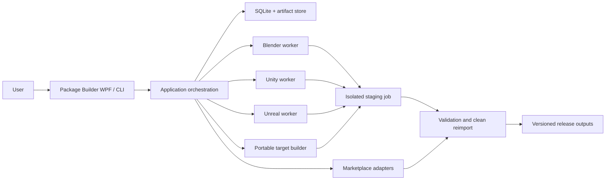
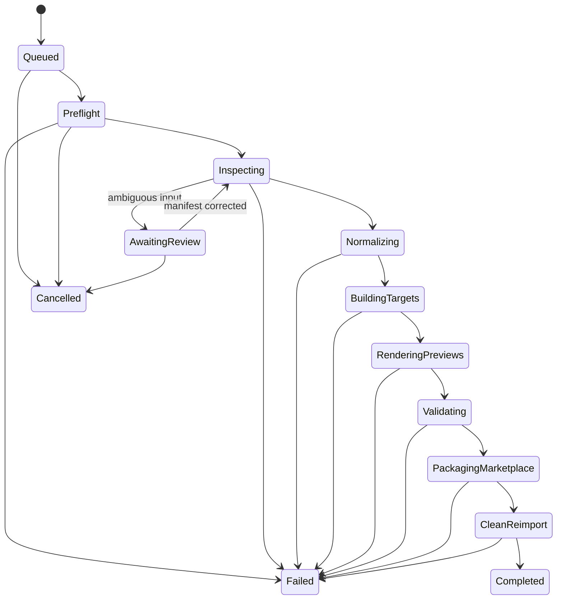
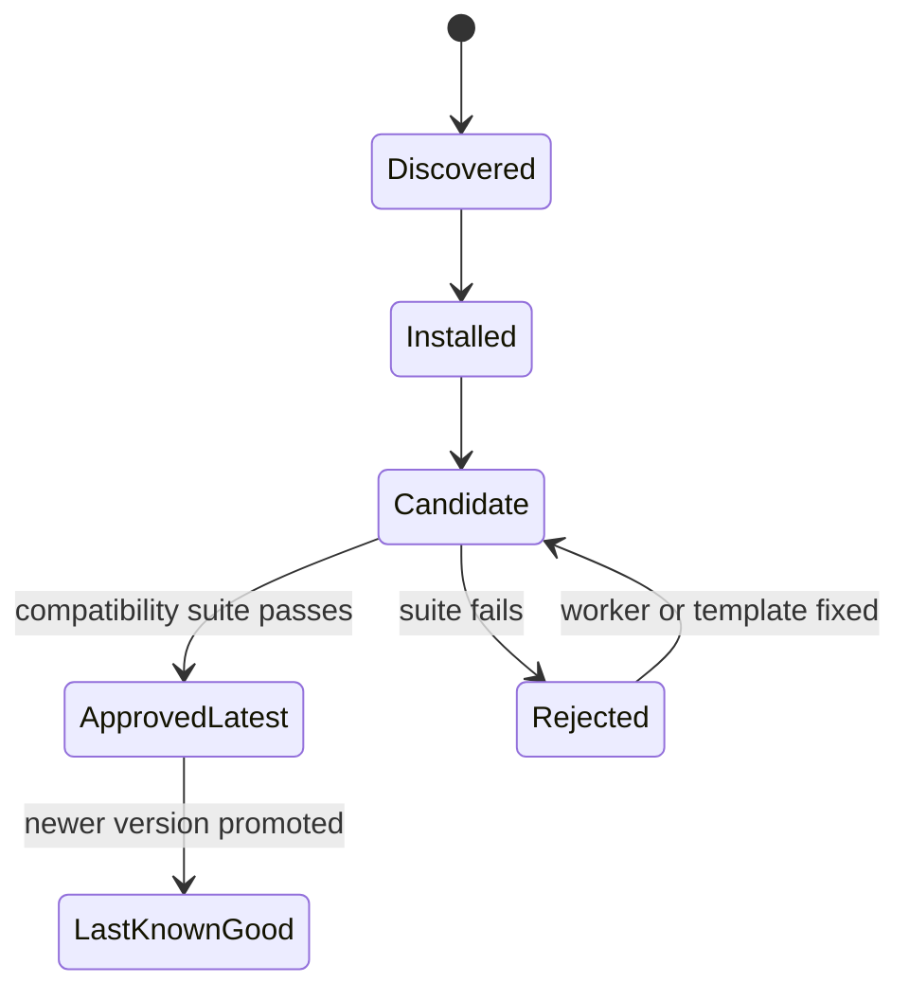

# Package Builder — Technology Stack and Architecture

**Document status:** Proposed baseline architecture
**Project:** Package Builder
**Repository:** `C:\Dev\PackageBuilder`
**Runtime data:** `C:\Dev\PackageBuilder\runtime-data`
**Last reviewed:** 2026-07-22

## 1. Purpose

This document defines the technologies, component boundaries, data contracts, execution model, version policy, testing strategy, and operational rules used to implement Package Builder.

The companion product plan explains **what** Package Builder must produce. This document explains **how** the software will produce it reliably.

Package Builder is a local-first Windows desktop application that coordinates Blender, Unity, and Unreal Engine to build:

- Portable FBX and GLB deliverables.
- Unity packages.
- Unreal Engine project packages.
- Product documentation.
- Preview scenes and marketplace media.
- Validation and clean-reimport reports.

Fab is the first marketplace adapter. Engine targets and marketplace adapters remain separate so the product can support additional stores later.

## 2. Architectural Goals

1. **Deterministic builds** — the same manifest, source files, tool versions, and adapter rules produce the same logical output.
2. **Latest stable engines** — new Unity and Unreal production releases are discovered, tested, and promoted quickly.
3. **Exact reproducibility** — every completed build records and pins the exact versions actually used.
4. **Source safety** — downloaded source files are never edited in place.
5. **Engine-native output** — Unity assets are created by Unity; Unreal assets are created by Unreal; Blender performs 3D interchange normalization.
6. **Failure isolation** — a Blender, Unity, or Unreal crash cannot corrupt the application or an already completed release.
7. **Marketplace independence** — Fab rules do not leak into the core domain or engine adapters.
8. **Automated validation** — a release is not marked successful until clean reimport and target-specific validation pass.
9. **Human control where necessary** — ambiguous texture roles, transparency, animation loops, scale, and item grouping require review or manifest overrides.
10. **Commercially maintainable dependencies** — prefer platform libraries and permissively licensed packages with centralized version management.
11. **Single-root containment** — every project file, managed tool, download, log, runtime-data file, cache, and generated artifact resolves beneath `C:\Dev\PackageBuilder`.
12. **No-cost required stack** — development and operation never require a paid software edition, paid subscription, or paid hosted service.
13. **Editor independence** — Visual Studio Code and repository scripts provide the supported development workflow; paid Visual Studio remains optional.

## 3. Current Development-Machine Audit

This is an environment snapshot, not a permanent architecture constraint.

| Tool | Current local status | Required action |
|---|---|---|
| Windows | Primary supported host | No action |
| Git | `2.43.0.windows.1` installed | Update through normal maintenance policy |
| .NET | SDK `10.0.302` installed at `tools\dotnet\10.0.302` and verified against Microsoft SHA-512 metadata | Enter the repository environment before using `dotnet` |
| Blender | Blender 5.0 executable detected | Use as initial normalization worker; track latest stable |
| Unity | `6000.2.9f1` and `6000.3.10f1` installed | Use newest approved stable version by policy |
| Unreal Engine | No `UE_*` installation detected in the standard Epic Games directory | Install the current production release before Unreal integration tests |
| Editor | Visual Studio Code is the supported baseline | Use CLI builds/tests; do not require paid Visual Studio features |

As of this document's review date, .NET 10 is the current LTS line, Unity 6.3 is the current LTS family, and Unreal Engine 5.8 is the current documented production family. These values are examples of the version policy in action; the code must not assume they remain current forever.

## 4. Selected Technology Stack

### 4.1 Core Application

| Concern | Selection | Reason |
|---|---|---|
| Runtime | .NET 10 LTS | Current supported LTS, strong process and filesystem APIs, native Windows desktop support |
| Language | C# 14 | Shared language with Unity worker code and strong domain modeling |
| Desktop UI | WPF | Stable Windows-native UI, excellent tooling, no embedded browser runtime |
| UI pattern | MVVM with CommunityToolkit.Mvvm | Clear testable separation with a small dependency footprint |
| CLI | `System.CommandLine` | Scriptable builds and CI without duplicating application logic |
| Hosting/DI | `Microsoft.Extensions.Hosting` and dependency injection | Consistent configuration, logging, lifetime, and service composition |
| Serialization | `System.Text.Json` | Built into .NET, fast, source-generation support |
| Schema validation | JsonSchema.Net or equivalent permissive JSON Schema library | Versioned validation of manifests and worker contracts |
| Logging | Serilog with text and JSON sinks | Structured per-job logs and readable local diagnostics |
| Persistence | SQLite through `Microsoft.Data.Sqlite` | Local build history without requiring a server |
| Image processing | SkiaSharp | Resize, inspect, and compress preview media with a permissive ecosystem |
| Archives | `System.IO.Compression.ZipArchive` | Built-in deterministic ZIP construction |
| Cryptographic hashes | `System.Security.Cryptography` SHA-256 | Artifact identity, cache keys, and duplicate detection |

### 4.2 Engine and DCC Workers

| Worker | Technology | Execution model |
|---|---|---|
| Blender | Blender-bundled Python | `blender --background --python ... -- <job>` |
| Unity | C# Editor assembly using `UnityEditor` APIs | `Unity.exe -batchmode -projectPath ... -executeMethod ...` |
| Unreal | Unreal Python Editor Scripting APIs | `UnrealEditor-Cmd.exe <project> ...` |
| Portable packaging | .NET plus normalized Blender output | In-process target builder |
| Media optimization | .NET/SkiaSharp | In-process after engine rendering |

The first Unreal implementation uses Python. A minimal C++ editor plugin is introduced only if required APIs are unavailable or unreliable through Python. Runtime marketplace packages do not depend on Package Builder editor code unless a generated preview feature explicitly requires it.

### 4.3 Engineering Tooling

| Concern | Selection |
|---|---|
| Source control | Git |
| Developer editor | Visual Studio Code with PowerShell and `dotnet` CLI; Visual Studio optional |
| Remote hosting | GitHub Free, private repository initially; optional for local development and operation |
| Unit tests | xUnit |
| .NET formatting | `dotnet format` plus `.editorconfig` |
| Python formatting/linting | Ruff |
| Unity tests | Unity Test Framework for Editor tests |
| Unreal tests | Python smoke tests plus Unreal Automation Tests where necessary |
| CI | Optional GitHub Actions free-tier workflow for core tests; no-cost self-hosted Windows runner for engine tests |
| Dependency updates | Dependabot or Renovate pull requests |
| Documentation | Markdown plus Architecture Decision Records |
| Installer | Deferred decision; no-cost MSIX or permissively licensed Velopack evaluated during productization |

## 5. Why This Stack

### 5.1 Why .NET and WPF

Package Builder is initially a Windows workstation tool. Its primary responsibilities are process orchestration, filesystem safety, structured manifests, engine discovery, job monitoring, and native desktop interaction. .NET and WPF provide these capabilities directly without shipping a Chromium runtime.

The UI is isolated behind application services. If macOS becomes a product requirement later, the WPF project can be replaced by an Avalonia frontend without rewriting the domain, orchestration, workers, CLI, or data contracts.

### 5.2 Why External Engine Workers

Blender, Unity, and Unreal have different runtimes, APIs, licensing requirements, memory profiles, and crash behavior. Running them as child processes gives Package Builder:

- Reliable version selection.
- Crash containment.
- Per-worker timeouts and cancellation.
- Independent logs.
- Clean project/template cloning.
- Clear testing boundaries.
- No attempt to load incompatible engine assemblies inside the desktop application.

### 5.3 Why JSON Files and JSON Lines Instead of gRPC

Version 1 uses versioned request/result JSON files and JSON Lines progress messages over standard output. This is easier to debug and remains usable even when an engine terminates unexpectedly.

Each worker receives a single job request path and writes a result file before exiting. A future remote-build service can wrap the same contracts in gRPC without changing the domain model.

### 5.4 Why Visual Studio Code Is Sufficient

The repository-local .NET SDK supplies the compiler, MSBuild, NuGet client, WPF reference packs, WPF templates, test runner, formatter, and publish commands. PowerShell scripts establish all required environment variables and invoke the same CLI commands used by CI. Visual Studio Code supplies editing, terminal, debugging, and optional free C# extensions; it is not part of the build dependency graph.

No task may require a paid Visual Studio licence, the Visual Studio XAML designer, proprietary test tooling, or an IDE-only build action. A contributor must be able to restore, build, test, run, debug, and package through documented repository commands. Optional IDE integrations may improve convenience without becoming acceptance requirements.

### 5.5 Cost and Service Boundary

All mandatory components have a no-cost local development path. Core code uses the .NET SDK, Git, PowerShell, Visual Studio Code, SQLite, and permissively licensed libraries. Blender is free and open source. Engine adapters must work with vendor editions available without an upfront paid subscription where the user's vendor-licence eligibility permits; Package Builder never mandates a paid tier or bundles a commercial licence.

Remote Git hosting, issue tracking, update checks, and CI are collaboration conveniences. Local builds, tests, engine workers, documentation, and release composition cannot depend on a paid hosted service or on network availability after approved tools and inputs are present.

## 6. System Context



## 7. Logical Architecture

Package Builder follows a modular hexagonal architecture. Dependencies point inward toward the domain and application layers.

### 7.1 Domain Layer

`PackageBuilder.Domain` contains no WPF, database, engine, marketplace, or filesystem implementation dependencies.

Primary domain types:

- `ProductManifest`
- `ProductIdentity`
- `PublisherProfile`
- `ProductCase`
- `SourceAssetSet`
- `TextureAssignment`
- `MaterialDefinition`
- `RigDefinition`
- `AnimationDefinition`
- `ItemDefinition`
- `TargetRequest`
- `MarketplaceRequest`
- `EngineVersionPolicy`
- `BuildJob`
- `BuildStep`
- `BuildArtifact`
- `ValidationFinding`
- `ValidationReport`

### 7.2 Application Layer

`PackageBuilder.Application` implements use cases and orchestration:

- Create and edit product manifests.
- Inspect source inputs.
- Resolve tool and engine versions.
- Create immutable staging jobs.
- Normalize source assets.
- Build requested targets.
- Generate previews and documentation.
- Apply marketplace rules.
- Validate and clean-reimport outputs.
- Promote passed artifacts to the release directory.
- Cancel, retry, and resume eligible jobs.

### 7.3 Contracts Layer

`PackageBuilder.Contracts` defines stable interfaces and worker protocol DTOs.

Core interfaces:

```csharp
public interface ISourceInspector;
public interface ISourceNormalizer;
public interface ITargetBuilder;
public interface IMarketplaceAdapter;
public interface IArtifactValidator;
public interface IPreviewRenderer;
public interface IDocumentationGenerator;
public interface IToolLocator;
public interface IEngineVersionProvider;
public interface IProcessRunner;
public interface IArtifactStore;
public interface IBuildHistoryStore;
```

Version 1 adapters are compiled and registered through dependency injection. Arbitrary third-party DLL loading is intentionally deferred until signing, compatibility, and security policies exist.

### 7.4 Infrastructure Layer

`PackageBuilder.Infrastructure` provides:

- Safe filesystem access.
- Staging directory management.
- SHA-256 hashing.
- ZIP creation and extraction.
- SQLite repositories.
- Structured process execution.
- Tool installation discovery.
- HTTP clients for official version metadata where permitted.
- Configuration and secret handling.
- Job locking and atomic output promotion.

### 7.5 Target Adapters

Target adapters create usable artifacts independent of a marketplace:

- `PackageBuilder.Targets.Portable`
- `PackageBuilder.Targets.Unity`
- `PackageBuilder.Targets.Unreal`

Blender is treated as a normalization/tool adapter rather than a marketplace target:

- `PackageBuilder.Tools.Blender`

### 7.6 Marketplace Adapters

Marketplace adapters package already validated target artifacts according to platform rules:

- `PackageBuilder.Marketplaces.Fab`
- Future: `PackageBuilder.Marketplaces.UnityAssetStore`
- Future: other stores or direct-download profiles

A marketplace adapter defines:

- Required and optional target formats.
- Archive and folder rules.
- Media constraints.
- Documentation sections.
- Listing metadata schema.
- Version restrictions.
- Final compliance validators.

It does not import models or create engine-native assets.

### 7.7 Presentation Layer

- `PackageBuilder.App.Wpf` — graphical workflow.
- `PackageBuilder.Cli` — local automation and CI.

Both call the same application services and produce identical build behavior.

## 8. Physical Repository Structure

```text
C:\Dev\PackageBuilder\
├── PackageBuilder.sln
├── global.json
├── Directory.Build.props
├── Directory.Packages.props
├── .editorconfig
├── .gitignore
├── README.md
├── LICENSE                 # selected before public release
├── docs/
│   ├── Package_Builder_Plan.md
│   ├── TECH_STACK_AND_ARCHITECTURE.md
│   └── adr/
├── schemas/
│   ├── product-manifest.schema.json
│   ├── publisher-profile.schema.json
│   ├── worker-request.schema.json
│   └── worker-result.schema.json
├── profiles/
│   ├── publishers/
│   │   └── AvivPeretsFBX.example.json
│   └── marketplaces/
│       └── fab.requirements.json
├── src/
│   ├── PackageBuilder.Domain/
│   ├── PackageBuilder.Application/
│   ├── PackageBuilder.Contracts/
│   ├── PackageBuilder.Infrastructure/
│   ├── PackageBuilder.App.Wpf/
│   ├── PackageBuilder.Cli/
│   ├── PackageBuilder.Tools.Blender/
│   ├── PackageBuilder.Targets.Portable/
│   ├── PackageBuilder.Targets.Unity/
│   ├── PackageBuilder.Targets.Unreal/
│   └── PackageBuilder.Marketplaces.Fab/
├── workers/
│   ├── blender/
│   │   ├── entrypoint.py
│   │   └── package_builder_blender/
│   ├── unity/
│   │   └── Packages/com.packagebuilder.worker/
│   └── unreal/
│       └── Plugins/PackageBuilderWorker/
├── engine-templates/
│   ├── unity/
│   └── unreal/
├── tests/
│   ├── PackageBuilder.Domain.Tests/
│   ├── PackageBuilder.Application.Tests/
│   ├── PackageBuilder.Infrastructure.Tests/
│   ├── PackageBuilder.Contract.Tests/
│   └── fixtures/
├── scripts/
├── .vscode/                 # source-controlled tasks/launch settings; no machine paths
├── .github/workflows/
├── tools/                   # ignored repository-local SDKs and engine installations
├── downloads/               # ignored verified installers, archives, and metadata
├── logs/                    # ignored setup/application/job logs
├── runtime-data/            # ignored mutable application state and caches
└── artifacts/               # ignored generated builds, reports, previews, and releases
```

Large source models, engine caches, generated packages, customer assets, and marketplace releases are never tracked by Git. They remain inside the single workspace root in ignored directories. `.gitignore` and containment tests protect that boundary.

## 9. Runtime Data Structure

```text
C:\Dev\PackageBuilder\
├── tools/
│   ├── dotnet/<version>/
│   ├── blender/<version>/
│   ├── unity/<version>/
│   └── unreal/<version>/
├── downloads/
│   └── <tool>/<version>/
├── logs/
│   ├── setup/<task-id>/
│   ├── application/
│   └── jobs/<job-id>/
├── runtime-data/
│   ├── source-assets/       # project-owned input copies or imports
│   ├── jobs/
│   │   └── <job-id>/
│   │       ├── request/
│   │       ├── source-snapshot/
│   │       ├── inspection/
│   │       ├── normalized/
│   │       ├── targets/
│   │       ├── marketplace/
│   │       ├── previews/
│   │       └── validation/
│   ├── engine-templates/
│   ├── engine-caches/
│   ├── cli-home/
│   ├── nuget-packages/
│   ├── nuget-http-cache/
│   ├── temp/
│   └── packagebuilder.db
└── artifacts/
    └── Builds/<publisher>/<product>/<version>/
```

Source snapshots use hard links only when safety can be proven; otherwise they are copied. A job never writes into `runtime-data/source-assets`. All configured roots are canonicalized and rejected unless they are descendants of `C:\Dev\PackageBuilder`; the application does not fall back to user-profile, sibling, or system-temporary paths.

## 10. Build Job State Machine



Every state transition is persisted. Completed steps record input hashes, output hashes, tool versions, start/end times, logs, and validation findings.

## 11. End-to-End Processing Pipeline

### Step 1 — Intake

- Accept a folder, ZIP, FBX, GLB, or multi-item manifest.
- Reject unsafe archives, path traversal, encrypted input without credentials, and unexpected executable content.
- Hash all source files.
- Copy inputs to an immutable job snapshot.

### Step 2 — Source Inspection

- Detect files and texture roles.
- Run Blender inspection for geometry, materials, rigs, and animations.
- Infer the product case.
- Compare the inference with explicit manifest values.
- Pause for review when ambiguity could change the output.

### Step 3 — Version Resolution

- Resolve the latest approved stable Blender, Unity, and Unreal versions needed by the requested targets.
- Verify required versions are installed beneath `C:\Dev\PackageBuilder\tools`; external executables are not eligible build dependencies.
- Offer installation guidance or an explicit contained install action; never silently accept engine EULAs or start very large downloads.
- Write the exact resolved versions to the job lock file.

### Step 4 — Normalization

- Run Blender against the immutable snapshot.
- Standardize naming, transforms, units, axes, material slots, rig/action names, and supported texture references.
- Export normalized FBX/GLB and an inspection result.
- Reimport normalized files into a fresh Blender process and compare expected deformation/animation metadata.

### Step 5 — Target Builds

- Build portable output from normalized assets.
- Clone a clean Unity template for the resolved Unity version and run the Unity worker.
- Clone a clean Unreal template for the resolved Unreal version and run the Unreal worker.
- Target builders write only to their assigned staging directories.

### Step 6 — Preview Rendering

- Generate product-specific overview scenes/maps.
- Render requested media with engine-native materials.
- Run image optimization without changing dimensions.
- Check visual bounds, empty frames, file formats, and size limits.

### Step 7 — Target Validation

- Validate structure, references, materials, rigs, clips, scenes, logs, and documentation.
- Execute animation motion checks where required.
- Fail on package-caused errors or consequential warnings.

### Step 8 — Marketplace Packaging

- Load the selected marketplace requirements profile.
- Generate marketplace-specific documentation and archives.
- Validate listing media and package structure.

### Step 9 — Clean Reimport

- Import the final Unity package into a new clean Unity project using the resolved version.
- Open the final Unreal project ZIP in a clean extraction and command-line validation run.
- Reimport portable FBX/GLB into a new Blender process.
- Compare the reimport result against expected counts, materials, rigs, and animations.

### Step 10 — Atomic Promotion

- Write the final report and build manifest.
- Move the completed release directory atomically into `artifacts/Builds`.
- Never expose partial failed output as a successful release.

## 12. Worker Protocol

Each external worker receives a versioned request:

```json
{
  "protocolVersion": 1,
  "jobId": "01J...",
  "operation": "build-unity-target",
  "manifestPath": ".../product.json",
  "inputDirectory": ".../normalized",
  "outputDirectory": ".../targets/unity",
  "resultPath": ".../targets/unity/result.json",
  "engineVersion": "6000.3.10f1"
}
```

Progress is emitted as one JSON object per line:

```json
{"type":"progress","step":"Importing textures","percent":35}
{"type":"finding","severity":"warning","code":"UNITY_TEXTURE_ALPHA_UNUSED"}
```

The result contains:

- Success/failure status.
- Worker and engine versions.
- Produced artifacts and SHA-256 hashes.
- Validation findings.
- Structured metrics.
- Log file paths.
- Retry safety information.

Unknown protocol versions fail clearly rather than being interpreted loosely.

## 13. Process Execution Rules

- Use `ProcessStartInfo.ArgumentList`; never construct an unescaped command string.
- Capture standard output and standard error separately.
- Assign every process to one build job.
- Use configurable startup, idle, and total timeouts.
- Support graceful cancellation followed by forced termination when required.
- Preserve logs after failure.
- Record executable path, file version, arguments with secrets redacted, and exit code.
- Require executable, working, temporary, cache, and log paths to resolve beneath the single project root.
- Set child-process environment variables explicitly so tools cannot create project state in the user profile or system temporary directory.
- Do not run multiple Unity processes against the same project clone.
- Do not run multiple Unreal writers against the same project clone.
- Limit concurrent engine jobs based on memory, disk, and licence capacity.

## 14. Engine-Version Strategy

### 14.1 Policy: Latest Approved Stable

The default policy is **Latest Approved Stable**, not merely "highest version number installed."

A version is eligible when:

- The vendor identifies it as a production, Update, or LTS release.
- It is not alpha, beta, preview, experimental, or release-candidate software.
- The required editor modules are available.
- Package Builder's compatibility fixtures pass.
- Requested marketplace rules permit it.

For Unity, current production Update releases can be preferred for new builds because Unity describes them as production-ready. LTS can be selected when a marketplace or customer compatibility profile requires it.

For Unreal, the newest non-preview launcher release becomes a candidate and must pass the same promotion suite.

### 14.2 Version Lifecycle



### 14.3 Update Discovery

- Check locally installed versions at startup.
- Refresh official stable-release metadata on a configurable schedule.
- Cache version metadata for offline use.
- Show a clear update notice when a newer stable candidate exists.
- Never auto-install large engines or accept licence terms without user confirmation.
- Allow a manual "Check for engine updates" command.

### 14.4 Compatibility Promotion

Before a candidate becomes the default, Package Builder runs:

1. Static-model fixture.
2. Rigged fixture.
3. Rigged-and-animated fixture.
4. Item-set fixture.
5. Item-collection fixture.
6. Material and preview rendering comparisons.
7. Clean export/reimport tests.
8. Marketplace structure validators.

If any required test fails, builds continue with the Last Known Good version and the UI explains why the newer version is not yet approved.

### 14.5 Reproducibility

Every release contains a build lock record:

```json
{
  "packageBuilderVersion": "1.0.0",
  "dotnetSdk": "10.0.302",
  "blender": "5.0.0",
  "unity": "6000.3.10f1",
  "unreal": "5.8.x",
  "marketplaceAdapter": "fab@2026-07-22",
  "manifestSchema": 1
}
```

The values above illustrate the structure and are not permanent defaults.

### 14.6 Multi-Version Compatibility

Using only the newest engine can reduce compatibility for customers on older versions. Package Builder therefore supports build matrices:

- `latest-stable` — required default requested by the publisher.
- `latest-lts` — optional Unity compatibility output.
- Explicit version — optional customer or marketplace target.

Each engine version builds independently from the normalized interchange source. A project created by a newer engine is not downgraded in place.

### 14.7 Template Versioning

Engine templates are versioned by compatibility family:

```text
engine-templates/unity/6000.3/
engine-templates/unreal/5.8/
```

Templates are copied to staging and migrated there. The source template is updated only through a reviewed migration change.

## 15. Marketplace Requirements Versioning

Marketplace rules change independently of engine versions. Requirements profiles contain:

- Adapter name and profile version.
- Effective date.
- Source links.
- Required targets.
- Media constraints.
- Archive limits.
- Folder/naming validators.
- Documentation/disclosure requirements.
- Supported engine-version ranges.

The Fab adapter ships with an updateable profile. New profile versions enter the same candidate/test/promotion process as engine versions. A completed build records the exact requirements profile used.

## 16. Persistence Model

SQLite stores metadata, not large binary artifacts.

Initial tables:

- `Products`
- `ProductVersions`
- `PublisherProfiles`
- `BuildJobs`
- `BuildSteps`
- `Artifacts`
- `ValidationFindings`
- `ToolInstallations`
- `EngineVersions`
- `RequirementsProfiles`
- `Settings`

Large files remain in the artifact store and are addressed by path plus SHA-256. Database migrations are versioned and backed up before upgrade.

## 17. Caching and Incremental Builds

A cache key includes:

- Source file hashes.
- Product manifest hash.
- Normalizer/worker version.
- Exact engine version.
- Target configuration.
- Marketplace requirements profile.

Only pure, validated steps are reusable. Engine outputs are not reused across incompatible engine versions. A user can force a clean build at any time.

Cache cleanup is quota-based and never deletes promoted release artifacts automatically.

## 18. Material Architecture

The domain stores a renderer-independent material definition:

- Base color texture and factor.
- Metallic texture and factor.
- Roughness texture and factor.
- Normal texture and scale.
- Emission texture, colour, and intensity.
- Ambient occlusion texture and strength.
- Opacity/cutout mode and threshold.
- Double-sided setting.
- UV set and transform.

Target material compilers convert this definition into:

- Portable FBX texture set.
- glTF metallic-roughness representation.
- Unity URP/Lit material and metallic-smoothness packing.
- Unreal material instance and ORM packing.

This prevents Unity- or Unreal-specific texture packing from becoming the canonical source representation.

## 19. Preview Architecture

Preview generation has three layers:

1. **Presentation specification** — camera roles, background, lighting intent, item visibility, and animation pose.
2. **Engine renderer** — Unity or Unreal creates the image with final engine-native materials.
3. **Media processor** — verifies dimensions, compresses within limits, and records hashes.

The preview system changes camera distance instead of scaling the product. Product transforms remain reset and real-world scale remains inspectable.

Static models, animated products, item sets, and collections use different presentation strategies defined in the product plan.

## 20. Documentation Architecture

Documentation uses UTF-8 templates with typed data rather than search-and-replace over previous product text.

Inputs:

- Product manifest.
- Inspection metrics.
- Target build results.
- Marketplace profile.
- Publisher profile.

Outputs:

- Portable README.
- Unity README.
- Unreal README or in-project documentation.
- Animation table.
- Set/collection inventory.
- Validation summary.

Missing required documentation data is a validation error, not an empty placeholder.

## 21. Error Model

All findings have:

- Stable code, for example `UNITY_MATERIAL_MISSING_NORMAL`.
- Severity: Info, Warning, Error, Fatal.
- Human-readable explanation.
- Source component.
- Related file or asset.
- Suggested action.
- Whether the finding blocks release.

Expected external failures are represented as results rather than unhandled exceptions. Unexpected programming defects are logged with stack traces and a correlation/job ID.

## 22. Security and Source Safety

- Treat downloaded models and archives as untrusted input.
- Defend against ZIP path traversal, decompression bombs, reparse points, and filename collisions.
- Restrict each worker to its job staging and template clone directories where practical.
- Do not execute scripts found inside product source archives.
- Do not interpolate filenames into shell command strings.
- Store no GitHub, Fab, Unity, or Epic credentials in manifests or source control.
- Keep the application local/offline by default except update checks and user-approved downloads.
- Verify every managed input, tool, download, log, runtime-data, cache, temporary, and output destination resolves beneath `C:\Dev\PackageBuilder` before reading, creating, deleting, moving, or replacing project-owned files.
- Use atomic directory promotion for completed releases.
- Retain the original source snapshot hash in the report.
- Scan final packages for unexpected executables, secrets, absolute local paths, and unrelated files.

## 23. Git and Dependency Policy

### Repository Rules

- Private GitHub repository initially.
- `main` must stay buildable.
- Feature branches and pull requests for reviewed work.
- Conventional or clearly scoped commit messages.
- Repository-local `tools`, `downloads`, `logs`, `runtime-data`, and `artifacts` remain ignored even though they live beneath the workspace root.
- No generated packages, engine caches, marketplace source models, credentials, or customer assets are tracked.
- Git LFS only for small legally approved test fixtures when necessary.

### Version Pinning

- `global.json` pins the exact approved .NET SDK with roll-forward disabled; promotion updates the pin deliberately after verification.
- `Directory.Packages.props` centralizes NuGet versions.
- Required dependencies must permit a no-cost development and redistribution path; a package requiring a paid build licence or hosted service is rejected.
- Python avoids third-party packages inside Blender unless necessary.
- Unity package dependencies are locked in template manifests.
- Unreal plugin/template dependencies are documented and versioned.

### Automated Updates

Dependency update bots open pull requests. Updates merge only after:

- Core unit tests pass.
- Contract/schema tests pass.
- Security/licence review passes.
- Relevant engine smoke tests pass.

## 24. Testing Strategy

### 24.1 Unit Tests

- Naming and sanitization.
- Product-case rules.
- Texture-role inference.
- Manifest validation.
- Version selection.
- State transitions.
- Path safety.
- Cache keys.
- Marketplace folder and media rules.

### 24.2 Contract Tests

- Worker request/result schema compatibility.
- Unknown-field and unknown-version behavior.
- JSON Lines progress parsing.
- Error and cancellation results.

### 24.3 Integration Tests

- Filesystem staging and atomic promotion.
- SQLite migrations and job recovery.
- ZIP creation/extraction safety.
- Process timeout and cancellation.
- Blender inspection/normalization.

### 24.4 Engine Tests

- Unity static import.
- Unity generic rig import.
- Unity animation clip and controller generation.
- Unreal static mesh import.
- Unreal skeletal mesh and animation import.
- Material correctness.
- Preview scene/map load and render.
- Clean package reimport.

### 24.5 Golden Fixtures

Maintain one legally distributable, intentionally small fixture for each product case:

1. Static model.
2. Rigged model without animation.
3. Rigged and animated model.
4. Item set.
5. Item collection.

Fixtures exercise albedo, normal, metallic, roughness, emission, optional alpha, multiple materials, and failure cases.

### 24.6 Visual Regression

Engine preview renders are compared with approved reference images using tolerant perceptual metrics. A difference does not automatically fail when an engine renderer intentionally changes, but it requires review before promoting a new engine version.

## 25. Continuous Integration

### GitHub-Hosted Workflow

When enabled on a GitHub Free repository, runs on each pull request:

- Restore with locked dependency versions.
- Build .NET solution.
- Run unit and contract tests.
- Run formatting/static checks.
- Validate JSON schemas and example manifests.
- Build documentation links/index.
- Scan dependencies and secrets.

The same restore, build, format, schema, and test commands are runnable locally from Visual Studio Code. Hosted CI is not required to develop or operate Package Builder, and no paid runner capacity is an architecture dependency.

### Self-Hosted Engine Workflow

Runs on a controlled Windows workstation because Unity and Unreal installations are large and licensing-sensitive:

- Blender fixtures.
- Unity Editor tests for every approved Unity family.
- Unreal smoke and automation tests for every approved Unreal family.
- Preview render comparisons.
- Clean-reimport suite.
- Candidate engine promotion suite.

Engine integration CI never publishes marketplace output automatically.

## 26. Observability and Supportability

Every job has a correlation ID visible in the UI and all logs.

Logs:

- `application.log`
- `job.log`
- `blender.log`
- `unity.log`
- `unreal.log`
- `validation.json`
- `validation.html`

The support bundle command collects manifests, versions, logs, and reports while excluding source models, textures, credentials, and private marketplace files by default.

## 27. Performance and Concurrency

- Lightweight inspection and hashing can run concurrently.
- Blender workers use a configurable small concurrency limit.
- Unity and Unreal builds default to one writer per engine installation/template family.
- Preview encoding can run concurrently after renders complete.
- Disk-space checks run before copying, extracting, rendering, or building.
- Large files are streamed rather than loaded fully into memory.
- Cancellation is cooperative first and forceful only after a timeout.

## 28. Distribution Strategy

Version 1 is a developer-operated repository application with a fully local, no-cost development path.

Productization later adds:

- Signed desktop installer.
- Self-contained .NET deployment.
- Engine/tool discovery wizard.
- Optional update channel.
- Crash/support bundle flow.
- Profile import/export.

Blender, Unity, and Unreal are not redistributed in Package Builder releases. For this workspace, approved installations are acquired through vendor-authorized channels into versioned directories beneath `C:\Dev\PackageBuilder\tools`; selected build executables cannot resolve outside the project root. Vendor licence eligibility remains the operator's responsibility, but Package Builder does not mandate a paid edition or subscription.

## 29. Architecture Decision Records

The following ADRs should be created when implementation begins:

1. `ADR-0001-dotnet-10-and-wpf.md`
2. `ADR-0002-external-engine-workers.md`
3. `ADR-0003-json-file-worker-protocol.md`
4. `ADR-0004-immutable-staging-and-atomic-promotion.md`
5. `ADR-0005-latest-approved-stable-engine-policy.md`
6. `ADR-0006-sqlite-build-history.md`
7. `ADR-0007-compiled-in-adapters-for-v1.md`
8. `ADR-0008-marketplace-requirements-profiles.md`

Each ADR records context, decision, alternatives, consequences, and migration considerations.

## 30. Implementation Order

1. Install and pin the repository-local .NET 10 LTS SDK, with downloads, logs, CLI state, caches, and temporary files contained beneath the project root.
2. Create solution, build properties, central package management, and tests.
3. Implement domain manifest, schemas, naming, and validation findings.
4. Implement staging, hashing, ZIP safety, process runner, and SQLite history.
5. Implement Blender inspection and static normalization contract.
6. Implement portable FBX/GLB target.
7. Implement Unity static target and clean reimport.
8. Implement rigged and animated Unity targets.
9. Implement documentation, previews, and Fab adapter.
10. Install latest stable Unreal and implement its worker.
11. Add sets and collections across targets.
12. Add engine-version discovery and candidate promotion automation.
13. Add WPF user workflow after core/CLI use cases are stable enough to drive.

The CLI and core orchestration should work before building a polished UI. This keeps the first milestones testable and avoids embedding business logic in view models.

## 31. Initial Technical Milestone

The first vertical slice is successful when one static fixture can:

1. Load a valid manifest.
2. Create an isolated job.
3. Locate the approved Blender and Unity installations.
4. Normalize and inspect source files.
5. Build the portable FBX package.
6. Build a Unity URP package.
7. Generate a README and preview.
8. Reimport both outputs cleanly.
9. Produce an HTML/JSON validation report.
10. Promote a versioned release atomically.

The second vertical slice repeats this flow with `Silverwing_Talonbow`, including one skeleton and the verified bow-shot animation.

## 32. Known Risks and Mitigations

| Risk | Mitigation |
|---|---|
| Latest engine release breaks an API | Candidate promotion suite plus Last Known Good fallback |
| Newer Unity package reduces older-version compatibility | Optional multi-version build matrix from normalized source |
| Engine crash leaves corrupt output | Isolated staging, external process, atomic promotion |
| Meshy filenames are inconsistent | Heuristics plus explicit manifest review |
| Roughness/metallic maps are assigned incorrectly | Renderer-independent material model and target compilers |
| Unreal Python lacks an API | Introduce narrowly scoped editor C++ module only where required |
| Marketplace rules change | Versioned marketplace requirements profiles |
| Preview looks different after engine upgrade | Visual regression and manual promotion review |
| Long paths break tools | One short project root, contained subdirectories, and path-length validation |
| Duplicate/generated files enter Git | Comprehensive `.gitignore`, CI size checks, and secret scans |
| Test fixtures have unclear licences | Use self-created or explicitly licensed minimal fixtures only |

## 33. Definition of Architecture Ready

This architecture is ready for implementation when:

- The .NET/WPF and external-worker decisions are accepted.
- Latest Approved Stable engine policy is accepted.
- Repository and runtime data locations are confirmed.
- Single-root containment, no-cost tooling, and Visual Studio Code development requirements are accepted and verified.
- Product and publisher manifest fields are approved.
- One test fixture exists for each product case.
- .NET 10 SDK is installed.
- The latest stable Unreal version is installed before Unreal milestone work.
- The first Fab requirements profile is created from current official rules.

## 34. Official References

- [.NET downloads and supported versions](https://dotnet.microsoft.com/en-us/download/dotnet)
- [.NET support policy](https://dotnet.microsoft.com/en-us/platform/support/policy/dotnet-core)
- [Unity 6 release and support policy](https://unity.com/releases/unity-6/support)
- [Unreal Engine 5.8 documentation](https://dev.epicgames.com/documentation/unreal-engine/unreal-engine-5-8-documentation?application_version=5.8)
- [Fab asset file and structure requirements](https://dev.epicgames.com/documentation/en-us/fab/asset-file-format-and-structure-requirements-in-fab)
- [Unity Asset Store submission guidelines](https://assetstore.unity.com/publishing/submission-guidelines)

Engine and marketplace documentation is reviewed when a new candidate version or requirements profile is discovered. Links in this document are reference starting points; the version manager and requirements-profile maintenance process prevent the architecture from depending permanently on today's versions.
