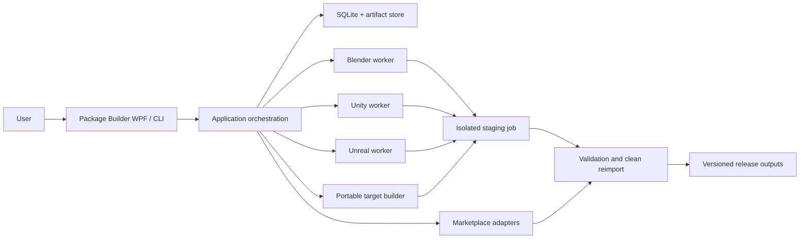
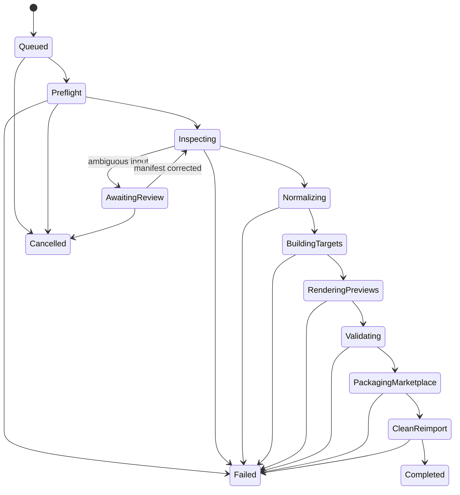
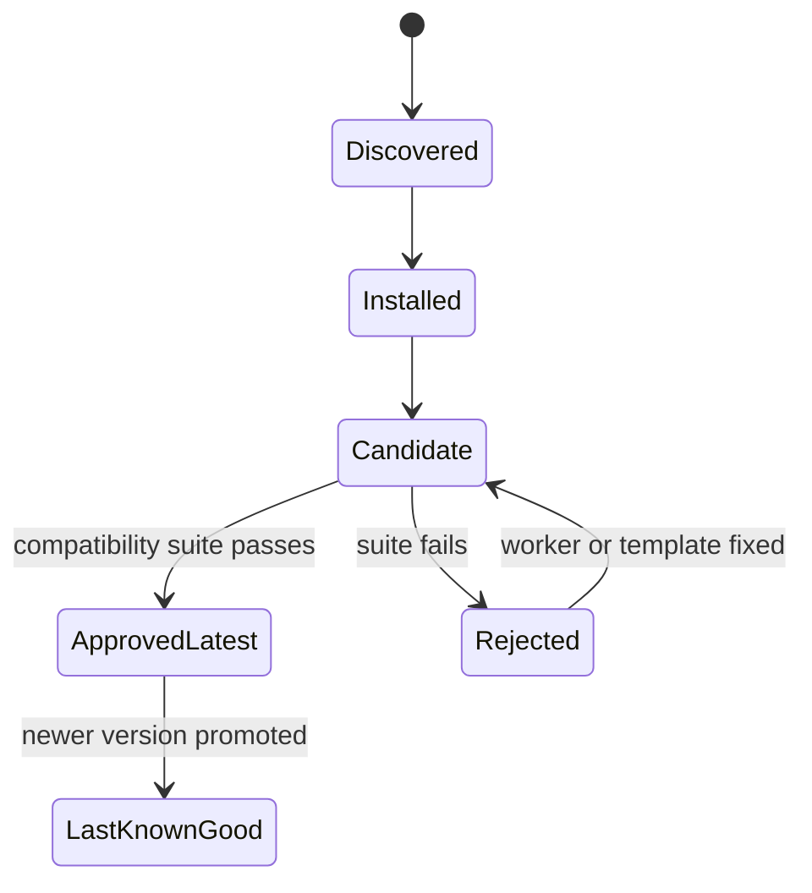

# Package Builder — Technology Stack and Architecture

**Document status:** Proposed baseline architecture
**Project:** Package Builder
**Repository:** `C:\Dev\PackageBuilder`
**GitHub repository:** [https://github.com/avivperets26/3DModels-Package-Builder](https://github.com/avivperets26/3DModels-Package-Builder)
**GitHub visibility:** Public, approved by the user on 2026-07-22
**Runtime data:** `C:\Dev\PackageBuilder\runtime-data`
**Last reviewed:** 2026-07-25

## 1. Purpose

This document defines the technologies, component boundaries, data contracts, execution model, version policy, testing strategy, and operational rules used to implement Package Builder.

The companion product plan explains **what** Package Builder must produce. This document explains **how** the software will produce it reliably.

Package Builder is a local-first Windows desktop application that coordinates Blender, Unity, and Unreal Engine to build:

- Portable FBX and GLB deliverables.
- Unity packages.
- Unreal Engine project packages.
- Product documentation.
- Preview scenes and marketplace media.
- Validation and clean-reimport reports.

Fab is the first marketplace adapter. Engine targets and marketplace adapters remain separate so the product can support additional stores later.

## 2. Architectural Goals

1. **Deterministic builds** — the same manifest, source files, tool versions, and adapter rules produce the same logical output.
2. **Latest stable engines** — new Unity and Unreal production releases are discovered, tested, and promoted quickly.
3. **Exact reproducibility** — every completed build records and pins the exact versions actually used.
4. **Source safety** — downloaded source files are never edited in place.
5. **Engine-native output** — Unity assets are created by Unity; Unreal assets are created by Unreal; Blender performs 3D interchange normalization.
6. **Failure isolation** — a Blender, Unity, or Unreal crash cannot corrupt the application or an already completed release.
7. **Marketplace independence** — Fab rules do not leak into the core domain or engine adapters.
8. **Automated validation** — a release is not marked successful until clean reimport and target-specific validation pass.
9. **Human control where necessary** — ambiguous texture roles, transparency, animation loops, scale, and item grouping require review or manifest overrides.
10. **Commercially maintainable dependencies** — prefer platform libraries and permissively licensed packages with centralized version management.
11. **Single-root containment** — every project file, managed tool, download, log, runtime-data file, cache, and generated artifact resolves beneath `C:\Dev\PackageBuilder`.
12. **No-cost required stack** — development and operation never require a paid software edition, paid subscription, or paid hosted service.
13. **Editor independence** — Visual Studio Code and repository scripts provide the supported development workflow; paid Visual Studio remains optional.
14. **Accessible, recoverable UX** — one consistent design system supports keyboard and assistive-technology use, guided dry runs, transparent progress, actionable errors, preserved input, and safe retry.
15. **Complete evidence traceability** — every normative requirement and PB acceptance criterion maps to at least one current test; approved supplementary verification never replaces that test.
16. **Measured quality** — coverage, mutation, performance, resource, accessibility, security, installation, and package-integrity evidence is reproducible and thresholded.
17. **Fail-closed releases** — missing, stale, contradictory, failing, or unapproved evidence blocks a release.

## 3. Current Development-Machine Audit

This is an environment snapshot, not a permanent architecture constraint.

| Tool | Current local status | Required action |
|---|---|---|
| Windows | Primary supported host | No action |
| Git | `2.43.0.windows.1` installed | Update through normal maintenance policy |
| .NET | SDK `10.0.302` installed at `tools\dotnet\10.0.302` and verified against Microsoft SHA-512 metadata | Enter the repository environment before using `dotnet` |
| Blender | Blender 5.0 executable detected | Use as initial normalization worker; track latest stable |
| Unity | `6000.2.9f1` and `6000.3.10f1` installed | Use newest approved stable version by policy |
| Unreal Engine | No `UE_*` installation detected in the standard Epic Games directory | Install the current production release before Unreal integration tests |
| Editor | Visual Studio Code is the supported baseline | Use CLI builds/tests; do not require paid Visual Studio features |

As of this document's review date, .NET 10 is the current LTS line, Unity 6.3 is the current LTS family, and Unreal Engine 5.8 is the current documented production family. These values are examples of the version policy in action; the code must not assume they remain current forever.

## 4. Selected Technology Stack

### 4.1 Core Application

| Concern | Selection | Reason |
|---|---|---|
| Runtime | .NET 10 LTS | Current supported LTS, strong process and filesystem APIs, native Windows desktop support |
| Language | C# 14 | Shared language with Unity worker code and strong domain modeling |
| Desktop UI | WPF | Stable Windows-native UI, excellent tooling, no embedded browser runtime |
| UI pattern | MVVM with CommunityToolkit.Mvvm | Clear testable separation with a small dependency footprint |
| CLI | `System.CommandLine` | Scriptable builds and CI without duplicating application logic |
| Hosting/DI | `Microsoft.Extensions.Hosting` and dependency injection | Consistent configuration, logging, lifetime, and service composition |
| Serialization | `System.Text.Json` | Built into .NET, fast, source-generation support |
| Schema validation | JsonSchema.Net 9.3.0 (MIT) | Pinned offline Draft 2020-12 validation of manifests and worker contracts |
| Logging | Serilog with text and JSON sinks | Structured per-job logs and readable local diagnostics |
| Persistence | SQLite through `Microsoft.Data.Sqlite` 10.0.10 with patched `SQLitePCLRaw.lib.e_sqlite3` 2.1.12 | Pinned local build history without a server or vulnerable native 2.1.11 runtime |
| Image processing | SkiaSharp | Resize, inspect, and compress preview media with a permissive ecosystem |
| Archives | `System.IO.Compression.ZipArchive` | Built-in deterministic ZIP construction |
| Cryptographic hashes | `System.Security.Cryptography` SHA-256 | Artifact identity, cache keys, and duplicate detection |

### 4.2 Engine and DCC Workers

| Worker | Technology | Execution model |
|---|---|---|
| Blender | Blender-bundled Python | `blender --background --python ... -- <job>` |
| Unity | C# Editor assembly using `UnityEditor` APIs | `Unity.exe -batchmode -projectPath ... -executeMethod ...` |
| Unreal | Unreal Python Editor Scripting APIs | `UnrealEditor-Cmd.exe <project> ...` |
| Portable packaging | .NET plus normalized Blender output | In-process target builder |
| Media optimization | .NET/SkiaSharp | In-process after engine rendering |

The first Unreal implementation uses Python. A minimal C++ editor plugin is introduced only if required APIs are unavailable or unreliable through Python. Runtime marketplace packages do not depend on Package Builder editor code unless a generated preview feature explicitly requires it.

### 4.3 Engineering Tooling

| Concern | Selection |
|---|---|
| Source control | Git |
| Developer editor | Visual Studio Code with PowerShell and `dotnet` CLI; Visual Studio optional |
| Remote hosting | GitHub Free, approved public repository at [https://github.com/avivperets26/3DModels-Package-Builder](https://github.com/avivperets26/3DModels-Package-Builder); optional for local development and operation |
| Unit tests | xUnit |
| .NET formatting | `dotnet format`, `.editorconfig`, and deterministic Git LF normalization |
| Python formatting/linting | Ruff |
| Unity tests | Unity Test Framework for Editor tests |
| Unreal tests | Python smoke tests plus Unreal Automation Tests where necessary |
| CI | PB-0009 GitHub Actions repository-baseline plus core restore/build/format/Ruff/test validation on GitHub Free Windows runners; no-cost self-hosted Windows runner for future engine/UI/installer/performance tests; never required for local product operation |
| Dependency updates | Dependabot v2 pull-request proposals for NuGet and GitHub Actions |
| Documentation | Markdown plus Architecture Decision Records |
| Installer | Deferred decision; no-cost MSIX or permissively licensed Velopack evaluated during productization |
| Coverage | Coverlet-compatible .NET collection plus a pinned no-cost report generator; line and branch thresholds enforced locally and in CI |
| Mutation testing | Pinned Stryker.NET or an approved no-cost equivalent for critical validation and security code |
| Benchmarks | Pinned BenchmarkDotNet or an approved no-cost equivalent plus end-to-end fixture resource measurement |
| WPF UI/accessibility tests | Windows UI Automation with a pinned permissively licensed driver such as FlaUI, plus manual representative-user studies |
| Supply-chain evidence | NuGet audit, pinned Gitleaks or equivalent secret scanning, supported static analyzers, and a pinned no-cost SBOM generator |

The approved PB-0007 formatting baseline uses the formatter supplied by repository-local .NET SDK `10.0.302`; no separate `dotnet-format` global tool is installed. Ruff `0.15.22` is pinned through root `ruff.toml` with a runtime `required-version` check and installed from the official checksum-verified Windows archive beneath `tools/ruff/0.15.22`. Downloads, setup logs, caches, and validation output remain beneath the ignored repository-local roots.

Ruff targets Python 3.11 because the planned Blender 5.0 worker runtime uses Blender's bundled Python compatibility family. This compatibility target is reviewed with a future approved Blender-family change instead of automatically selecting the newest Python syntax. Root `.editorconfig`, `.gitattributes`, `ruff.toml`, and `scripts/Test-Formatting.ps1` define the shared local policy; verification is non-mutating by default, while an explicit fix mode may apply reviewed formatting changes.

The root `.gitattributes` rule `* text=auto eol=lf` makes text-file checkout line endings deterministic on Windows and other hosts, independently of local `core.autocrlf`. `text=auto` retains Git's binary-content detection instead of forcing binary files through text normalization. The dependency-free formatting-configuration validator requires the root file to be the only reviewable Git attribute file, requires its single non-conflicting rule, and verifies representative C#, PowerShell, YAML, Markdown, solution, and configuration paths with `git check-attr`.

The PB-0008 test baseline keeps the four existing xUnit v3 projects on the centrally pinned VSTest-compatible package set. Each project has a deterministic offline `Category=Smoke` test that loads its directly referenced production assembly and verifies the expected assembly identity. `scripts/Test-TestProjects.ps1` validates the exact project inventory, production references, package configuration, and discoverable smoke-test source without external dependencies. `scripts/Test-BaselineUnitTests.ps1` defaults to repository-local SDK `10.0.302`, a locked restore, Debug configuration, and PB-0008 result paths. It also supports the PB-0009 controlled Release pipeline with no repeated restore or build, while preserving zero-discovery, failure, skip, stale/missing-result, unclassified-outcome, source-nonmutation, and minimum-total protections.

The PB-0009 core pipeline is exposed through `scripts/Invoke-CoreCi.ps1` for Visual Studio Code, Windows PowerShell 5.1, and GitHub Actions `pwsh`. It performs repository-baseline validation, exact SDK verification, one locked restore, a warning-free Release build, non-mutating .NET formatting, checksum-verified Ruff `0.15.22` installation, Ruff lint/format checks, and all four Release test projects in a fixed fail-closed order. Local execution accepts only `tools/dotnet/10.0.302`; explicit GitHub Actions mode accepts the `actions/setup-dotnet` managed runner SDK only after the GitHub workspace and exact SDK version are verified. All Package Builder CLI state, NuGet/Ruff caches, temporary files, logs, and results remain beneath the selected repository workspace.

PB-0010 establishes `README.md` and `CONTRIBUTING.md` as the contributor entry points without presenting planned product functionality as available. `scripts/Test-ContributionDocumentation.ps1` is a dependency-free PowerShell validator for required sections, real command/file references, local Markdown links, branch types, lifecycle markers, optional pull requests, direct merges, the permanent one-merge rollover, version boundaries, no-cost tooling, and public-repository safeguards. `scripts/Test-RepositoryBaseline.ps1` runs it in-process and through standalone Windows PowerShell 5.1 before the core pipeline proceeds.

PB-0011 adds stable Markdown issue templates, an optional pull-request review template, `.github/CODEOWNERS`, bounded weekly Dependabot v2 proposals for NuGet and GitHub Actions, and a minimal `SECURITY.md`. It does not enable automerge, publication, private registries, repository settings, or a private vulnerability-reporting channel. GitHub public-repository secret scanning runs automatically for free; `.github/secret_scanning.yml` is intentionally absent because GitHub documents it only as a path-exclusion configuration. `scripts/Test-GitHubGovernance.ps1` validates the supported locations, template front matter, ownership, Dependabot policy, safe-reporting limitations, and absence of secret-scanning exclusions and Renovate configuration without external dependencies.

PB-0012 records the initial accepted architecture decisions in ADRs 0001–0013, adds documentation and ADR indexes, and validates the exact inventory, required sections, statuses, links, implementation boundaries, and permanent repository policies through dependency-free `scripts/Test-ArchitectureDecisionRecords.ps1`. ADR acceptance records an approved direction; it does not claim that the corresponding application, engine, packaging, UI, security, or installer behavior is implemented.

## 5. Why This Stack

### 5.1 Why .NET and WPF

Package Builder is initially a Windows workstation tool. Its primary responsibilities are process orchestration, filesystem safety, structured manifests, engine discovery, job monitoring, and native desktop interaction. .NET and WPF provide these capabilities directly without shipping a Chromium runtime.

The UI is isolated behind application services. If macOS becomes a product requirement later, the WPF project can be replaced by an Avalonia frontend without rewriting the domain, orchestration, workers, CLI, or data contracts.

### 5.2 Why External Engine Workers

Blender, Unity, and Unreal have different runtimes, APIs, licensing requirements, memory profiles, and crash behavior. Running them as child processes gives Package Builder:

- Reliable version selection.
- Crash containment.
- Per-worker timeouts and cancellation.
- Independent logs.
- Clean project/template cloning.
- Clear testing boundaries.
- No attempt to load incompatible engine assemblies inside the desktop application.

### 5.3 Why JSON Files and JSON Lines Instead of gRPC

Version 1 uses versioned request/result JSON files and JSON Lines progress messages over standard output. This is easier to debug and remains usable even when an engine terminates unexpectedly.

Each worker receives a single job request path and writes a result file before exiting. A future remote-build service can wrap the same contracts in gRPC without changing the domain model.

### 5.4 Why Visual Studio Code Is Sufficient

The repository-local .NET SDK supplies the compiler, MSBuild, NuGet client, WPF reference packs, WPF templates, test runner, formatter, and publish commands. PowerShell scripts establish all required environment variables and invoke the same CLI commands used by CI. Visual Studio Code supplies editing, terminal, debugging, and optional free C# extensions; it is not part of the build dependency graph.

No task may require a paid Visual Studio licence, the Visual Studio XAML designer, proprietary test tooling, or an IDE-only build action. A contributor must be able to restore, build, test, run, debug, and package through documented repository commands. Optional IDE integrations may improve convenience without becoming acceptance requirements.

### 5.5 Cost and Service Boundary

All mandatory components have a no-cost local development path. Core code uses the .NET SDK, Git, PowerShell, Visual Studio Code, SQLite, and permissively licensed libraries. Blender is free and open source. Engine adapters must work with vendor editions available without an upfront paid subscription where the user's vendor-licence eligibility permits; Package Builder never mandates a paid tier or bundles a commercial licence.

Remote Git hosting, issue tracking, update checks, and CI are collaboration conveniences. Local builds, tests, engine workers, documentation, and release composition cannot depend on a paid hosted service or on network availability after approved tools and inputs are present.

### 5.6 Quality Evidence Toolchain

`docs/QUALITY_AND_RELEASE_GATES.md` is the normative source for the exact 68 stable requirement IDs. Other documents reference rather than redefine those IDs. All selected quality tools must be free for required local or self-hosted use, installed or restored beneath the project root, version-pinned, and callable from Visual Studio Code tasks and repository scripts.

The canonical release blockers are REL-001 through REL-008 in `docs/QUALITY_AND_RELEASE_GATES.md`; missing, stale, unreadable, contradictory, or failing evidence blocks release.

The quality pipeline produces:

- A criterion-level requirements-to-tests traceability matrix.
- Unit, contract, integration, end-to-end, UI, accessibility, regression, installer, upgrade, failure-recovery, engine-fixture, and malicious-input results.
- Overall line and branch coverage, critical-code branch coverage, trend data, and a user-approved exclusion register.
- Mutation results for validation and security components.
- Small, medium, and large fixture benchmark results with time, peak memory, peak disk, temporary-space, bytes read/written, machine profile, and tool-version evidence.
- Threat-model coverage, warning-free compilation/analyzer output, dependency-vulnerability, secret, static-analysis, licence, download-integrity, and SBOM evidence.
- Installer/portable, privilege, prerequisite, repair, upgrade, downgrade-prevention, uninstall, retained-data, diagnostic-export, and containment evidence.
- Generated-package inventory, hashes, unexpected-content scan, validation-report consistency, and clean import/reopen evidence.

The default test suite is deterministic and offline. Tests that require a network are explicitly categorized as network integration tests, run separately, and cannot be the sole evidence for behavior that can be validated locally.

## 6. System Context


```mermaid
flowchart LR
    User["User"] --> App["Package Builder WPF / CLI"]
    App --> Core["Application orchestration"]
    Core --> Store["SQLite + artifact store"]
    Core --> Blender["Blender worker"]
    Core --> Unity["Unity worker"]
    Core --> Unreal["Unreal worker"]
    Core --> Portable["Portable target builder"]
    Core --> Market["Marketplace adapters"]
    Blender --> Stage["Isolated staging job"]
    Unity --> Stage
    Unreal --> Stage
    Portable --> Stage
    Stage --> Validation["Validation and clean reimport"]
    Market --> Validation
    Validation --> Releases["Versioned release outputs"]
```

## 7. Logical Architecture

Package Builder follows a modular hexagonal architecture. Dependencies point inward toward the domain and application layers.

### 7.1 Domain Layer

`PackageBuilder.Domain` contains no WPF, database, engine, marketplace, or filesystem implementation dependencies.

Primary domain types:

- `ProductManifest`
- `ProductIdentity`
- `PublisherProfile`
- `ProductCase`
- `SourceAssetSet`
- `TextureAssignment`
- `MaterialDefinition`
- `RigDefinition`
- `AnimationDefinition`
- `ItemDefinition`
- `TargetRequest`
- `MarketplaceRequest`
- `EngineVersionPolicy`
- `BuildJob`
- `BuildStep`
- `BuildArtifact`
- `ValidationFinding`
- `ValidationReport`

PB-0101 implements the first immutable naming types in `PackageBuilder.Domain.Naming`:

- `ProductDisplayName` preserves human-readable Unicode text exactly as supplied.
- `InternalAssetId` uses `[A-Za-z][A-Za-z0-9]*`.
- `ProductFolderName` uses `[A-Za-z0-9][A-Za-z0-9_-]*`.
- `PublisherRoot` uses `[A-Za-z][A-Za-z0-9_]*` and remains configurable; `AvivPeretsFBX` is an example, not a hard-coded singleton.
- `CanonicalTextureNameToken` currently exposes and accepts only ordinal `Albedo`. PB-0103 owns the complete texture-role model.

Each type exposes `Create(string?)` returning `NamingValidationResult<T>`, with `NamingValidationError` identifying expected user-input failures without requiring exceptions. Inputs are never trimmed, normalized, case-folded, or transformed. Common validation rejects null, empty, whitespace-only, leading/trailing whitespace, controls, Windows-rooted or drive-qualified forms, traversal segments, and directory separators. Filesystem segments additionally reject trailing dots/spaces and Windows-reserved device names. Folder and identifier grammars reject all characters not listed above; no arbitrary length limit is imposed. Equality is type-specific and ordinal case-sensitive, and hash codes use a stable culture-independent ordinal algorithm.

PB-0102 adds closed immutable domain identities without engine dependencies:

- `PackageBuilder.Domain.Products.ProductCase` exposes exactly `Static`, `Rigged`, `RiggedAnimated`, `ItemSet`, and `ItemCollection`, with canonical identifiers `static`, `rigged`, `rigged-animated`, `item-set`, and `item-collection` in that stable order. Set and collection identity does not constrain whether later item manifests contain rigs or animations.
- `PackageBuilder.Domain.Targets.BuildTarget` exposes exactly `Portable`, `Unity`, and `Unreal`, with canonical identifiers `portable`, `unity`, and `unreal` in that stable order. Portable identifies engine-independent FBX/GLB packaging; Unity and Unreal remain identities only and contain no engine settings.
- Both types expose `TryParse(string?)` returning `CanonicalIdentifierParseResult<T>`. Parsing is exact ordinal and case-sensitive, accepts only lowercase ASCII words separated by single hyphens, and distinguishes null, empty, whitespace-only, malformed, and well-formed but unknown input without using exceptions for expected failures.

The PB-0102 API adds no target selection object, manifest/schema converter, publisher or marketplace profile, Fab coupling, filesystem or persistence behavior, or reference to the Portable, Unity, or Unreal adapter projects.

PB-0103 adds immutable source-asset and renderer-independent texture interpretation in `PackageBuilder.Domain.Assets` and `PackageBuilder.Domain.Textures`:

- `SourceAssetKind` exposes exactly `Fbx`, `Glb`, `Archive`, and `Image`, with canonical identifiers `fbx`, `glb`, `archive`, and `image`.
- `SourceAsset.Create(SourceAssetKind?, string?, string?)` returns `SourceAssetValidationResult`. It stores a kind, a canonical logical source-relative reference, and an optional original filename without filesystem access, file-existence checks, archive extraction, decoding, hashing, copying, or mutation.
- Logical references preserve accepted Unicode and casing exactly, use `/` as their only separator, and are compared ordinally and case-sensitively. Validation rejects null/empty/whitespace, rooted and drive-relative forms, URI-like/colon forms, backslashes, empty segments, `.`/`..` segments, segment-edge whitespace, and control characters. It never trims, case-folds, replaces separators, resolves traversal, or otherwise normalizes unsafe input.
- Explicit source-format consistency requires `.fbx` for FBX, `.glb` for GLB, and `.zip` for Archive, using ordinal case-insensitive extension comparison while preserving the supplied text. Image extensions remain unrestricted until an approved image-format policy exists.
- `TextureRole` exposes exactly Albedo, Normal, Metallic, Roughness, Emission, Ambient Occlusion, Opacity, and Height. Canonical identifiers are `albedo`, `normal`, `metallic`, `roughness`, `emission`, `ambient-occlusion`, `opacity`, and `height`; `Albedo` is the exact display spelling and `Albeado`, Base Color, Diffuse, target packing names, and unknown values are not canonical roles.
- `ColourSpace` exposes `Srgb` (`srgb`, display `sRGB`) and `Linear` (`linear`). Albedo and Emission require sRGB; every other canonical role requires Linear.
- `NormalConvention` exposes Auto, OpenGL, and DirectX using `auto`, `open-gl`, and `direct-x`. A convention is required for Normal and forbidden for every non-Normal role.
- `TextureAssignment.Create(SourceAsset?, TextureRole?, ColourSpace?, NormalConvention?)` returns `TextureAssignmentValidationResult`, accepts only Image sources, and rejects null, incompatible, missing, or contradictory combinations without silently correcting them.

All PB-0103 canonical identity parsers reuse `CanonicalIdentifierParseResult<T>` and exact ordinal PB-0102 parsing behavior. Source-asset and assignment errors remain task-local expected-input results rather than pre-empting PB-0109's global validation-finding and stable-code model. PB-0103 adds no `SourceAssetSet`, material/shader model, classifier, channel packing, image decoding, engine import setting, filesystem implementation, marketplace rule, or JSON converter.

PB-0104 adds immutable renderer-independent material intent in `PackageBuilder.Domain.Materials`:

- `SurfaceMode` exposes exactly Opaque, Cutout, and Transparent in stable canonical order with exact ordinal parsing.
- `EmissionProperties` stores non-negative finite linear RGB components and intensity. Values are not arbitrarily capped, so HDR material intent is preserved.
- `UvTransform` stores finite horizontal/vertical scale and offset. Signed and zero scales remain valid renderer-independent mirroring or coordinate intent.
- `MaterialDefinition` stores metallic and roughness factors, normal scale, emission, ambient-occlusion strength, signed height scale, opacity, surface mode, optional alpha cutoff, UV transform, double-sided intent, and PB-0103 `TextureAssignment` values.
- Metallic, roughness, ambient-occlusion, opacity, and alpha-cutoff factors use the inclusive unit interval. Normal scale is non-negative and finite; height scale is any finite signed value.
- Opaque requires opacity `1` and forbids alpha cutoff. Cutout requires a finite unit-interval alpha cutoff. Transparent permits unit-interval opacity and forbids alpha cutoff.
- Texture assignments are copied into an immutable list in `TextureRole.All` order. Every canonical role is supported and duplicate assignments for one role are rejected.

Creation uses task-local structured validation results for expected input failures. Equality and hashing include every retained property, use exact ordinal texture/source identity, and remain culture independent and deterministic. PB-0104 adds no material name or specular workflow, UV-set index, shader, packing, renderer asset, image conversion, filesystem, persistence, networking, marketplace, WPF, JSON, or PB-0109 global finding behavior.

PB-0105 adds immutable renderer-independent rig and animation intent in `PackageBuilder.Domain.Rigging` and `PackageBuilder.Domain.Animations`:

- `RigType` exposes only `Generic` and explicitly selected `Humanoid`; skeleton presence never implies Humanoid.
- `BoneDefinition` preserves validated Unicode identities exactly and uses ordinal, case-sensitive identity and parent-reference semantics.
- `SkeletonDefinition` requires exactly one root, rejects null or duplicate bones, self-parenting, missing parents, missing or multiple roots, and direct or indirect cycles, then retains root-first depth-first order with ordinal sibling ordering.
- `RigTransform` retains any finite signed translation and scale. Its finite non-zero quaternion is normalized robustly at numeric boundaries and sign-canonicalized so equivalent `q` and `-q` rotations compare and hash identically.
- `BonePose` and `PoseDefinition` represent one complete reference/rest transform per known skeleton bone, reject unknown, duplicate, null, or missing entries, and retain skeleton order independently of input order.
- `RigDefinition` combines an explicitly selected rig type, validated skeleton, and matching complete reference pose.
- `LoopBehavior` exposes `Once` and `Loop`; `RootMotionStatus` exposes `None` and `RootBone`.
- `AnimationDefinition` preserves a validated Unicode clip name, inclusive signed `long` source-frame range, finite positive FPS, loop behavior, root-motion status, exact root reference, and rig. Negative source frames are valid. Inclusive frame count is `EndFrame - StartFrame + 1`; duration is the number of sample intervals, `EndFrame - StartFrame`, divided by FPS, so one frame has zero duration.

PB-0105 creation uses task-local non-throwing validation results rather than PB-0109 global finding codes. Collections are immutable snapshots; hierarchy, pose, equality, and FNV-based hashing are deterministic, ordinal, and culture independent. PB-0105 adds no skin weights, curve data, parsing, baking, compression, retargeting, root-motion extraction, humanoid maps, axes, units, engine assets, renderer behavior, filesystem, persistence, networking, marketplace, WPF, or JSON behavior.

PB-0106 adds immutable renderer-independent item-group intent in `PackageBuilder.Domain.Items`:

- `ItemCategory` and `AttachmentSlot` are validated, extensible lowercase canonical identifiers. They contain no hard-coded armor, weapon, engine-socket, skeleton-bone, or marketplace category registry.
- `ItemDefinition` reuses `InternalAssetId` for stable ordinal item identity, retains user-controlled item order at the group boundary, and stores canonically ordered immutable categories, an optional logical attachment/body slot, and canonically ordered shared-asset ID references.
- `SharedAssetDefinition` associates an `InternalAssetId` with an existing immutable `SourceAsset`; it declares logical sharing only and performs no material/texture deduplication, filesystem access, hashing, or copying.
- `ItemRelationship` represents an undirected relationship between two distinct item IDs. Endpoints are canonicalized ordinally so exact and reversed duplicates have the same value, while group validation rejects unknown endpoints.
- `ItemSetDefinition` always reuses `ProductCase.ItemSet`. It may contain `AssembledSetRules` with complete declared membership, optional logical slots, a uniqueness policy, and extensible compatibility metadata.
- `ItemCollectionDefinition` always reuses `ProductCase.ItemCollection`, keeps every item independently usable, explicitly rejects assembled-set rules, and exposes no combined runtime object.
- Assembled membership rejects unknown, missing, duplicate, or slot-contradictory members. When uniqueness is required, repeated non-null attachment slots are rejected. Empty and single-item groups remain valid because no approved PB-0106 requirement defines a minimum group size.
- Group validation rejects null entries, exact ordinal duplicate item or shared-asset IDs, duplicate relationships, unknown shared-asset references, and shared-asset declarations that no item references. Shared declarations may be referenced by multiple items.

PB-0106 creation uses task-local structured `ItemValidationResult<T>` values rather than PB-0109 global finding codes. All retained collections are immutable snapshots; item order is intentionally user-controlled, while relationships, categories, shared declarations/references, assembled members, and compatibility metadata have deterministic ordinal ordering. Equality and FNV-based hashing are ordinal, case-sensitive, culture independent, renderer independent, and stable across supported processes. PB-0106 adds no source-file grouping, manifest mapping, transforms, retargeting, package generation, preview behavior, engine assets, marketplace identifiers, filesystem, persistence, networking, WPF, or JSON behavior.

PB-0107 adds immutable publisher and generic marketplace profile intent in
`PackageBuilder.Domain.Profiles`:

- `PublisherDisplayName` and `CopyrightHolder` preserve accepted Unicode exactly, reject null,
  empty, whitespace-only, edge-whitespace, control-character, and over-limit input, and compare
  ordinally.
- `SupportContact` is created explicitly as an email address or secure URL. Email validation is
  deterministic syntactic validation; URL validation permits only absolute HTTPS without URI
  credentials. Neither path performs DNS, HTTP, delivery, or other network verification.
- `CopyrightYearPolicyKind` exposes `single-year`, `year-range`, and `publication-year`.
  `CopyrightYearPolicy` requires explicit years, rejects missing, out-of-range, degenerate,
  reversed, or contradictory combinations, and never consults the system clock.
- `AiDisclosureState` exposes `undeclared`, `no-ai-assistance`, and `ai-assisted`.
  `AiDisclosure` keeps that state separate from optional caller-authored text and forbids text
  for the undeclared state.
- `BrandingImage` reuses PB-0103 `SourceAsset`, requires `SourceAssetKind.Image`, and declares
  only `logo` or `watermark` intent. `PublisherBranding` rejects empty, null, or duplicate-role
  declarations and returns an immutable role-ordered snapshot.
- `PublisherProfile` combines the existing configurable `PublisherRoot` with publisher display,
  support, copyright, disclosure, and optional branding values.
- `MarketplaceIdentifier`, `MarketplaceProfileIdentifier`, and `MarketplaceProfile` model
  extensible lowercase ordinal identity independently from publisher identity and without any
  Fab-specific listing rule.
- Expected input failures use task-local `ProfileValidationResult<T>` values rather than
  pre-empting PB-0109's global validation-finding model. Equality and FNV-based hashing are
  culture-independent, deterministic, ordinal, and case-sensitive.

PB-0107 adds no JSON schema or converter, file loading/saving/migration, profile resolution,
documentation rendering, image processing, UI, credentials, engine setting, namespace/assembly,
Unreal prefix, preview theme, marketplace rule, filesystem, persistence, or networking behavior.
PB-0111 owns profile schemas; PB-0901/PB-0902 own documentation templates and profile resolution;
PB-0602/PB-0605 and PB-1105 own engine naming behavior; PB-0306/PB-0308 own engine-version
selection/locking; and PB-0906 owns preview presentation semantics.

PB-0110 adds the first versioned product-manifest boundary:

- `schemas/product-manifest.schema.json` is a self-contained JSON Schema Draft 2020-12 document
  with schema identity `https://schemas.packagebuilder.dev/product-manifest/v1`. Every owned
  object rejects unknown properties; required values reject `null` and wrong JSON types.
- Schema version `1` covers all five exact PB-0102 cases and only `portable`, `unity`, and
  `unreal` targets. Conditional rules require or forbid rig, animation, item-set, and
  item-collection sections according to the selected case.
- `PackageBuilder.Domain.Manifests.ProductManifest` composes the PB-0103 through PB-0107 values,
  adds an exact three-component decimal `ProductVersion`, validates duplicate identities and
  cross-references, and returns PB-0109 blocking `ValidationFinding` values for semantic
  contradictions.
- `PackageBuilder.Contracts.Manifests.ProductManifestJson` embeds the approved schema, validates
  offline with pinned JsonSchema.Net 9.3.0, rejects duplicate JSON properties, limits input to
  1 MiB and nesting to 64 levels, returns structured expected failures, and serializes in one
  stable canonical property and collection order.
- Valid and invalid fixtures are retained beneath `tests/fixtures/manifests`. Golden contract
  tests prove exact deterministic round trips for static, rigged, rigged-animated, item-set, and
  item-collection manifests.

PB-0110 does not load files, migrate schema versions, resolve publisher/profile records, infer
product cases, perform engine conversion, or add marketplace-specific listing rules. Those
responsibilities remain with their documented later PB owners.

PB-0111 adds two separate strict profile boundaries:

- `schemas/publisher-profile.schema.json` has identity
  `https://schemas.packagebuilder.dev/publisher-profile/v1` and represents the exact PB-0107
  publisher aggregate through `schemaVersion`, `root`, `displayName`, `supportContact`,
  `copyright.yearPolicy`, `aiDisclosure`, and optional role-ordered `branding.images`.
- `schemas/marketplace-profile.schema.json` has identity
  `https://schemas.packagebuilder.dev/marketplace-profile/v1` and represents only
  `schemaVersion`, generic `marketplace`, and `profile` identity.
- `PublisherProfileJson` and `MarketplaceProfileJson` use embedded Draft 2020-12 schemas, the
  PB-0110 1 MiB input and depth-64 limits, recursive duplicate-property rejection, strict offline
  schema evaluation, Domain reconstruction, stable lower-camel-case output, omitted optionals,
  and deterministic UTF-8 serialization.
- Public retained examples live beneath `profiles/publishers` and `profiles/marketplaces`. The
  Fab example is identity only; it is not the PB-1001 Fab requirements profile and adds no
  packaging, media, listing, engine, documentation, upload, or submission behavior.

The PB-0110 product-manifest `publisherProfileReference` is an exact ordinal reference to the
publisher profile `root`. Its optional marketplace reference uses the same `marketplace` and
`profile` identity pair as the marketplace profile contract; full profiles are not embedded.
Profile migration, persistence, discovery, default resolution, documentation rendering, branding
processing, engine defaults, editor UI, and marketplace requirements remain assigned to their
existing later tasks.

PB-0113 adds the shared manifest/profile migration boundary in Contracts:

- `SchemaVersion` is a validated positive `int`-bounded compatibility value.
- `MigrationDocumentFamily` covers product manifests, publisher profiles, and generic marketplace
  identity profiles without including marketplace-requirements profiles.
- `MigrationRegistry` contains explicit compiled steps and rejects duplicates, gaps, cycles,
  downgrades, non-contiguous edges, and ambiguous outgoing paths before execution.
- `ManifestProfileMigrationEngine` separates side-effect-free compatibility inspection from
  execution, never downgrades or selects a path silently, reparses every output with the existing
  input-size, depth, strict-parser, and recursive duplicate safeguards, and retains exact original
  input audit evidence without exposing raw JSON in diagnostics.
- Every step supplies an explicit deterministic change ledger. Structural node comparison,
  including empty objects and arrays, requires additions, removals, renames, defaults, and
  conversions to be recorded; unrecorded removal or transformation fails closed.
- Production finalization validates the current embedded schema, reconstructs and semantically
  validates the current Domain aggregate, and uses the existing canonical serializer.

The first tracked product-manifest schema (PB-0110) and both first tracked profile schemas
(PB-0111) are version 1. No approved legacy production format exists. The production registry is
therefore empty at PB-0113, version-1 inputs report current/no migration required, and positive
future versions fail closed. Retained internal representative fixtures exercise a generic
version 1 → 2 → 3 chain without changing a production schema or claiming a public legacy
contract. File discovery/persistence, SQLite, engine-template, marketplace-requirements-profile,
network, telemetry, and UI migration behavior remain outside PB-0113.

PB-0108 adds immutable build execution intent in `PackageBuilder.Domain.BuildJobs`:

- `BuildJobState` explicitly represents Queued, Preflight, Inspecting, AwaitingReview,
  Normalizing, BuildingTargets, RenderingPreviews, Validating, PackagingMarketplace,
  CleanReimport, Completed, Failed, and Cancelled. Its category distinguishes active,
  review-waiting, terminal-success, terminal-failure, and terminal-cancelled states.
- `BuildJobTransitionPolicy` is the single authoritative transition table and contains only the
  edges in section 10. Self-transitions, unlisted edges, and every transition from a terminal
  state are rejected through `BuildJobTransitionResult` without throwing.
- `BuildJob` begins in Queued, accepts creation and transition timestamps from callers, requires
  UTC, and retains copy-on-transition ordinal history in immutable collections.
- `BuildStep` retains typed job/step identity, an extensible logical operation type, one execution
  stage, pending/running/completed/failed/cancelled recorded status, stable non-negative order,
  UTC timing, and completed-only logical input/output/tool-version/log metadata. Step status is
  retained metadata, not an additional retry, resume, or orchestration state machine.
- `BuildArtifact` retains typed artifact/job/owning-step identity, an extensible logical role,
  optional Portable/Unity/Unreal association, safe logical reference, staged/validated/promoted
  lifecycle metadata, and caller-supplied UTC timestamps.
- Job construction rejects duplicate step identity/order, duplicate artifact identity, unknown
  job or owning-step references, and timestamps predating the job. Returned collections are
  immutable deterministic snapshots with ordinal culture-independent equality and stable hashing.

PB-0108 performs no filesystem access, path resolution, hash calculation, persistence, process
execution, orchestration, retry/resume behavior, validation-finding modeling, worker protocol,
serialization, engine behavior, marketplace behavior, networking, or UI. PB-0109 owns validation
findings, PB-0112 owns worker contracts, PB-0204 owns streamed hashes, PB-0210/PB-0211 own
persistence, and PB-0213 owns orchestration and persisted execution behavior.

PB-0109 adds immutable validation-finding intent in `PackageBuilder.Domain.Validation`:

- `FindingCode` is a stable ordinal compatibility identity. Its grammar is
  `[A-Z][A-Z0-9]*(?:_[A-Z][A-Z0-9]*)*`: one or more non-empty uppercase ASCII letter-led
  alphanumeric segments separated by one underscore. It is never derived from filenames, user
  data, timestamps, GUIDs, or changing diagnostic prose.
- `FindingSeverity` exposes exactly Info, Warning, Error, and Fatal, in that order, with stable
  serialization tokens `info`, `warning`, `error`, and `fatal`.
- `FindingSourceComponent` is an extensible lowercase ASCII word identity using single hyphens,
  consistent with other extensible Domain component identities.
- `FindingExplanation` and optional `CorrectiveAction` preserve accepted Unicode exactly, reject
  null/empty/whitespace-only, edge-whitespace, and control-character input, and impose no
  arbitrary length limit. A corrective action may be absent when no safe, practical caller action
  exists.
- `ValidationFinding` retains code, severity, explanation, source, optional PB-0108
  `BuildArtifactId`, optional corrective action, and explicit release-blocking state.

Severity and release blocking are independent facts. All eight severity/blocking combinations are
valid; PB-0109 introduces no policy that derives blocking from severity or prohibits a combination.
Expected invalid input uses `ValidationFindingResult<T>` and `ValidationFindingError`, without
filesystem, persistence, logging, engine, marketplace, network, WPF, or report-generation behavior.

### 7.2 Application Layer

`PackageBuilder.Application` implements use cases and orchestration:

- Create and edit product manifests.
- Inspect source inputs.
- Produce a side-effect-free dry-run plan containing canonical paths, proposed names, actions, outputs, warnings, and resource estimates.
- Resolve tool and engine versions.
- Create immutable staging jobs.
- Normalize source assets.
- Build requested targets.
- Generate previews and documentation.
- Apply marketplace rules.
- Validate and clean-reimport outputs.
- Promote passed artifacts to the release directory.
- Cancel, retry, and resume eligible jobs.

### 7.3 Contracts Layer

`PackageBuilder.Contracts` defines stable interfaces and worker protocol DTOs.

PB-0109 places the System.Text.Json boundary in Contracts so Domain remains serialization
independent. `ValidationFindingJson` uses the exact ordered properties `code`, `severity`,
`explanation`, `source`, optional `relatedArtifactId`, optional `suggestedAction`, and
`blocksRelease`. Absent optional values are omitted rather than written as JSON `null`. Unknown or
duplicate properties, missing required properties, invalid types, unknown severity tokens, and
invalid Domain values return structured `ValidationFindingDeserializationResult` failures.
Property names, severity tokens, ordering, and omission behavior are compatibility commitments;
changes require an explicitly versioned migration. This finding contract is not the PB-0910
validation-report schema and is not a PB-0112 worker envelope.

PB-0112 adds three strict Draft 2020-12 worker schemas and corresponding immutable Contracts
values. Protocol version `1` is the only accepted version. Request, result, and every individual
event carry `protocolVersion`; unknown versions fail closed. Request references are syntax-checked
logical references only and do not claim canonical filesystem safety. Event kinds are `progress`,
`finding`, and `metric`; result statuses are `success`, `failure`, and `cancelled`; retry safety is
`safe`, `unsafe`, or `requires-cleanup`; metric units are `milliseconds`, `bytes`, `count`, and
`percent`; cancellation outcomes are `acknowledged` and `partial`. Findings reuse the PB-0109 JSON
contract and artifact/job identity reuses PB-0108. Individual event input is limited to 65,536
characters; request/result input retains the approved 1,048,576-character and depth-64 limits.

PB-0112 never reads a request/result file, frames or recovers JSON Lines, canonicalizes or checks
filesystem paths, calculates a hash, executes a process, signals cancellation, performs cleanup,
or retries work. PB-0201 owns path roots and containment, PB-0204 hashing, PB-0207 execution,
PB-0208 signalling/timeout/termination/cleanup, PB-0209 stream framing and malformed-line
recovery, and PB-0213 orchestration and retry/resume behavior.

Core interfaces:

```csharp
public interface ISourceInspector;
public interface ISourceNormalizer;
public interface ITargetBuilder;
public interface IMarketplaceAdapter;
public interface IArtifactValidator;
public interface IPreviewRenderer;
public interface IDocumentationGenerator;
public interface IToolLocator;
public interface IEngineVersionProvider;
public interface IProcessRunner;
public interface IArtifactStore;
public interface IBuildHistoryStore;
public interface IBuildPlanner;
public interface IResourceMonitor;
public interface IDiagnosticReportExporter;
public interface IReleaseGateEvaluator;
```

Version 1 adapters are compiled and registered through dependency injection. Arbitrary third-party DLL loading is intentionally deferred until signing, compatibility, and security policies exist.

### 7.4 Infrastructure Layer

`PackageBuilder.Infrastructure` provides:

- Safe filesystem access.
- Staging directory management.
- SHA-256 hashing.
- ZIP creation and extraction.
- SQLite repositories.
- Structured process execution.
- Tool installation discovery.
- HTTP clients for official version metadata where permitted.
- Configuration and secret handling.
- Job locking and atomic output promotion.

### 7.5 Target Adapters

Target adapters create usable artifacts independent of a marketplace:

- `PackageBuilder.Targets.Portable`
- `PackageBuilder.Targets.Unity`
- `PackageBuilder.Targets.Unreal`

Blender is treated as a normalization/tool adapter rather than a marketplace target:

- `PackageBuilder.Tools.Blender`

### 7.6 Marketplace Adapters

Marketplace adapters package already validated target artifacts according to platform rules:

- `PackageBuilder.Marketplaces.Fab`
- Future: `PackageBuilder.Marketplaces.UnityAssetStore`
- Future: other stores or direct-download profiles

A marketplace adapter defines:

- Required and optional target formats.
- Archive and folder rules.
- Media constraints.
- Documentation sections.
- Listing metadata schema.
- Version restrictions.
- Final compliance validators.

It does not import models or create engine-native assets.

### 7.7 Presentation Layer

- `PackageBuilder.App.Wpf` — graphical workflow.
- `PackageBuilder.Cli` — local automation and CI.

Both call the same application services and produce identical build behavior.

The WPF layer uses one accessible design system and contains no build policy. View models expose explicit loading, progress, validation, cancellation, failure, retry, and completion states. Critical setup-to-results workflows support keyboard-only and screen-reader operation, high contrast, scalable text, visible focus, predictable focus order, sensible defaults, and progressive disclosure. User input is retained independently of transient job state so a failed worker cannot erase reviewed configuration.

Dry run is an application use case, not a visual mock. It resolves and validates the same manifest, paths, names, tool versions, target plan, and estimated resource requirements used by execution without changing source or generating target files. Execution records the approved plan identity and reports material differences before proceeding.

## 8. Physical Repository Structure

```text
C:\Dev\PackageBuilder\
├── PackageBuilder.sln
├── global.json
├── Directory.Build.props
├── Directory.Packages.props
├── .gitattributes
├── .editorconfig
├── .gitignore
├── SECURITY.md
├── README.md
├── CONTRIBUTING.md
├── LICENSE                 # selected before public release
├── docs/
│   ├── Package_Builder_Plan.md
│   ├── TECH_STACK_AND_ARCHITECTURE.md
│   ├── IMPLEMENTATION_BACKLOG.md
│   ├── QUALITY_AND_RELEASE_GATES.md
│   ├── README.md
│   ├── PB-0010_CONTRIBUTION_WORKFLOW_EVIDENCE.md
│   ├── PB-0011_GITHUB_GOVERNANCE_EVIDENCE.md
│   ├── PB-0012_INITIAL_ADRS_EVIDENCE.md
│   └── adr/
│       ├── README.md
│       ├── ADR-0001-dotnet-10-and-wpf.md
│       ├── ...
│       └── ADR-0013-installer-portable-and-lifecycle-safety.md
├── schemas/
│   ├── product-manifest.schema.json
│   ├── publisher-profile.schema.json
│   ├── marketplace-profile.schema.json
│   ├── worker-request.schema.json
│   ├── worker-progress-event.schema.json
│   └── worker-result.schema.json
├── profiles/
│   ├── publishers/
│   │   └── AvivPeretsFBX.example.json
│   └── marketplaces/
│       └── fab.identity.example.json
├── src/
│   ├── PackageBuilder.Domain/
│   ├── PackageBuilder.Application/
│   ├── PackageBuilder.Contracts/
│   ├── PackageBuilder.Infrastructure/
│   ├── PackageBuilder.App.Wpf/
│   ├── PackageBuilder.Cli/
│   ├── PackageBuilder.Tools.Blender/
│   ├── PackageBuilder.Targets.Portable/
│   ├── PackageBuilder.Targets.Unity/
│   ├── PackageBuilder.Targets.Unreal/
│   └── PackageBuilder.Marketplaces.Fab/
├── workers/
│   ├── blender/
│   │   ├── entrypoint.py
│   │   └── package_builder_blender/
│   ├── unity/
│   │   └── Packages/com.packagebuilder.worker/
│   └── unreal/
│       └── Plugins/PackageBuilderWorker/
├── engine-templates/
│   ├── unity/
│   └── unreal/
├── tests/
│   ├── PackageBuilder.Domain.Tests/
│   ├── PackageBuilder.Application.Tests/
│   ├── PackageBuilder.Infrastructure.Tests/
│   ├── PackageBuilder.Contract.Tests/
│   └── fixtures/
├── scripts/
│   ├── Test-ArchitectureDecisionRecords.ps1
│   ├── Test-ContributionDocumentation.ps1
│   └── Test-GitHubGovernance.ps1
├── .vscode/                 # source-controlled tasks/launch settings; no machine paths
├── .github/
│   ├── ISSUE_TEMPLATE/
│   │   ├── bug_report.md
│   │   ├── feature_request.md
│   │   └── config.yml
│   ├── CODEOWNERS
│   ├── dependabot.yml
│   ├── pull_request_template.md
│   └── workflows/
├── tools/                   # ignored repository-local SDKs and engine installations
├── downloads/               # ignored verified installers, archives, and metadata
├── logs/                    # ignored setup/application/job logs
├── runtime-data/            # ignored mutable application state and caches
└── artifacts/               # ignored generated builds, reports, previews, and releases
```

Large source models, engine caches, generated packages, customer assets, and marketplace releases are never tracked by Git. They remain inside the single workspace root in ignored directories. `.gitignore` and containment tests protect that boundary.

The repository ignore policy is validated by `scripts/Test-GitIgnorePolicy.ps1` with synthetic repository-relative paths and `git check-ignore -v --no-index`. The policy protects generated and local-only .NET, editor, Blender, Unity, Unreal, operating-system, temporary, credential, key, and signing state without blanket ignores for model, texture, engine-source, package-input, code, or documentation formats. Shared `.vscode` settings, tasks, launch configurations, and extension recommendations remain trackable, and every tracked path is checked for an unexpected ignore match.

The source-controlled documentation set includes `docs/QUALITY_AND_RELEASE_GATES.md`. PB-1801 also maintains a criterion-level traceability record in a documented source-controlled format, while large generated test reports and release evidence remain beneath ignored `artifacts` and `logs` directories.

## 9. Runtime Data Structure

```text
C:\Dev\PackageBuilder\
├── tools/
│   ├── dotnet/<version>/
│   ├── blender/<version>/
│   ├── unity/<version>/
│   └── unreal/<version>/
├── downloads/
│   └── <tool>/<version>/
├── logs/
│   ├── setup/<task-id>/
│   ├── application/
│   └── jobs/<job-id>/
├── runtime-data/
│   ├── source-assets/       # project-owned input copies or imports
│   ├── jobs/
│   │   └── <job-id>/
│   │       ├── request/
│   │       ├── source-snapshot/
│   │       ├── inspection/
│   │       ├── normalized/
│   │       ├── targets/
│   │       ├── marketplace/
│   │       ├── previews/
│   │       └── validation/
│   ├── engine-templates/
│   ├── engine-caches/
│   ├── cli-home/
│   ├── nuget-packages/
│   ├── nuget-http-cache/
│   ├── temp/
│   └── packagebuilder.db
└── artifacts/
    └── Builds/<publisher>/<product>/<version>/
```

Source snapshots use hard links only when safety can be proven; otherwise they are copied. A job never writes into `runtime-data/source-assets`. All configured roots are canonicalized and rejected unless they are descendants of `C:\Dev\PackageBuilder`; the application does not fall back to user-profile, sibling, or system-temporary paths.

### 9.1 PB-0201 path configuration

PB-0201 uses one source-controlled repository-root file, `packagebuilder.paths.json`, with exact
schema version 1. There is no environment-variable, command-line, AppData, user-profile,
registry, `appsettings` profile, or current-working-directory precedence chain. The loader reads
only `C:\Dev\PackageBuilder\packagebuilder.paths.json`; loading never creates a directory, rewrites
configuration, expands placeholders, or silently repairs a rejected value.

The exact JSON shape is:

```json
{
  "schemaVersion": 1,
  "roots": {
    "repository": "C:\\Dev\\PackageBuilder",
    "tools": "tools",
    "downloads": "downloads",
    "data": "runtime-data",
    "sourceAssets": "runtime-data\\source-assets",
    "jobs": "runtime-data\\jobs",
    "cache": "runtime-data\\engine-caches",
    "temp": "runtime-data\\temp",
    "templates": "runtime-data\\engine-templates",
    "builds": "artifacts\\Builds",
    "artifacts": "artifacts",
    "logs": "logs"
  }
}
```

Relative values resolve only against the approved repository root. Canonical values use
case-insensitive ordinal Windows comparison, directory-boundary containment, immutable typed root
identities, and stable culture-independent hashing. `sourceAssets`, `jobs`, `cache`, `temp`, and
`templates` must be dedicated descendants of `data`; `builds` must be a dedicated descendant of
`artifacts`; the top-level operational roots and same-parent children may not collide or use
unapproved nesting.

Validation rejects empty or unresolved values, malformed or unknown JSON, duplicate properties,
drive-relative, separator-rooted, UNC, device/extended-length, alternate-data-stream, invalid,
other-drive, sibling-prefix, traversal, user-profile, system, and project-root-as-child paths.
Physical inspection is isolated behind `IReparsePointInspector`; the Windows implementation
rejects any existing reparse point crossed by a configured root, including the nearest existing
ancestor of a nonexistent descendant. Failures use stable codes, the logical property name, and
sanitized actionable diagnostics rather than echoing the rejected physical value.

This boundary validates a point-in-time configuration and its currently existing ancestors. It
does not claim protection against a privileged or concurrent actor replacing a validated
directory with a junction, symbolic link, or other reparse point after validation. Every later
file operation must revalidate its exact source/destination as close to use as practical and use
the narrower safe-operation controls owned by PB-0202, PB-0203, PB-0205, PB-0206, and PB-0214.

### 9.2 PB-0202 safe ZIP boundary

PB-0202 separates immutable policy/contracts from physical I/O. Callers provide explicit archive,
entry-count, depth, per-entry expanded-size, total expanded-size, expansion-ratio, and extension
limits; the service has no hidden product defaults. A complete streaming preflight builds an
immutable canonical plan before a dedicated destination is created. It rejects traversal,
absolute paths, Windows aliases/device names, unsafe characters, links/reparse metadata, special
files, duplicate/case-equivalent targets, file/directory collisions, unexpected extensions,
corrupt data, and quota violations.

The physical adapter holds the source ZIP without write/delete sharing, creates output files with
create-new semantics, and uses bounded asynchronous streaming. Every existing source and
destination component is inspected for reparse points, every planned file target is a strict
canonical descendant of the dedicated destination, and the destination is checked again between
preflight and creation. The operation never executes content and never writes to its source.

PB-0202 intentionally does not own source snapshot hashes (PB-0203/PB-0204), cleanup or atomic
promotion (PB-0206/PB-0214), product-specific quota defaults (PB-0215), or the later broad hostile
archive suites (PB-1501/PB-1502). Failed partial output remains confined to the new job-owned
destination and is reported for those later cleanup boundaries.

### 9.3 PB-0203 immutable source snapshots

PB-0203 separates immutable snapshot contracts from physical filesystem I/O. A caller names the
trusted project root, an accepted source directory, an existing dedicated job root, a new
`source-snapshot` destination, and explicit file-count, per-file-byte, and total-byte limits. The
service has no hidden production quota defaults.

The complete source tree is preflighted before the destination is created. Project, source, job,
and snapshot paths must already be absolute and canonical. Source and job roots must be strict
project descendants, the snapshot must be a strict job descendant, and source/destination trees
must not overlap. Existing components and enumerated entries are rejected when they cross a
reparse point; names must be portable across the supported Windows/engine toolchain.

Accepted files are always copied rather than hard-linked. Each source is opened without
write/delete sharing, copied asynchronously with a bounded 64 KiB buffer and create-new output
semantics, and hashed with SHA-256 during that same stream. A successful immutable receipt lists
logical `/`-separated paths, exact byte counts, and lowercase digests in deterministic order.
Copied files are marked read-only after flush. The service exposes no mutation operation and never
writes into `runtime-data/source-assets`.

PB-0203 intentionally does not define reusable artifact identity, duplicate-content detection, or
cache keys (PB-0204), artifact-store metadata (PB-0205), cleanup/recovery (PB-0214), or approved
product defaults and aggregate resource guards (PB-0215). A failed partial destination remains
job-contained and must be discarded by the later cleanup boundary.

### 9.4 PB-0204 streamed artifact identity

PB-0204 defines a reusable content identity as an exact non-negative byte length plus one canonical
lowercase SHA-256 digest. Logical build artifact IDs remain separate from content identity: two
different logical artifacts may intentionally share one content identity. Equality, ordering, and
hashing are ordinal, culture-independent, and deterministic.

The physical hashing service accepts an already trusted project root, a canonical strictly
contained file path, and a logical artifact ID. It rejects missing paths, project-root aliases,
outside paths, and any existing reparse-point boundary. The file is opened read-only without
write/delete sharing and consumed asynchronously through a pooled 64 KiB buffer. Exact byte counts
are checked before and during hashing so replacement, truncation, growth, cancellation, and I/O
errors fail closed through sanitized structured results. Complete files are never loaded into
memory and source bytes are never modified.

Duplicate detection consumes completed receipts rather than reopening files. It rejects duplicate
logical artifact IDs and groups only identities with both equal length and equal SHA-256 digest.
Groups and their members are returned in deterministic ordinal order. PB-0204 does not define
artifact-store paths or persistence (PB-0205), cleanup/recovery (PB-0214), cache eviction, or
product-wide resource defaults (PB-0215).

### 9.5 PB-0205 artifact store

PB-0205 implements `IArtifactStore` beneath the configured project-contained `artifacts` root.
Physical directories never reuse untrusted logical IDs: ordinal, case-sensitive job and artifact
IDs are converted to lowercase SHA-256 directory keys, while the version-one metadata document
retains the original typed IDs. Each entry has the deterministic portable layout
`Jobs/{job-key}/{artifact-key}/payload` plus `artifact.json`. This avoids traversal, reserved-name,
Unicode, length, and case-insensitive filesystem collisions without normalizing domain identity.

Staging copies one project-contained source through a pooled 64 KiB buffer, then uses PB-0204's
locked streamed hasher to persist exact byte length and canonical SHA-256. Reads strictly parse a
bounded metadata object, reject missing, duplicate, unknown, malformed, or inconsistent fields,
revalidate the typed path identity, and rehash the payload before returning it. Expected path,
state, cancellation, integrity, and I/O failures are structured and do not disclose untrusted
physical paths. Existing path components and source files are rejected when they cross a reparse
point.

New records begin only as `staged`. Optimistic transitions permit exactly `staged` to `validated`
and `validated` to `promoted`, require the caller's expected current state, and replace the small
metadata sidecar through a same-directory next file. PB-0206 remains responsible for the physical,
collision-safe, recoverable promotion into `Builds`; callers must not record `promoted` before
that operation. PB-0214 retains cleanup/recovery and cache ownership, and PB-0215 retains quotas
and concurrency guards. PB-0205 adds no deletion, network, database, engine, UI, or marketplace
behavior.

### 9.6 PB-0206 atomic release promotion

PB-0206 implements `IArtifactPromotionService` between PB-0205's validated artifact store and the
configured project-contained `artifacts/Builds` root. The service reuses PB-0205 integrity reads;
only a record in `validated` state may begin physical promotion, while an already `promoted`
record may only resume from its matching persisted journal.

The artifact's safe logical reference becomes a portable Builds-relative file path. Promotion
revalidates canonical project/artifact/Builds containment and existing reparse boundaries, rejects
Windows device names, invalid/reserved characters, controls, and trailing dots/spaces, then
streams the payload through a pooled 64 KiB buffer into the hidden same-volume
artifact-root `.packagebuilder-promotion/{job-key}/{artifact-key}.partial` path, outside the Builds
release tree but on the same volume. Independent job and artifact keys prevent same-ID staging
collisions across jobs. The complete partial is rehashed against
the validated PB-0205 content identity before a non-overwriting `File.Move` atomically exposes the
final release.

Existing releases are immutable collision inputs rather than overwrite targets. Version 1 uses
the requested name; later versions use `Name (2).ext` through a bounded 10,000-name search. A
collision appearing after selection but before rename advances the same persisted intent and
retries without replacing either file.

Each artifact stores one strict bounded version-one `promotion.json` recovery journal before
copying. A restart can reuse an identity-matching complete partial, rebuild a corrupt partial,
recognize a completed atomic rename, and finish the optimistic `validated` to `promoted` metadata
transition without creating a second release. A promoted record with a missing/inconsistent
journal or changed release fails closed. No final release path is visible before the complete
same-volume rename.

PB-0206 adds no release deletion, package composition, product/version naming defaults, job
orchestration, database, engine, UI, marketplace, or network behavior. PB-0214 owns deterministic
cache storage, PB-0215 owns aggregate resource/concurrency guards, and PB-1506 retains the later
cross-cutting destructive-target containment suite.

### 9.7 PB-0207 structured external process boundary

PB-0207 implements `IExternalProcessRunner` as the single shell-free boundary for contained
external tools. Requests carry typed job ownership, canonical project/executable/working/temp/
cache/log paths, immutable literal arguments, explicit environment entries, and a bounded
per-stream capture limit. `ProcessStartInfo.UseShellExecute` is false and only `ArgumentList` is
used; command-string interpolation and shell quoting are absent.

The child begins with an empty environment. Only reviewed Windows bootstrap variables are copied,
while common profile, temporary, cache, and log variables are forced to contained request roots.
Every launch path must already be an existing canonical absolute strict descendant of the project
root and must not cross an existing reparse point. The executable is locked against replacement
while its byte count, SHA-256, safe relative path, and available version metadata are measured and
launch begins.

Standard output and error are drained independently and concurrently, retained only to the
caller-approved bound, and returned with truncation flags and the exact exit code. Expected
validation, access, launch, metadata, and I/O failures use sanitized structured results that do not
repeat rejected paths, argument values, or environment values. PB-0208 owns cancellation,
timeouts, process-tree termination, and cleanup; PB-0209 owns JSON Lines framing and recovery;
PB-0212 owns structured redacted logs; PB-0213 owns orchestration and retry/resume behavior.

### 9.8 PB-0208 process lifecycle boundary

PB-0208 extends the process runner with explicit positive startup, idle, total-runtime, and
graceful-termination intervals. Startup requires the first stdout or stderr activity, either
stream resets the idle timer, and total runtime remains absolute. External cancellation propagates
through `CancellationToken` into the runner; cancellation before launch produces no child or
runtime state.

After a started process is cancelled or exceeds a deadline, the runner atomically creates one
unpredictable marker beneath the validated temporary root and exposes its exact path through the
runner-owned `PACKAGEBUILDER_CANCELLATION_FILE` child environment variable. Cooperative workers
may exit during the bounded grace period. Otherwise the runner terminates the complete process
tree and waits for exit. Only a marker successfully created by the runner is deleted, preventing a
collision from authorizing deletion of unowned state.

Every started process receives unique complete stdout/stderr files beneath the validated contained
log root in addition to bounded in-memory captures. Receipts use safe project-relative references
and record the completion cause, signal creation, graceful acknowledgement, forced escalation, and
cleanup result. PB-0209 owns JSON Lines parsing; PB-0212 owns structured redaction and correlation;
PB-0213 owns persisted orchestration and retry/resume behavior; PB-1314 owns user controls.

### 9.9 PB-0209 JSON Lines progress boundary

`WorkerProgressJsonLinesReader.ReadAsync` consumes a caller-owned `TextReader` incrementally and
returns one `WorkerProgressJsonLineReadResult` for every physical worker-output line. Results carry
the one-based physical line number, either the existing typed PB-0112 event or its stable
`WorkerJsonError`, and only sanitized parser details. Untrusted raw line content is never returned
or repeated.

The reader supports LF and CRLF framing and processes a final unterminated line at end of stream.
It uses a fixed pooled read buffer and retains no more than the approved 65,536-character event
limit plus the single CR needed to distinguish an exact-limit CRLF record. Once a line exceeds the
bound, the remaining characters are discarded until the next LF and a `LineTooLarge` result is
emitted. Empty, malformed, duplicate-property, schema-invalid, and domain-invalid records likewise
produce one structured failure without preventing later valid progress, finding, or metric events
from being parsed. Caller cancellation propagates through asynchronous stream reads.

This boundary performs no process launch, filesystem access, logging, redaction, persistence,
retry, or orchestration. PB-0208 retains process lifecycle ownership, PB-0212 owns structured
redaction and correlation, PB-0213 owns persisted orchestration and retry/resume behavior, and the
caller remains responsible for opening and disposing the stream.

## 10. Build Job State Machine


```mermaid
stateDiagram-v2
    [*] --> Queued
    Queued --> Preflight
    Preflight --> Inspecting
    Inspecting --> AwaitingReview: ambiguous input
    AwaitingReview --> Inspecting: manifest corrected
    Inspecting --> Normalizing
    Normalizing --> BuildingTargets
    BuildingTargets --> RenderingPreviews
    RenderingPreviews --> Validating
    Validating --> PackagingMarketplace
    PackagingMarketplace --> CleanReimport
    CleanReimport --> Completed
    Preflight --> Failed
    Inspecting --> Failed
    Normalizing --> Failed
    BuildingTargets --> Failed
    RenderingPreviews --> Failed
    Validating --> Failed
    PackagingMarketplace --> Failed
    CleanReimport --> Failed
    Queued --> Cancelled
    Preflight --> Cancelled
    AwaitingReview --> Cancelled
```

Every state transition is persisted. Completed steps record input hashes, output hashes, tool versions, start/end times, logs, and validation findings.

## 11. End-to-End Processing Pipeline

### Step 1 — Intake

- Accept a folder, ZIP, FBX, GLB, or multi-item manifest.
- Reject unsafe archives, path traversal, encrypted input without credentials, and unexpected executable content.
- Hash all source files.
- Copy inputs to an immutable job snapshot.

### Step 2 — Source Inspection

- Detect files and texture roles.
- Run Blender inspection for geometry, materials, rigs, and animations.
- Infer the product case.
- Compare the inference with explicit manifest values.
- Pause for review when ambiguity could change the output.

### Step 3 — Version Resolution

- Resolve the latest approved stable Blender, Unity, and Unreal versions needed by the requested targets.
- Verify required versions are installed beneath `C:\Dev\PackageBuilder\tools`; external executables are not eligible build dependencies.
- Offer installation guidance or an explicit contained install action; never silently accept engine EULAs or start very large downloads.
- Write the exact resolved versions to the job lock file.

### Step 4 — Normalization

- Run Blender against the immutable snapshot.
- Standardize naming, transforms, units, axes, material slots, rig/action names, and supported texture references.
- Export normalized FBX/GLB and an inspection result.
- Reimport normalized files into a fresh Blender process and compare expected deformation/animation metadata.

### Step 5 — Target Builds

- Build portable output from normalized assets.
- Clone a clean Unity template for the resolved Unity version and run the Unity worker.
- Clone a clean Unreal template for the resolved Unreal version and run the Unreal worker.
- Target builders write only to their assigned staging directories.

### Step 6 — Preview Rendering

- Generate product-specific overview scenes/maps.
- Render requested media with engine-native materials.
- Run image optimization without changing dimensions.
- Check visual bounds, empty frames, file formats, and size limits.

### Step 7 — Target Validation

- Validate structure, references, materials, rigs, clips, scenes, logs, and documentation.
- Execute animation motion checks where required.
- Fail on package-caused errors or consequential warnings.

### Step 8 — Marketplace Packaging

- Load the selected marketplace requirements profile.
- Generate marketplace-specific documentation and archives.
- Validate listing media and package structure.

### Step 9 — Clean Reimport

- Import the final Unity package into a new clean Unity project using the resolved version.
- Open the final Unreal project ZIP in a clean extraction and command-line validation run.
- Reimport portable FBX/GLB into a new Blender process.
- Compare the reimport result against expected counts, materials, rigs, and animations.

### Step 10 — Atomic Promotion

- Write the final report and build manifest.
- Move the completed release directory atomically into `artifacts/Builds`.
- Never expose partial failed output as a successful release.

## 12. Worker Protocol

Each external worker receives a protocol-version-1 request. The values below are logical
contract references; PB-0201 must later resolve and prove actual filesystem containment:

```json
{
  "protocolVersion": 1,
  "jobId": "01J...",
  "operation": "build-unity-target",
  "productManifestReference": "request/product.json",
  "inputDirectoryReference": "normalized",
  "outputDirectoryReference": "targets/unity",
  "resultFileReference": "targets/unity/result.json",
  "engineVersion": "6000.3.10f1",
  "target": "unity"
}
```

Progress is emitted as one JSON object per line:

```json
{"protocolVersion":1,"eventKind":"progress","jobId":"01J...","stage":"importing-textures","percent":35}
{"protocolVersion":1,"eventKind":"finding","jobId":"01J...","finding":{"code":"UNITY_TEXTURE_ALPHA_UNUSED","severity":"warning","explanation":"The texture alpha channel is not used.","source":"unity-worker","blocksRelease":false}}
```

Percent is optional for indeterminate progress. Metric events contain a stable `metricId`, finite
numeric `value`, and one explicit unit: `milliseconds`, `bytes`, `count`, or `percent`. Each event
serializes as one compact JSON object without a physical newline; PB-0209 owns stream framing.

The result contains:

- `success`, `failure`, or first-class `cancelled` status.
- Worker and engine versions.
- Produced artifacts and SHA-256 hashes.
- Validation findings.
- Structured metrics.
- Log file paths.
- `safe`, `unsafe`, or `requires-cleanup` retry safety.
- `acknowledged` or `partial` cancellation outcome for cancelled results.

SHA-256 values, when supplied, are exactly 64 lowercase hexadecimal characters. Hash calculation
remains PB-0204. A successful result cannot contain a release-blocking finding; failed or
cancelled results cannot claim promoted output; cancellation state does not represent a .NET
`CancellationToken` or process signal. Unknown protocol versions fail clearly rather than being
interpreted loosely.

## 13. Process Execution Rules

- Use `ProcessStartInfo.ArgumentList`; never construct an unescaped command string.
- Capture standard output and standard error separately.
- Assign every process to one build job.
- Use configurable startup, idle, and total timeouts.
- Support graceful cancellation followed by forced termination when required.
- Preserve logs after failure.
- Record executable path, file version, arguments with secrets redacted, and exit code.
- Require executable, working, temporary, cache, and log paths to resolve beneath the single project root.
- Set child-process environment variables explicitly so tools cannot create project state in the user profile or system temporary directory.
- Do not run multiple Unity processes against the same project clone.
- Do not run multiple Unreal writers against the same project clone.
- Limit concurrent engine jobs based on memory, disk, and licence capacity.

## 14. Engine-Version Strategy

### 14.1 Policy: Latest Approved Stable

The default policy is **Latest Approved Stable**, not merely "highest version number installed."

A version is eligible when:

- The vendor identifies it as a production, Update, or LTS release.
- It is not alpha, beta, preview, experimental, or release-candidate software.
- The required editor modules are available.
- Package Builder's compatibility fixtures pass.
- Requested marketplace rules permit it.

For Unity, current non-preview production Update releases can become candidates for new builds after the compatibility promotion suite passes. LTS can be selected when a marketplace or customer compatibility profile requires it.

For Unreal, the newest non-preview launcher release becomes a candidate and must pass the same promotion suite.

### 14.2 Version Lifecycle


```mermaid
stateDiagram-v2
    [*] --> Discovered
    Discovered --> Installed
    Installed --> Candidate
    Candidate --> ApprovedLatest: compatibility suite passes
    Candidate --> Rejected: suite fails
    ApprovedLatest --> LastKnownGood: newer version promoted
    Rejected --> Candidate: worker or template fixed
```

### 14.3 Update Discovery

- Check locally installed versions at startup.
- Refresh official stable-release metadata on a configurable schedule.
- Cache version metadata for offline use.
- Show a clear update notice when a newer stable candidate exists.
- Never auto-install large engines or accept licence terms without user confirmation.
- Allow a manual "Check for engine updates" command.

### 14.4 Compatibility Promotion

Before a candidate becomes the default, Package Builder runs:

1. Static-model fixture.
2. Rigged fixture.
3. Rigged-and-animated fixture.
4. Item-set fixture.
5. Item-collection fixture.
6. Material and preview rendering comparisons.
7. Clean export/reimport tests.
8. Marketplace structure validators.

If any required test fails, builds continue with the Last Known Good version and the UI explains why the newer version is not yet approved.

### 14.5 Reproducibility

Every release contains a build lock record:

```json
{
  "packageBuilderVersion": "1.0.0",
  "dotnetSdk": "10.0.302",
  "blender": "5.0.0",
  "unity": "6000.3.10f1",
  "unreal": "5.8.x",
  "marketplaceAdapter": "fab@2026-07-22",
  "manifestSchema": 1
}
```

The values above illustrate the structure and are not permanent defaults.

### 14.6 Multi-Version Compatibility

Using only the newest engine can reduce compatibility for customers on older versions. Package Builder therefore supports build matrices:

- `latest-stable` — required default requested by the publisher.
- `latest-lts` — optional Unity compatibility output.
- Explicit version — optional customer or marketplace target.

Each engine version builds independently from the normalized interchange source. A project created by a newer engine is not downgraded in place.

### 14.7 Template Versioning

Engine templates are versioned by compatibility family:

```text
engine-templates/unity/6000.3/
engine-templates/unreal/5.8/
```

Templates are copied to staging and migrated there. The source template is updated only through a reviewed migration change.

## 15. Marketplace Requirements Versioning

Marketplace rules change independently of engine versions. Requirements profiles contain:

- Adapter name and profile version.
- Effective date.
- Source links.
- Required targets.
- Media constraints.
- Archive limits.
- Folder/naming validators.
- Documentation/disclosure requirements.
- Supported engine-version ranges.

The Fab adapter ships with an updateable profile. New profile versions enter the same candidate/test/promotion process as engine versions. A completed build records the exact requirements profile used.

## 16. Persistence Model

SQLite stores metadata, not large binary artifacts.

Initial tables:

- `Products`
- `ProductVersions`
- `PublisherProfiles`
- `BuildJobs`
- `BuildSteps`
- `Artifacts`
- `ValidationFindings`
- `ToolInstallations`
- `EngineVersions`
- `RequirementsProfiles`
- `Settings`

Large files remain in the artifact store and are addressed by path plus SHA-256. Database migrations are versioned and backed up before upgrade.

PB-0210 implements schema version 1 in `PackageBuilder.Infrastructure.Persistence` with SQLite
`PRAGMA user_version` as the single migration-version source. Database and backup locations must
be absolute, exist beneath the approved project root, and cross no existing reparse point. The
runtime database remains `runtime-data/packagebuilder.db`; callers explicitly supply a contained
backup directory.

The initial migration creates all eleven approved tables, their foreign keys, canonical state
constraints, uniqueness constraints, and query indexes in one transaction. An existing version-0
database receives a consistent SQLite online backup before that transaction begins. A failed
migration rolls back every schema statement and leaves the pre-upgrade backup available; current
version-1 databases are idempotent, and databases with a newer schema version fail closed without
modification. Integrity checks run before and after upgrades. Diagnostics return stable codes and
never include physical paths, SQL text, or database content. PB-0211 remains the owner of typed
job, artifact, tool, and finding repository operations; PB-0210 does not introduce CRUD behavior.

PB-0211 exposes persistence-neutral contracts in `PackageBuilder.Contracts.Persistence` and a
single SQLite implementation in `PackageBuilder.Infrastructure.Persistence`. Callers consume
separate job, artifact, finding, and tool interfaces; they never issue SQL or depend on the
managed SQLite provider. The repository opens only an existing, current-version database whose
physical path is contained beneath the approved project root and crosses no reparse point. It
verifies database integrity and the complete table inventory before becoming usable.

Job creation accepts only the initial queued state. State updates require both the expected state
and previous update timestamp, validate the PB-0108 transition policy, and update atomically in a
transaction. Failed transitions require a stable finding-code-compatible failure code;
non-failure states reject one. Resumable queries return only nonterminal jobs in deterministic
creation/identity order. PB-0213 remains responsible for orchestration and for deciding when to
request transitions.

Artifact and finding operations verify same-job correlation before insertion. SQLite stores only
logical artifact references, optional lowercase SHA-256 values, byte counts, and typed metadata;
binary content remains in the artifact store. Tool discovery is an idempotent upsert keyed by its
stable installation identity, with deterministic approval filtering. All SQL is parameterized,
cancellation propagates, expected constraint conflicts return stable results, malformed stored
metadata fails closed, and diagnostics omit physical paths, SQL, and stored values.

## 17. Caching and Incremental Builds

A cache key includes:

- Source file hashes.
- Product manifest hash.
- Normalizer/worker version.
- Exact engine version.
- Target configuration.
- Marketplace requirements profile.

Only pure, validated steps are reusable. Engine outputs are not reused across incompatible engine versions. A user can force a clean build at any time.

Cache cleanup is quota-based and never deletes promoted release artifacts automatically.

## 18. Material Architecture

The domain stores a renderer-independent material definition:

- Base color texture and factor.
- Metallic texture and factor.
- Roughness texture and factor.
- Normal texture and scale.
- Emission texture, colour, and intensity.
- Ambient occlusion texture and strength.
- Opacity/cutout mode and threshold.
- Double-sided setting.
- UV set and transform.

PB-0104 implements the currently approved shared subset as metallic/roughness factors, normal scale, linear emission RGB and intensity, AO strength, finite signed height scale, opacity, Opaque/Cutout/Transparent mode, Cutout-only alpha threshold, UV scale/offset, double-sided intent, and canonical texture assignments. A UV-set index and base-colour factor remain unimplemented because PB-0104 has no approved semantics or acceptance requirement for them; they require a later explicit domain task rather than an undocumented default.

Target material compilers convert this definition into:

- Portable FBX texture set.
- glTF metallic-roughness representation.
- Unity URP/Lit material and metallic-smoothness packing.
- Unreal material instance and ORM packing.

This prevents Unity- or Unreal-specific texture packing from becoming the canonical source representation.

## 19. Preview Architecture

Preview generation has three layers:

1. **Presentation specification** — camera roles, background, lighting intent, item visibility, and animation pose.
2. **Engine renderer** — Unity or Unreal creates the image with final engine-native materials.
3. **Media processor** — verifies dimensions, compresses within limits, and records hashes.

The preview system changes camera distance instead of scaling the product. Product transforms remain reset and real-world scale remains inspectable.

Static models, animated products, item sets, and collections use different presentation strategies defined in the product plan.

## 20. Documentation Architecture

Documentation uses UTF-8 templates with typed data rather than search-and-replace over previous product text.

Inputs:

- Product manifest.
- Inspection metrics.
- Target build results.
- Marketplace profile.
- Publisher profile.

Outputs:

- Portable README.
- Unity README.
- Unreal README or in-project documentation.
- Animation table.
- Set/collection inventory.
- Validation summary.

Missing required documentation data is a validation error, not an empty placeholder.

## 21. Error Model

All findings have:

- Stable code, for example `UNITY_MATERIAL_MISSING_NORMAL`.
- Severity: Info, Warning, Error, Fatal.
- Human-readable explanation.
- Source component.
- Related file or asset.
- Suggested action.
- Whether the finding blocks release.

Stable codes use `[A-Z][A-Z0-9]*(?:_[A-Z][A-Z0-9]*)*`; each underscore-delimited segment starts
with an uppercase ASCII letter and may continue with uppercase ASCII letters or digits. Codes
remain culture independent, identify a condition rather than an occurrence, and therefore exclude
filenames, user data, timestamps, GUIDs, paths, and changing prose.

Severity uses the exact Info, Warning, Error, and Fatal values with stable JSON tokens `info`,
`warning`, `error`, and `fatal`. Release blocking is explicit and independent: no
severity/blocking combination is prohibited. The optional related artifact is a typed
`BuildArtifactId`, not a path. Suggested corrective action is omitted only when there is no safe,
practical action for the caller.

Expected external failures are represented as results rather than unhandled exceptions. Unexpected programming defects are logged with stack traces and a correlation/job ID.

## 22. Security and Source Safety

- Maintain a versioned threat model for archives, FBX/GLB models, textures, embedded scripts/executables, engine projects, plugins, managed downloads, external processes, generated packages, and update/network boundaries.
- Treat downloaded models and archives as untrusted input.
- Defend against ZIP path traversal, decompression bombs, excessive expansion ratios, nesting/file-count abuse, symlink/reparse-point escapes, duplicate destinations, command injection, unsafe process arguments, and filename collisions.
- Before extraction, validate compressed and projected extracted sizes, expansion ratio, file count, nesting, extension policy, duplicate/canonical destinations, and the final contained target.
- Restrict each worker to its job staging and template clone directories where practical.
- Do not execute scripts found inside product source archives.
- Do not interpolate filenames into shell command strings.
- Store no GitHub, Fab, Unity, or Epic credentials in manifests or source control.
- Store no token, credential, or private key in source code, logs, test fixtures, manifests, generated documentation, or generated packages.
- Run external tools with the least privilege practical, isolated contained working directories, explicit arguments, bounded idle/total timeouts, cancellation, and verified cleanup.
- Redact secrets and sensitive paths from logs, reports, support bundles, diagnostics, process records, and user-facing errors through tested policy.
- Pin managed downloads and dependencies and verify vendor checksums and digital signatures where available. Retain verification evidence beneath the project root.
- Generate a machine-readable SBOM for releases and run no-cost dependency-vulnerability, secret, static-analysis, and licence checks locally and in approved CI.
- Treat compiler and approved analyzer warnings as errors in production projects and release builds; scope and justify any suppression.
- Do not add telemetry, uploads, cloud processing, update communication, or other external communication without explicit user consent, purpose disclosure, and documented offline/disable behavior.
- Document private vulnerability reporting, triage severity, response targets, dependency-update review, emergency patching, and disclosure procedures.
- Keep the application local/offline by default except update checks and user-approved downloads.
- Verify every managed input, tool, download, log, runtime-data, cache, temporary, and output destination resolves beneath `C:\Dev\PackageBuilder` before reading, creating, deleting, moving, or replacing project-owned files.
- Use atomic directory promotion for completed releases.
- Retain the original source snapshot hash in the report.
- Scan final packages for unexpected executables, secrets, absolute local paths, and unrelated files.
- GitHub public-repository secret scanning remains active without repository path exclusions; do not add `.github/secret_scanning.yml` unless a future task documents a specific approved exclusion and its risk.

## 23. Git and Dependency Policy

### Repository Rules

- The approved GitHub repository is public: [https://github.com/avivperets26/3DModels-Package-Builder](https://github.com/avivperets26/3DModels-Package-Builder).
- Apply the public-repository safeguards in `AGENTS.md` to every tracked file and every handoff.
- `main` must stay buildable.
- Feature branches for reviewed work; pull requests remain optional, and direct merges follow the documented validation and user-controlled publication sequence.
- Conventional or clearly scoped commit messages.
- Repository-local `tools`, `downloads`, `logs`, `runtime-data`, and `artifacts` remain ignored even though they live beneath the workspace root.
- No generated packages, engine caches, marketplace source models, credentials, or customer assets are tracked.
- The categorized `.gitignore` policy is tested by `scripts/Test-GitIgnorePolicy.ps1` and the repository-baseline workflow; rules remain repository-relative, safe examples use explicit negation, shared `.vscode` configuration remains trackable, and legitimate source or licensed-fixture extensions are not ignored globally.
- Git LFS only for small legally approved test fixtures when necessary.
- Stable Markdown issue templates and the optional pull-request template prevent sensitive public reports and expose the review checklist without relying on preview Issue Forms.
- `.github/CODEOWNERS` assigns `@avivperets26` by default and explicitly owns `.github/`; ownership routing does not imply that required code-owner review or branch protection is enabled.

### Version Pinning

- `global.json` pins the exact approved .NET SDK with roll-forward disabled; promotion updates the pin deliberately after verification.
- `Directory.Packages.props` centralizes NuGet versions.
- Required dependencies must permit a no-cost development and redistribution path; a package requiring a paid build licence or hosted service is rejected.
- Python avoids third-party packages inside Blender unless necessary.
- Unity package dependencies are locked in template manifests.
- Unreal plugin/template dependencies are documented and versioned.
- Production projects enable nullable reference types, deterministic/continuous-integration builds, strict supported analyzers, and compiler/analyzer warnings as errors.
- Analyzer suppressions are narrow, documented, tested where applicable, and included in review evidence.
- Architecture tests enforce that domain logic has no dependency on WPF, Blender, Unity, Unreal, persistence implementations, filesystem implementations, or marketplace adapters.
- Expected failures cross boundaries through typed, versioned contracts and explicit result/error values; dependency injection occurs at composition boundaries.
- Important architecture, security, compatibility, dependency, installation, privacy, and quality decisions are recorded in ADRs.

### Automated Updates

Dependabot v2 opens bounded weekly NuGet and GitHub Actions pull-request proposals against `main`. No private registry, credential, automerge, publication, paid service, or second dependency bot is configured. Updates merge only after user review and:

- Core unit tests pass.
- Contract/schema tests pass.
- Security/licence review passes.
- Relevant engine smoke tests pass.

Every code review uses a checklist covering correctness, mapped requirements/tests, UX/accessibility impact, performance evidence, security/threat-model impact, containment, dependency/licence impact, diagnostics, and documentation. No review may rely on an unsupported claim of best practice, security, speed, or production readiness.

## 24. Testing Strategy

The requirements-to-tests traceability matrix maps every normative requirement and PB acceptance criterion to an owner, at least one concrete test ID, fixture, evidence location, and status. Approved manual or documentary verification may be recorded in addition to, but never instead of, a test. Missing or stale mappings are release-blocking. Test counts, coverage, and mutation scores supplement rather than replace criterion-level evidence.

The default unit/contract/integration suite is deterministic and offline. Network-dependent tests are explicitly categorized as network integration tests, execute separately, and cannot be the sole evidence for behavior that can be verified locally. Repeated runs must produce equivalent logical results and stable reports apart from declared timestamps, durations, and environment measurements.

### 24.1 Unit Tests

- Naming and sanitization.
- Product-case rules.
- Texture-role inference.
- Manifest validation.
- Version selection.
- State transitions.
- Path safety.
- Cache keys.
- Marketplace folder and media rules.

### 24.2 Contract Tests

- Worker request/result schema compatibility.
- Unknown-field and unknown-version behavior.
- JSON Lines progress parsing.
- Error and cancellation results.

### 24.3 Integration Tests

- Filesystem staging and atomic promotion.
- SQLite migrations and job recovery.
- ZIP creation/extraction safety.
- Process timeout and cancellation.
- Blender inspection/normalization.

### 24.4 Engine Tests

- Unity static import.
- Unity generic rig import.
- Unity animation clip and controller generation.
- Unreal static mesh import.
- Unreal skeletal mesh and animation import.
- Material correctness.
- Preview scene/map load and render.
- Clean package reimport.

### 24.5 Golden Fixtures

Maintain one legally distributable, intentionally small fixture for each product case:

1. Static model.
2. Rigged model without animation.
3. Rigged and animated model.
4. Item set.
5. Item collection.

Fixtures exercise albedo, normal, metallic, roughness, emission, optional alpha, multiple materials, and failure cases.

### 24.6 Visual Regression

Engine preview renders are compared with approved reference images using tolerant perceptual metrics. A difference does not automatically fail when an engine renderer intentionally changes, but it requires review before promoting a new engine version.

### 24.7 Coverage and Mutation

- Measure and trend line and branch coverage for production code.
- Enforce at least 90% line coverage and 85% branch coverage overall.
- Enforce 100% branch coverage for security validation, path handling, naming, manifest validation, and package-integrity code.
- Require written technical justification and explicit user approval for every exclusion; retain exclusions in the evidence bundle.
- Mutation-test critical validation and security components with approved thresholds based on a measured baseline.
- Treat surviving high-risk mutants as blocking until killed or explicitly reviewed and approved by the user.

### 24.8 Complete Product and Failure Matrix

All five product cases run against portable, Unity, and Unreal targets wherever applicable. Representative golden fixtures cover valid static, rigged, animated, set, and collection behavior. Boundary/security suites cover corrupt, incomplete, malicious, unusually large, deeply nested, long-path, Unicode, and resource-pressure inputs. The portfolio includes unit, contract, integration, end-to-end, UI, regression, installer, upgrade, and failure-recovery tests.

### 24.9 UX, Accessibility, and Usability

Critical setup, inspect, configure, dry-run, build, cancel, diagnose, retry/resume, and results-review workflows have deterministic UI automation. Accessibility evidence covers keyboard-only operation, screen-reader semantics, high contrast, scalable text, visible focus, focus order, actionable errors, and preserved input. Representative first-time users validate approved scenarios and success criteria; automated accessibility checks do not replace usability studies.

### 24.10 Installation and Upgrade

Clean-machine tests cover installer and portable delivery where approved, privilege/elevation boundaries, prerequisites, first run, repair, supported upgrade, downgrade prevention, interrupted operations, uninstall, user-data preservation, diagnostics export, root containment, and the free Visual Studio Code workflow.

### 24.11 Evidence Retention and Release Evaluation

Generated test, coverage, mutation, benchmark, accessibility, usability, analyzer, vulnerability, secret-scan, static-analysis, licence, SBOM, installation, package-integrity, and engine-import evidence is written beneath ignored `artifacts` or `logs` paths. The release evaluator validates schema, freshness, commit/tool identity, threshold results, mapped requirements, and approved exceptions. Missing, stale, unreadable, contradictory, or failing evidence blocks release.

## 25. Continuous Integration

### PB-0002 Bootstrap Repository Job

PB-0002 established the initial GitHub Free repository-completion workflow before the .NET solution and test projects existed. PB-0009 preserves its `validate-repository-baseline` job in the same workflow file. The job still runs first on `windows-latest`, checks out full history with credentials disabled, and invokes the same dependency-free PowerShell validator used locally.

The bootstrap validator is limited to required tracked files, the approved `global.json` SDK pin, PowerShell parsing, Markdown structure and local links, backlog task/dependency/branch/lifecycle/Completion Log consistency, current repository secret/personal-path/binary/generated/runtime exclusions, `git diff --check`, and reachable-history integrity. PB-0010 extends this dependency-free baseline with focused README and CONTRIBUTING validation for required sections, real commands and files, policy agreement, version boundaries, free tooling, public-repository safeguards, optional pull requests, direct merges, and the one-merge rollover. PB-0011 adds in-process and standalone Windows PowerShell 5.1 validation of templates, CODEOWNERS, Dependabot, `SECURITY.md`, and the enforced absence of secret-scanning exclusions. GitHub containment resolves from `GITHUB_WORKSPACE`; the workflow does not require the hosted checkout to use `C:\Dev\PackageBuilder`.

The baseline job remains dependency-free: it does not restore or build the application, install .NET or an engine, upload artifacts, add telemetry, publish outputs, or require a paid service. It now also validates the PB-0009 workflow and local-entry configuration before the dependent core job can start.

### PB-0009 Full GitHub-Hosted Workflow

PB-0009 expands `.github/workflows/repository-baseline.yml` for pull requests targeting `main` and pushes to `main`. Repository permissions remain `contents: read`. Both jobs use GitHub Free `windows-latest` runners with bounded timeouts, full-history checkout, and disabled persisted credentials:

1. `validate-repository-baseline` runs the preserved PB-0002 dependency-free validator.
2. `core-ci` depends on the baseline job, uses SHA-pinned `actions/setup-dotnet` for exact SDK `10.0.302`, and invokes `scripts/Invoke-CoreCi.ps1` in explicit GitHub Actions mode.

The reviewed action pins are:

- `actions/checkout` `v7.0.1` at immutable commit `3d3c42e5aac5ba805825da76410c181273ba90b1`.
- `actions/setup-dotnet` `v6.0.0` at immutable commit `a98b56852c35b8e3190ac28c8c2271da59106c68`.

The core entry point runs repository validation, exact SDK verification, one locked restore, the complete Release build, `dotnet format --verify-no-changes`, checksum-verified Ruff `0.15.22` installation, Ruff lint and format verification, then all four baseline test projects with no repeated restore/build. Each project must discover and pass at least one test; the aggregate must contain at least four passes and no failed, skipped, missing, stale, or unclassified result.

The action-managed SDK path is runner infrastructure and is not described as repository-contained. Explicit GitHub Actions mode verifies `GITHUB_ACTIONS`, exact `GITHUB_WORKSPACE`, and SDK `10.0.302`; every project-owned CLI home, NuGet package/cache, Ruff cache, scratch, temporary, log, and result path remains below `GITHUB_WORKSPACE`. Local execution continues to require `tools/dotnet/10.0.302`.

No action uses a mutable tag. PB-0009 adds no package cache, artifact upload, secret, paid service, engine, telemetry, publishing, release, deployment, marketplace operation, coverage threshold, or supply-chain gate. PB-1806 owns coverage enforcement and PB-1611 owns dependency, licence, vulnerability, and secret CI.

The same logical command is runnable from a Visual Studio Code terminal with omitted or explicit repository root. Hosted CI is not required to develop or operate Package Builder, and no paid runner capacity is an architecture dependency.

### Self-Hosted Engine Workflow

Runs on a controlled Windows workstation because Unity and Unreal installations are large and licensing-sensitive:

- Blender fixtures.
- Unity Editor tests for every approved Unity family.
- Unreal smoke and automation tests for every approved Unreal family.
- Preview render comparisons.
- Clean-reimport suite.
- Candidate engine promotion suite.

Engine integration CI never publishes marketplace output automatically.

### Release Gate Workflow

The fail-closed release gate consumes local or self-hosted evidence for traceability, required tests, coverage, mutation, engine fixtures, clean import/reopen, accessibility, representative-user validation, performance budgets, vulnerabilities, secrets, static analysis, SBOM, installer lifecycle, and package integrity. It fails when evidence is absent, stale, contradictory, below threshold, or associated with a different commit/tool lock. It never publishes automatically; Git commits, tags, pushes, merges, pull requests, and releases remain user-controlled under `AGENTS.md`.

The same gate is runnable from a Visual Studio Code terminal without a paid hosted service. GitHub Actions may mirror core checks within the GitHub Free allowance, and no-cost self-hosted Windows runners execute engine, UI, installer, and performance evidence.

## 26. Observability and Supportability

Every job has a correlation ID visible in the UI and all logs.

Logs:

- `application.log`
- `job.log`
- `blender.log`
- `unity.log`
- `unreal.log`
- `validation.json`
- `validation.html`

The support bundle command collects manifests, versions, logs, and reports while excluding source models, textures, credentials, and private marketplace files by default.

## 27. Performance and Concurrency

- Define user-approved numeric elapsed-time, peak-memory, peak-project-disk, and temporary-space budgets for small, medium, and large versioned fixtures and each applicable stage/target.
- Benchmark with recorded fixture hashes, CPU/memory/storage/OS profile, exact tool versions, warm-up policy, sample count, variance, and regression thresholds.
- Lightweight inspection and hashing can run concurrently.
- Blender workers use a configurable small concurrency limit.
- Unity and Unreal builds default to one writer per engine installation/template family.
- Preview encoding can run concurrently after renders complete.
- Disk-space checks run before copying, extracting, rendering, or building.
- Large files are streamed rather than loaded fully into memory.
- Cancellation is cooperative first and forceful only after a timeout.
- Every long-running .NET operation propagates `CancellationToken`; worker processes receive equivalent cancellation; all long-running work uses bounded concurrency, idle and total timeouts, and verified cleanup.
- Cache use requires tested content identity, invalidation, concurrency, corruption recovery, and exact version compatibility.
- Avoid unnecessary FBX, GLB, texture, archive, and engine-project copies while preserving immutable-source and containment guarantees.
- Record stage/total durations, peak process memory, peak contained project-disk and temporary-space use, and bytes read/written in every build report.
- Optimize only from reproducible benchmark evidence and never at the expense of correctness, determinism, security, accessibility, or source safety.

## 28. Distribution Strategy

Version 1 is a developer-operated repository application with a fully local, no-cost development path.

Productization later adds:

- Simple signed desktop installer plus a portable distribution where technically practical; any rejected portable path requires evidence and user approval.
- Self-contained .NET deployment.
- Prerequisite and permission checks for .NET, Blender, Unity, Unreal, required modules, disk space, and project-root containment.
- Guided first-run engine/tool discovery, missing-tool explanations, and repair flows without silent engine installation or third-party licence acceptance.
- Optional update channel.
- Redacted in-application diagnostic export and crash/support bundle flow.
- Profile import/export.

Installation avoids administrator access unless a documented component genuinely requires elevation. Lifecycle tests cover fresh installation, portable startup, repair, supported upgrade, downgrade prevention, interrupted operations, uninstall, and preservation of user projects, source assets, generated packages, release artifacts, and other data not explicitly selected for removal.

Blender, Unity, and Unreal are not redistributed in Package Builder releases. For this workspace, approved installations are acquired through vendor-authorized channels into versioned directories beneath `C:\Dev\PackageBuilder\tools`; selected build executables cannot resolve outside the project root. Vendor licence eligibility remains the operator's responsibility, but Package Builder does not mandate a paid edition or subscription.

## 29. Architecture Decision Records

The initial ADR inventory is:

1. [ADR-0001: .NET 10 LTS and WPF](adr/ADR-0001-dotnet-10-and-wpf.md)
2. [ADR-0002: External Engine Workers](adr/ADR-0002-external-engine-workers.md)
3. [ADR-0003: JSON File Worker Protocol](adr/ADR-0003-json-file-worker-protocol.md)
4. [ADR-0004: Immutable Staging and Atomic Promotion](adr/ADR-0004-immutable-staging-and-atomic-promotion.md)
5. [ADR-0005: Latest Approved Stable Engine Policy](adr/ADR-0005-latest-approved-stable-engine-policy.md)
6. [ADR-0006: SQLite Build History](adr/ADR-0006-sqlite-build-history.md)
7. [ADR-0007: Compiled-in Adapters for Version 1](adr/ADR-0007-compiled-in-adapters-for-v1.md)
8. [ADR-0008: Marketplace Requirements Profiles](adr/ADR-0008-marketplace-requirements-profiles.md)
9. [ADR-0009: Requirements Traceability and Release Evidence](adr/ADR-0009-requirements-traceability-and-release-evidence.md)
10. [ADR-0010: Accessible Guided Dry-run Workflow](adr/ADR-0010-accessible-guided-dry-run-workflow.md)
11. [ADR-0011: Threat Model, Secrets, and Network Consent](adr/ADR-0011-threat-model-secrets-and-network-consent.md)
12. [ADR-0012: Quality Toolchain and Thresholds](adr/ADR-0012-quality-toolchain-and-thresholds.md)
13. [ADR-0013: Installer, Portable Distribution, and Lifecycle Safety](adr/ADR-0013-installer-portable-and-lifecycle-safety.md)

All thirteen initial ADRs are **Accepted**. Each records context, decision, alternatives, consequences and trade-offs, migration or evolution considerations, implementation status and follow-up work, and relevant repository links. Accepted architecture direction does not mean its implementation is complete. The [ADR index](adr/README.md) defines status and evolution conventions.

## 30. Implementation Order

1. Install and pin the repository-local .NET 10 LTS SDK, with downloads, logs, CLI state, caches, and temporary files contained beneath the project root.
2. Create solution, build properties, central package management, and tests.
3. Implement domain manifest, schemas, naming, and validation findings.
4. Implement staging, hashing, ZIP safety, process runner, and SQLite history.
5. Implement Blender inspection and static normalization contract.
6. Implement portable FBX/GLB target.
7. Implement Unity static target and clean reimport.
8. Implement rigged and animated Unity targets.
9. Implement documentation, previews, and Fab adapter.
10. Install latest stable Unreal and implement its worker.
11. Add sets and collections across targets.
12. Add engine-version discovery and candidate promotion automation.
13. Add WPF user workflow after core/CLI use cases are stable enough to drive.

The CLI and core orchestration should work before building a polished UI. This keeps the first milestones testable and avoids embedding business logic in view models.

## 31. Initial Technical Milestone

The first vertical slice is successful when one static fixture can:

1. Load a valid manifest.
2. Create an isolated job.
3. Locate the approved Blender and Unity installations.
4. Normalize and inspect source files.
5. Build the portable FBX package.
6. Build a Unity URP package.
7. Generate a README and preview.
8. Reimport both outputs cleanly.
9. Produce an HTML/JSON validation report.
10. Promote a versioned release atomically.

The second vertical slice repeats this flow with `Silverwing_Talonbow`, including one skeleton and the verified bow-shot animation.

## 32. Known Risks and Mitigations

| Risk | Mitigation |
|---|---|
| Latest engine release breaks an API | Candidate promotion suite plus Last Known Good fallback |
| Newer Unity package reduces older-version compatibility | Optional multi-version build matrix from normalized source |
| Engine crash leaves corrupt output | Isolated staging, external process, atomic promotion |
| Meshy filenames are inconsistent | Heuristics plus explicit manifest review |
| Roughness/metallic maps are assigned incorrectly | Renderer-independent material model and target compilers |
| Unreal Python lacks an API | Introduce narrowly scoped editor C++ module only where required |
| Marketplace rules change | Versioned marketplace requirements profiles |
| Preview looks different after engine upgrade | Visual regression and manual promotion review |
| Long paths break tools | One short project root, contained subdirectories, and path-length validation |
| Duplicate/generated files enter Git | Comprehensive `.gitignore`, CI size checks, and secret scans |
| Test fixtures have unclear licences | Use self-created or explicitly licensed minimal fixtures only |
| Coverage masks missing behavior | Criterion-level traceability, mutation tests, hostile inputs, and evidence review |
| Performance regresses on real assets | Approved fixture budgets, repeatable benchmarks, trends, and fail-closed release checks |
| UI is inaccessible or confusing | Accessible design system, deterministic UI/accessibility tests, and representative first-time-user studies |
| Installer damages or removes user data | Privilege boundaries plus fresh/repair/upgrade/downgrade/uninstall and retained-data tests |
| Quality evidence is stale or contradictory | Commit/tool-bound evidence schemas and a fail-closed release evaluator |

## 33. Definition of Architecture Ready

This architecture is ready for implementation when:

- The .NET/WPF and external-worker decisions are accepted.
- Latest Approved Stable engine policy is accepted.
- Repository and runtime data locations are confirmed.
- Single-root containment, no-cost tooling, and Visual Studio Code development requirements are accepted and verified.
- `docs/QUALITY_AND_RELEASE_GATES.md`, stable quality requirement IDs, ownership, traceability schema, threat-model scope, accessibility-critical workflows, performance-budget method, and fail-closed release conditions are accepted.
- Product and publisher manifest fields are approved.
- One test fixture exists for each product case.
- .NET 10 SDK is installed.
- The latest stable Unreal version is installed before Unreal milestone work.
- The first Fab requirements profile is created from current official rules.

## 34. Official References

- [.NET downloads and supported versions](https://dotnet.microsoft.com/en-us/download/dotnet)
- [.NET support policy](https://dotnet.microsoft.com/en-us/platform/support/policy/dotnet-core)
- [Unity 6 release and support policy](https://unity.com/releases/unity-6/support)
- [Unreal Engine 5.8 documentation](https://dev.epicgames.com/documentation/unreal-engine/unreal-engine-5-8-documentation?application_version=5.8)
- [Fab asset file and structure requirements](https://dev.epicgames.com/documentation/en-us/fab/asset-file-format-and-structure-requirements-in-fab)
- [Unity Asset Store submission guidelines](https://assetstore.unity.com/publishing/submission-guidelines)

Engine and marketplace documentation is reviewed when a new candidate version or requirements profile is discovered. Links in this document are reference starting points; the version manager and requirements-profile maintenance process prevent the architecture from depending permanently on today's versions.
